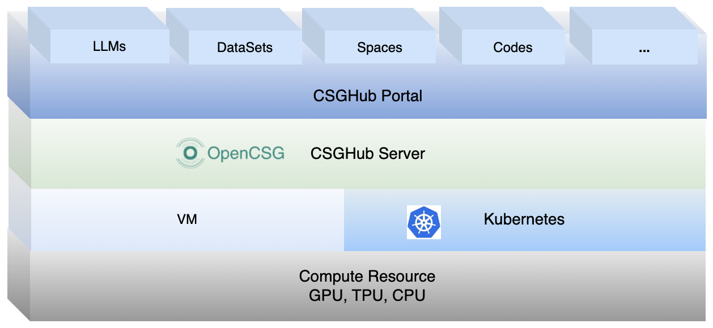

**[简体中文](README_zh.md) ∙ [日本語](README_jp.md) ∙ [한국어](README_kr.md) ∙ [Español](README_es.md)**

## CSGHub

CSGHub is an open-source platform designed for managing Large Language Models (LLM) assets, offering an efficient way to handle the entire LLM and their assets such as datasets, spaces and codes etc. It allows users to upload, download, store, verify, and distribute LLM assets like DeepSeek,Llama etc.via a web interface, `git` command line, a natural language Chatbot, or [CSGHub SDK](https://github.com/OpenCSGs/csghub-sdk).

Additionally, CSGHub features microservice submodules and standardized OpenAPIs for seamless integration with existing systems. It aims to provide a user-friendly management platform specifically for LLM, which can be deployed On-Premise for secure, offline operation. Essentially, CSGHub serves as a private, on-premise version of Huggingface.

### Key Features

- Unified LLMs Management
- Extensible Development Framework
- Advanced Model Capabilities and Optimization
- Space and Asset Management Assistant (Copilot)
- Multi-Source Data Synchronization and Recommendation
- Enterprise-Level Security and Access Control
- On-Premises Deployment Solutions
- E2E Data Processing and Intelligent Annotation System
- Resilient High-Availability Architecture

For further information, please see the [detailed introduction](./docs/detailed_intro_en.md) of CSGHub.

### Demo Video

To help users get up to speed with CSGHub, we have created a demo video that highlights its key features and how it works. You can watch it below or on [YouTube](https://www.youtube.com/watch?v=6LwGQ07qBxU)/[Bilibili](https://www.bilibili.com/video/BV1ynmxY3EXz/).
<video width="658" height="432" src="https://github.com/user-attachments/assets/04f9fa17-9294-44c1-8c4a-4d7b9a5c66fa"></video>

### Quick Start

- For those looking to quickly explore, experiment with CSGHub's free SaaS version on the [OpenCSG website](https://opencsg.com). Refer to this [brief quick start guide](./docs/csghub_saas_en.md) to handle LLMs/datasets and deploy LLM applications with CSGHub SaaS interface.
For more information, please refer to the [OpenCSG Documentation Center](https://opencsg.com/docs/en/intro).

- For those seeking a hands-on experience, you can quickly launch CSGHub on your local environment (Linux/MacOS/Windows) using the [Docker one-click deployment guide](https://github.com/OpenCSGs/csghub-installer/tree/main/docker), which allows you to start an all-in-one container with simplified commands and instantly experience the core functionalities of CSGHub.

- For those deploying on Kubernetes, refer to the [Helm Chart installation guide](https://github.com/OpenCSGs/csghub-installer/tree/main/helm) for step-by-step instructions.

### Quick Try

### Roadmap

Discover the [roadmap](./docs/roadmap_en.md) outlining CSGHub's future direction.

### Release Notes

Refer to [release notes](./docs/release_notes.md) for information on feature improvements.

### Meetings & Contributing

We warmly invite you to explore the [OpenCSG Community](https://github.com/OpenCSGs/community), where you'll find comprehensive guides on becoming a vital part of the project.

- The process for joining [community meetings](https://github.com/OpenCSGs/community?tab=readme-ov-file#community-meeting), where you can engage with fellow members and share your ideas.
- Refer to the [contribution guide](https://github.com/OpenCSGs/community/blob/main/guidelines/CONTRIBUTING_en.md) for strategies on how to contribute to the project.
- [Contact us](https://github.com/OpenCSGs/community?tab=readme-ov-file#questions-and-issues) for any questions or issues, ensuring you're always supported throughout your journey with OpenCSG.
- Refer to the [development guide](./docs/setup_en.md) for instructions on setting up the development environment.
