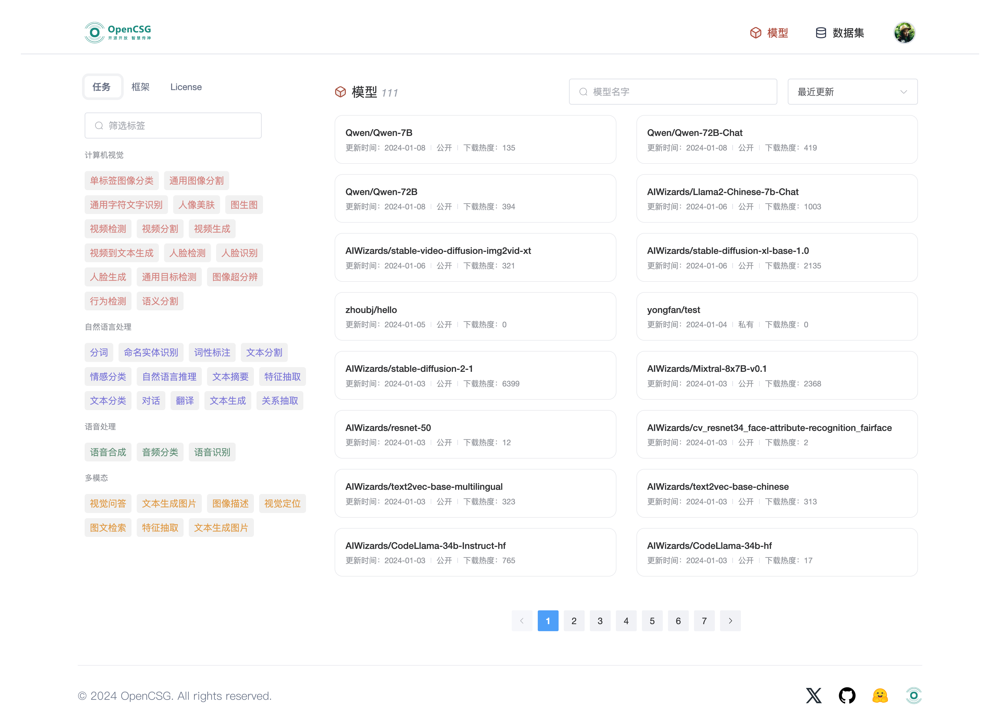

## CSGHub产品说明文档

[README English Version](/docs/readme_en.md)

CSGHub是一个开源、可信的大模型资产管理平台，可帮助用户治理LLM和LLM应用生命周期中涉及到的资产（数据集、模型文件、代码等）。基于CSGHub，用户可以通过Web界面、Git命令行或者自然语言Chatbot等方式，实现对模型文件、数据集、代码等资产的操作，包括上传、下载、存储、校验和分发；同时平台提供微服务子模块和标准化API，便于用户与自有系统集成。

CSGHub致力于为用户带来针对大模型原生设计的、可私有化部署离线运行的资产管理平台。CSGHub提供类似私有化的Huggingface功能，以类似OpenStack Glance管理虚拟机镜像、Harbor管理容器镜像以及Sonatype Nexus管理制品的方式，实现对LLM资产的管理。

您可以通过OpenCSG传神社区官网体验SaaS版功能：https://portal.opencsg.com/models

### 更新
- [2024.02.15] v0.2 规划: 内置代码Repo；数据集自动转换，完整的数据集预览功能。*
- [2024.01.15] v0.1 CSGHub Alpha版本发布，支持模型和数据集管理功能，详细功能说明参见下文。

### 核心理念
在这个多元化的大模型时代，数据和模型逐渐成为企业和个人用户最重要的数字资产。然而，目前面临着管理工具分散、管理手段单一、单机化等问题，这不仅对安全运营构成潜在威胁，也可能阻碍企业大模型能力的更新迭代。若您认同大模型将成为信息革命的主要推动力，或许也在考虑如何更高效、更安全可靠地管理核心资产——模型、数据和大模型应用代码。CSGHub便是为解决这些问题而设计的开源项目。

CSGHub的功能特点如下（持续迭代中）：
- **资产统一管理**： 一站式Hub统一管理模型文件、数据集、大模型应用代码。
- **研发生态兼容**： 同时支持HTTPS和SSH协议的Git命令和Web界面操作， 确保不同用户均可方便使用。
- **大模型能力扩展**：原生支持版本化管理、模型格式转化、数据自动预处理、数据集预览等功能。
- **权限与安全**： 支持与企业用户系统集成、支持资产可见范围设置、外部内部零信任的鉴权接口设计， 最大化满足企业安全。
- **私有化部署支持**： 无互联网依赖、无云厂商依赖等外部依赖，可一键启动私有化部署。
- **大模型原生设计**： 支持自然语言交互、模型一键部署、Agent与Copilot App等资产管理。

### 技术特点
CSGHub的技术特点如下：
- CSGHub整合了多源Git Server、Git LFS大文件存储协议和对象存储OSS等技术，提供可靠的数据存储层、灵活的基础设施接入层和高兼容的研发工具支持。
- 通过服务化的架构， CSGHub提供CSGHub Server后台服务和CSGHub Web Service的管理界面，普通用户可以快速使用Docker compose或Kubernetes Helm Chart启动服务，实现生产级的资产管理。具备自研能力的用户可利用CSGHub Server进行二次开发，将管理功能集成到外部系统或自定义高级功能。
- CSGHub借助Apache Arrow和DuckDB等优秀开源项目，支持Parquet数据文件格式的预览，便于算法研究人员和爱好者进行本地化数据集管理。
- CSGHub提供直观的Web界面和面向企业组织架构的权限设计，用户可通过Web UI实现版本控制管理、在线浏览和下载，也可以设置数据集和模型文件的可见范围，实现数据安全隔离，还可以对模型和数据集发起话题讨论。

OpenCSG团队专注于大模型领域，希望通过CSGHub项目解决大模型开发过程中的痛点。我们鼓励大家贡献高质量的开发和运维文档，共同改进这个平台，让大模型"有据可循"。

### 演示视频
为了帮助您更直观地了解 CSGHub 的功能和使用方法，我们录制了演示视频。您可以通过观看视频，快速了解本项目的主要特性和操作流程。
- CSGHub功能演示：[演示视频](https://portal.opencsg.com/)

### 近期路线图
- **资产管理**
  - [ ] 内置代码仓库：内置代码Repo管理功能，可关联模型、数据集、Space空间应用的代码。
  - [ ] 多源数据同步: 支持配置并启用远端仓库, 自动数据同步，支持OpenCSG传神社区、Huggingface等远端源。
- **AI能力增强**
  - [ ] 一键微调: 支持与OpenCSG llm-finetune集成，一键启动模型微调训练。
  - [ ] 一键推理: 支持与OpenCSG llm-inference集成，一键启动模型推理服务。
- **应用与企业功能**
  - [ ] 应用空间: 支持托管Gradio/Streamlit应用并发布到Space应用空间
  - [ ] 细粒度权限控制：面向企业架构的细粒度权限和访问控制设置
- **安全合规**
  - [ ] GitServer适配器: 通用GitServer适配器，通过Adaptor模式实现对多种主流Git仓库后端的支持。
  - [ ] 资产元数据: 资产元数据管理机制， 支持自定义元数据类型和对应的AutoTag规则。

详细路线图设计如下：[完整路线图](./docs/roadmap.md)

### 详细架构
#### CSGHub Portal 架构图

#### CSGHub Server 架构图

### 快速使用
- [参见详细文档](./script/all_in_one/README.md)

### 详细技术文档
- [开发环境搭建](./docs/setup.md)

### 致谢
本项目基于 Rails、Vue3、Tailwind CSS、Administrate、Postgresql、Apache Arrow、DuckDB 和 GoGin，在此深深感谢他们的开源贡献！

### 联系我们
使用过程中的任何问题， 您可以在github 发起issue或者加入我们的微信讨论群.

