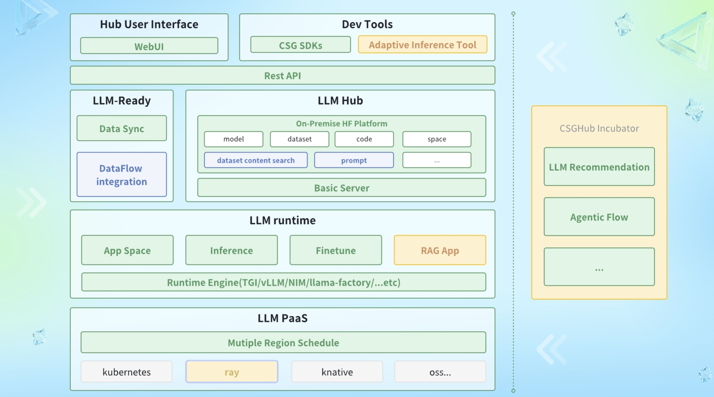

  
  
  

**[English](README.md) ∙ [简体中文](README_zh.md) ∙ [한국어](README_kr.md)**

## CSGHub

CSGHubは、大規模言語モデル（LLM）の資産管理のために設計されたオープンソースプラットフォームであり、データセット、スペース、コードなどのLLM資産を効率的に管理する手段を提供します。CSGHubを利用することで、ユーザーはウェブインターフェース、`git` コマンドライン、自然言語チャットボット、または [CSGHub SDK](https://github.com/OpenCSGs/csghub-sdk) を介してLLM資産をアップロード、ダウンロード、保存、検証、および配布できます。

さらに、CSGHubは、既存のシステムとのシームレスな統合を可能にするマイクロサービスのサブモジュールと標準化されたOpenAPIも備えています。CSGHubは、LLMに特化した使いやすい管理プラットフォームを提供し、セキュアなオフライン運用のためにオンプレミスでのデプロイも可能です。事実上、CSGHubはHuggingfaceのプライベートなオンプレミス版と位置付けられます。

### 主な特徴

- **大規模モデル資産の統合管理**：  
  モデル、データセット、およびコードのワンストップ管理を提供し、保存、バージョン管理、変更、検索をサポートします。超大容量ファイルのアップロードとダウンロードをサポートし、Web上でのオンライン編集とプレビューにより、開発と協業の効率を高めます。

- **柔軟で互換性のある開発エコシステム**：  
  HTTPSおよびSSHプロトコルをサポートし、ユーザーがGitコマンドやWebインターフェースを通じて簡単に操作できるようにします。プラットフォームはGradioやStreamlitなどの人気SDKを統合し、AIアプリケーション開発を簡素化します。また、ワンクリックでモデルの推論と微調整サービスを提供し、環境を自動で最適化することで、効率的なデプロイと運用を実現します。

- **大規模モデルの能力拡張**：  
  包括的なバージョン管理、モデル形式変換、そして自動データ処理をサポートします。CSV、JSONなどの一般的なデータ形式の変換ツールを提供し、Web上でParquet形式のデータセットをプレビューすることで、ユーザーが迅速にデータを確認できるようにします。

- **アプリケーションスペースと資産管理アシスタント（Copilot）**：  
  ユーザーはアプリケーションスペースでモデルの能力を展示し、プロトタイプを構築し、柔軟に新規作成、削除、変更、検索が可能です。Copilotアシスタントは資産管理を簡素化し、企業のオンプレミス展開をサポートするプライベートバージョンも提供します。

- **マルチソースデータの同期と推薦**：  
  OpenCSGコミュニティと統合し、コミュニティのモデルおよびデータセットの同期をサポートします。ビジネスシナリオに基づいた個別の推薦を提供し、企業が適切なAIソリューションを開発できるよう支援します。

- **包括的な権限とセキュリティ管理**：  
  企業ユーザーシステムとの統合をサポートし、資産の可視性設定および内部・外部インターフェースの認証を提供します。ライセンス遵守の検証と追跡を通じて、モデルが法的要件を満たしていることを保証します。

- **オンプレミス展開のサポート**：  
  クラウドサービスに依存せず、ワンクリックでのオンプレミス展開を実現し、企業がデータを完全に管理し、安全性を確保できるようにします。

- **エンドツーエンドのデータ処理とインテリジェントラベリングシステム**：  
  カスタマイズ可能なデータ処理パイプラインを提供し、複雑なデータのクリーニングと変換をサポートします。並列処理により作業の速度を向上させ、インテリジェントラベリングシステムは多ユーザーの協力とレビューをサポートし、データ品質を保証します。

- **高可用性と災害復旧設計**：  
  高可用性システムアーキテクチャを採用し、負荷分散とリソース調整を通じて高負荷状態でも安定性を確保します。冗長バックアップとスナップショット技術を使用した災害復旧をサポートし、ビジネスの継続性を保証します。

詳細については、CSGHubの[詳細紹介](./docs/detailed_intro_en.md)をご覧ください。

### クイックスタート

- **探索したい方**：[OpenCSGのウェブサイト](https://opencsg.com/models)で、CSGHubの無料SaaS版を試用できます。[クイックスタートガイド](./docs/csghub_saas_en.md)を参考にして、CSGHub SaaSインターフェースを使い、LLMやデータセットの管理とLLMアプリケーションのデプロイをお試しください。
詳細については、[OpenCSG ドキュメントセンター](https://opencsg.com/docs/en/intro)をご参照ください。

- **実践を希望する方**：CSGHubの基本的なローカルインスタンスを迅速にデプロイするには、[インストールガイド](https://github.com/OpenCSGs/csghub-installer/tree/main/docker-compose/csghub)をご参照ください。

- **Kubernetesでのデプロイを希望する方**：KubernetesクラスタでのCSGHubのデプロイについては、[Helm Chartインストールガイド](https://github.com/OpenCSGs/csghub-installer/tree/main/helm-chart)をご覧ください。

### ロードマップ

CSGHubの今後の方向性については、[ロードマップ](./docs/roadmap_en.md)をご確認ください。

### リリースノート

機能改善に関する情報は、[リリースノート](./docs/release_notes.md)を参照してください。

### ミーティングと貢献

[OpenCSGコミュニティ](https://github.com/OpenCSGs/community)をぜひご覧ください。プロジェクトの重要な一員になるための包括的なガイドが見つかります。

- 他のメンバーとの交流やアイデアの共有ができる[コミュニティミーティング](https://github.com/OpenCSGs/community?tab=readme-ov-file#community-meeting)に参加する方法を確認してください。  
- プロジェクトへの貢献方法については、[貢献ガイド](https://github.com/OpenCSGs/community/blob/main/guidelines/CONTRIBUTING_en.md)をご参照ください。  
- 質問や問題がある場合は、[お問い合わせ](https://github.com/OpenCSGs/community?tab=readme-ov-file#questions-and-issues)ください。OpenCSGでの旅がスムーズに進むよう、常にサポートいたします。  
- [開発ガイド](./docs/setup_en.md)を参照して、開発環境をセットアップしてください。
