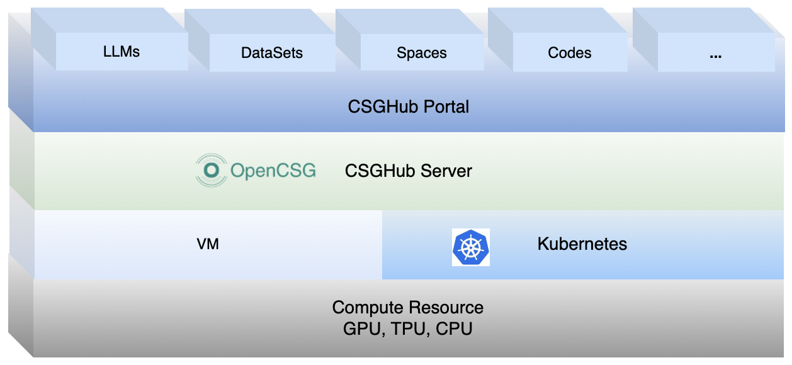

**[English](README.md) ∙ [日本語](README_jp.md) ∙ [한국어](README_kr.md)**

## **CSGHub**

### **1. 项目简介**
随着大语言模型（LLM）的广泛应用，管理这些模型及其相关数据资产（如数据集、代码等）变得越来越复杂。**CSGHub** 提供了一种统一、安全、高效的解决方案，帮助团队和企业简化 LLM 资产管理流程，同时保证数据的安全性和可控性。

**CSGHub** 是一个**Hybrid Huggingface平台**，融合了 Huggingface 的大模型资产管理功能，同时兼顾企业级私有化的需求，为用户提供以下能力：
- 支持模型上传、下载、验证、存储和分发。
- 适配企业需求的本地化部署和离线操作。
- 提供灵活的扩展框架和多种集成方式。

无论您是研究人员、开发者，还是需要分布式模型管理的企业团队，CSGHub 都是理想的选择。

---

### **2. 核心功能概览**
#### **🔑 功能亮点**
1. **统一管理大模型资产**：提供模型、数据集和代码的集中管理和版本控制。
2.  **灵活兼容的开发生态系统**：支持多种协议和热门 SDK，简化 AI 应用开发。
3.  **大模型能力扩展**：实现模型格式转换和自动化数据处理工具。
4.  **应用空间与资产管理助手**：允许展示模型能力并灵活管理资产。
5.  **多源数据同步与推荐**：与 OpenCSG 社区集成，支持社区模型和数据同步。
6.  **完善的权限与安全管控**：集成企业系统，确保数据和模型安全。
7.  **支持私有化部署**：可一键实现企业本地部署，保护数据控制。
8.  **一站式数据处理与智能标注系统**：提供定制的数据处理流程和智能标注功能。
9.  **高可用与灾难恢复设计**：确保系统稳定性和业务连续性。

详细功能介绍请参见 [CSGHub 详细介绍](./docs/detailed_intro_zh.md) 。

#### **📽️ 功能演示**
- [YouTube](https://www.youtube.com/watch?v=6LwGQ07qBxU)
- [Bilibili](https://www.bilibili.com/video/BV1ynmxY3EXz/)
<video width="658" height="432" src="https://github.com/user-attachments/assets/04f9fa17-9294-44c1-8c4a-4d7b9a5c66fa"></video>

#### **🛠️ SDK**
- CSGHub提供了 [SDK](https://github.com/OpenCSGs/csghub-sdk)，方便开发者在不同环境下使用 CSGHub 的功能。
---

### **3. 快速上手**
#### **🖥️ SaaS 版本**
- 访问 [OpenCSG 网站](https://opencsg.com)，无需部署，可直接体验。
- 快速入门可参考 [简要指南](./docs/csghub_saas_zh.md) 。 
- 详细使用教程请参阅 [OpenCSG 文档中心](https://opencsg.com/docs/intro)

#### **💻 本地部署**
- **方法 1: 使用 Docker**。详细部署说明请参阅：[Docker 部署指南](https://github.com/OpenCSGs/csghub-installer/blob/main/docs/zh/README_cn_docker.md)

- **方法 2: 使用 Kubernetes**。详细部署说明请参阅： [Helm Chart 安装指南](https://github.com/OpenCSGs/csghub-installer/blob/main/docs/zh/README_cn_helm_chart.md)

#### **☁️ 云端部署**
- 我们也支持在阿里云市场一键部署 CSGHub：[阿里云市场]((https://market.aliyun.com/products/56014009/cmgj00068499.html?source=5176.29345612&userCode=swc743za))

#### **🎯 场景说明**
| 部署方式| 适用场景| 文档链接|
|--|---|--|
| **SaaS 版本**| 快速体验、无需环境配置| [SaaS 体验指南](https://opencsg.com/docs/intro) |
| **Docker**| 单机部署、小型团队| [Docker 指南](https://github.com/OpenCSGs/csghub-installer/blob/main/docs/zh/README_cn_docker.md) |
| **Kubernetes**| 企业级集群部署、大规模使用 | [K8s 指南](https://github.com/OpenCSGs/csghub-installer/blob/main/docs/zh/README_cn_helm_chart.md) |
| **阿里云市场**| 云端快速一键部署| [阿里云快速部署]((https://market.aliyun.com/products/56014009/cmgj00068499.html?source=5176.29345612&userCode=swc743za)) |

---

### **4. 路线图与版本发布说明**
#### **📈 发展路线图**
- 了解 CSGHub 的未来发展计划：[路线图](./docs/roadmap.md)

#### **📋 发布说明**
- 获取最新功能改进与更新：[发布说明](./docs/release_notes_zh.md)

### **5. 社区与支持**
#### **🌍 加入社区**
- 访问 [OpenCSG 社区](https://github.com/OpenCSGs/community)，成为社区的贡献者分享您的内容。
- 参加 [社区会议](https://github.com/OpenCSGs/community?tab=readme-ov-file#community-meeting)，与其他成员互动并分享您的想法。

#### **📖 贡献指南**
- 请参阅 [贡献指南](https://github.com/OpenCSGs/community/blob/main/guidelines/CONTRIBUTING_zh.md) 以了解如何为项目做出贡献。
- 请参考 [开发指南](./docs/setup.md) 设置开发环境。

#### **📬 联系我们**
- 如有问题或需求，可通过多种方式 [联系我们](https://github.com/OpenCSGs/community?tab=readme-ov-file#questions-and-issues)。
