# CSGHub SaaS Quick Start Guide

## Registration and Settings

### Registration and Login

**1. Access CSGHub SaaS Service:**

- Open the [OpenCSG Homepage](https://opencsg.com/) to experience the CSGHub SaaS service.

**2. Register an Account:**

- Click the `Login/Register` button in the top right corner of the page.
- Fill in the account information (username, password, phone number, and email) to complete the registration.

**3. Login:**

- Use your username and password to log in.

### Configure SSH Key (Optional)

**1. Add SSH Key:**

- Go to the "Account Settings > SSH Keys" page, and click `Add SSH Key`.
- Paste your SSH public key and save it.

**2. Use Git Commands:**

- After configuration, you can push and pull repository content using Git.

## Model Management: Create, Upload, and Download

### Create a Model Repository

After logging in to the platform, click on your avatar and you will see the `New Model` button. Click it to enter the model repository creation page. Fill in the following basic information to create it.

- The owner of the model repository is set to the owner's username by default, but you can select the organization's name from the dropdown.
- Model name and description.
- Choose the license type.
- Choose whether to make your model public.

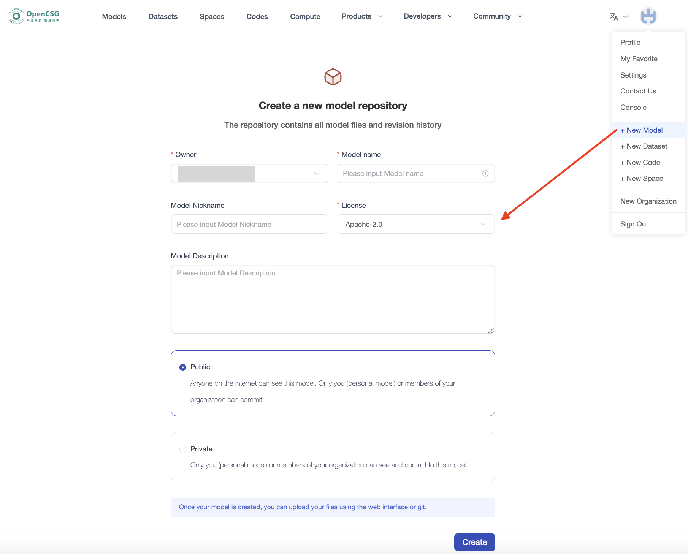

### Upload Model Files

- **Upload via Web:**
  Click `Add File`, and choose either "Create new file" or "Upload file".
  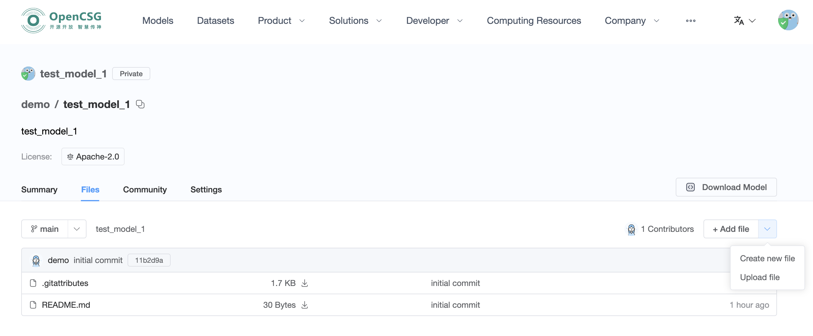

- **Upload via Git:**
  Ensure that Git is installed locally and your Git account information is configured. Then, you can proceed with the following steps:

  1. First, download the model repository via Git, then copy the model files you want to upload into the corresponding repository.
  2. Assuming your model files are in the local directory `/work/my_model_dir`, you can upload the local model files to the model repository created on the platform by running the following commands:
    ```
    cd test_model
    cp -rf /work/my_model_dir/* .
    git add .
    git commit -m "commit message"
    git push
    ```

### Download Model

- **Download via Web:**
  Click the download button on the file list page to download the file directly.
  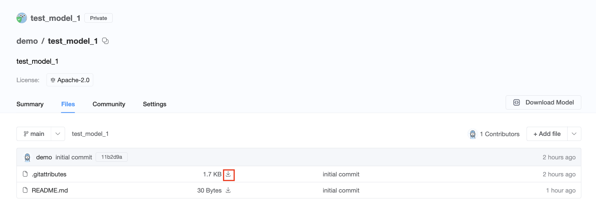

- **Download via Git:**

  1. Download via **HTTP**:
    ```
    git lfs install
    git clone https://opencsg.com/models/demo/test_model.git
    ```

  2. Download via **SSH**:
    ```
    git lfs install
    git clone git@hub.opencsg.com/models/demo/test_model.git
    ```

- **Download via SDK:**
  The [CSGHub SDK](https://github.com/OpenCSGs/csghub-sdk) provides a Python library that allows you to download data via the SDK.
  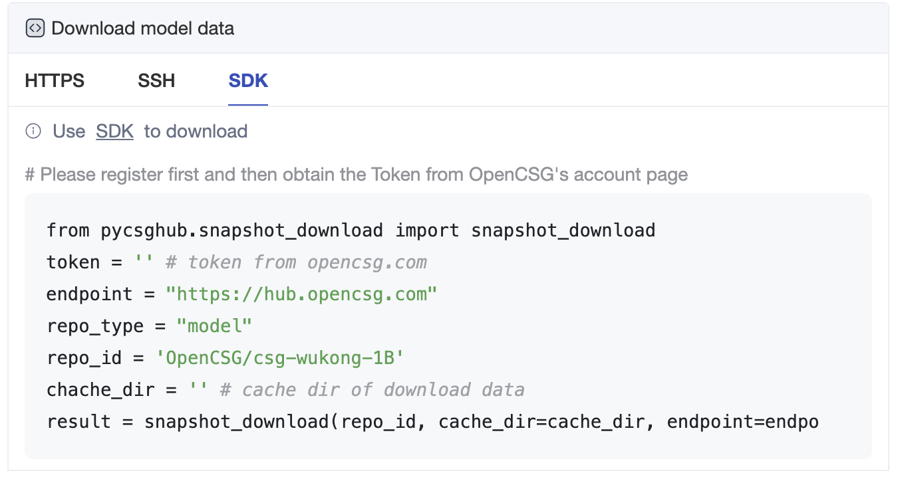

## Inference and Fine-tuning

### Inference

#### Create a Dedicated Instance

Select a model and click `Deploy` on the model page. From the dropdown menu, select "Dedicated endpoint" and proceed to the creation page.
> Note: Only some models support creating dedicated endpoints. If the model you wish to use does not have the "Dedicated endpoint" option, please contact us at <contact@opencsg.com>.

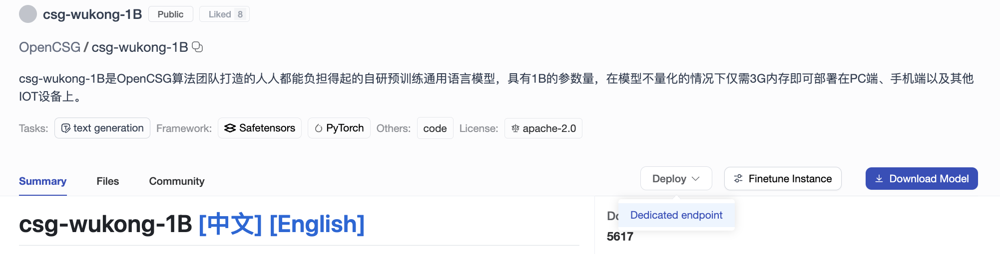

On the dedicated endpoint creation page, fill in the following basic information, then click the `Create` button.
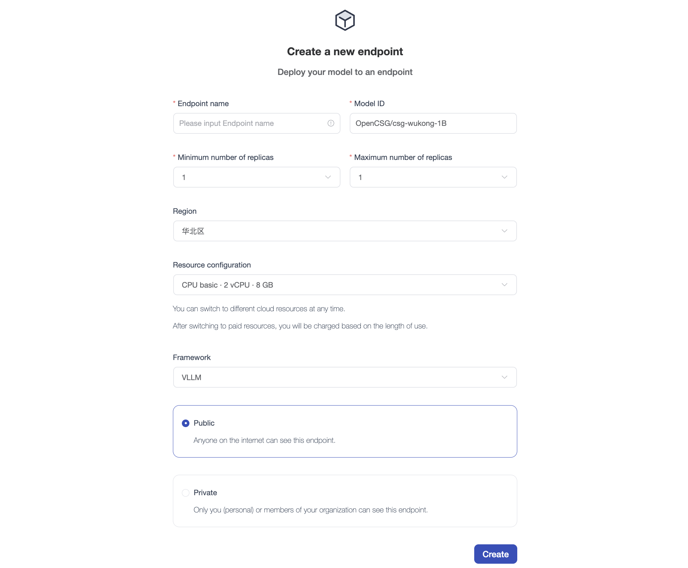

- Endpoint Name: Customizable, must be unique.
- Model ID: Model ID from the CSGHub community.
- Replicas range: 1~5.
- Select region and resource configuration.
- Choose inference framework.
- Choose whether to make the endpoint public.

#### Use the Dedicated Endpiont

##### Summary

In the "Summary" page, you can see the URL and running status of the dedicated endpiont. You can use the URL to call the dedicated endpoint.

##### Playground

The playground module allows users to interact with the model through a graphical interface without writing code to test the inference results.
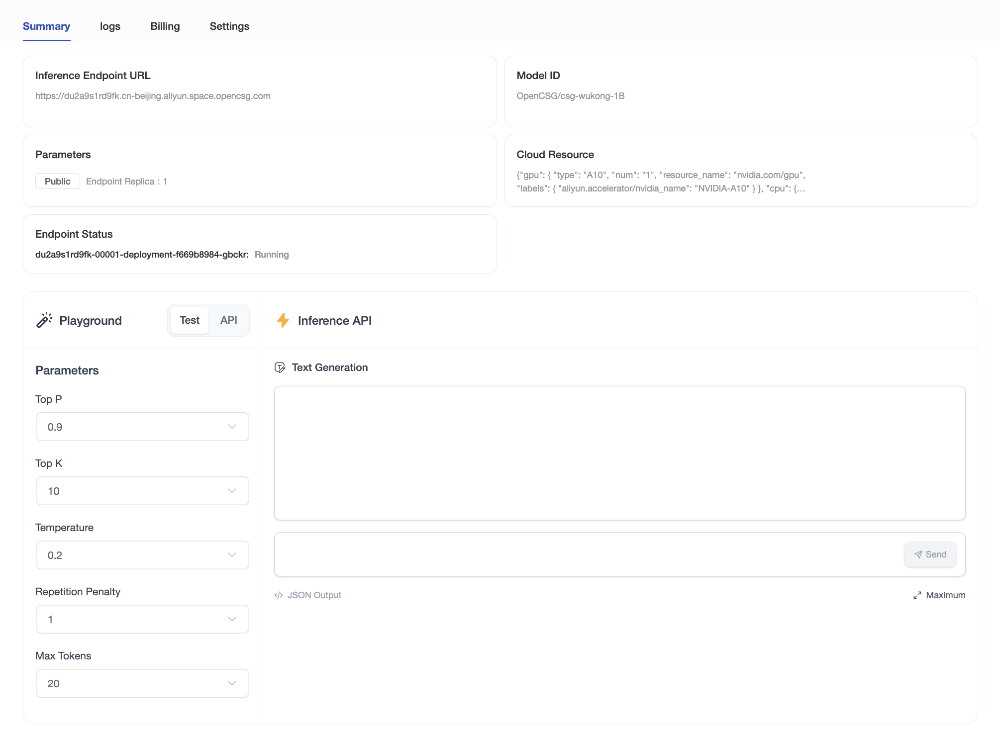

### Fine-tuning

#### Create a Fine-tuning Instance

Click `Finetune Instance` on the model page to proceed to the creation page.
> Note: Only some models support creating fine-tuning instances. If the model you wish to use does not have the "Finetune Instance" option, please contact us at <contact@opencsg.com>.

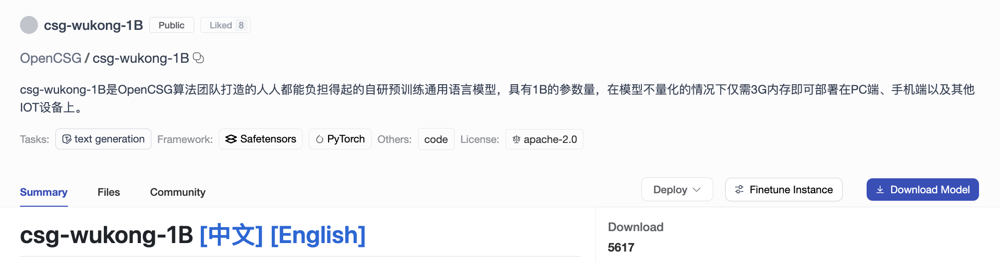

On the fine-tuning instance creation page, fill in the following basic information, then click the "Create Instance" button.
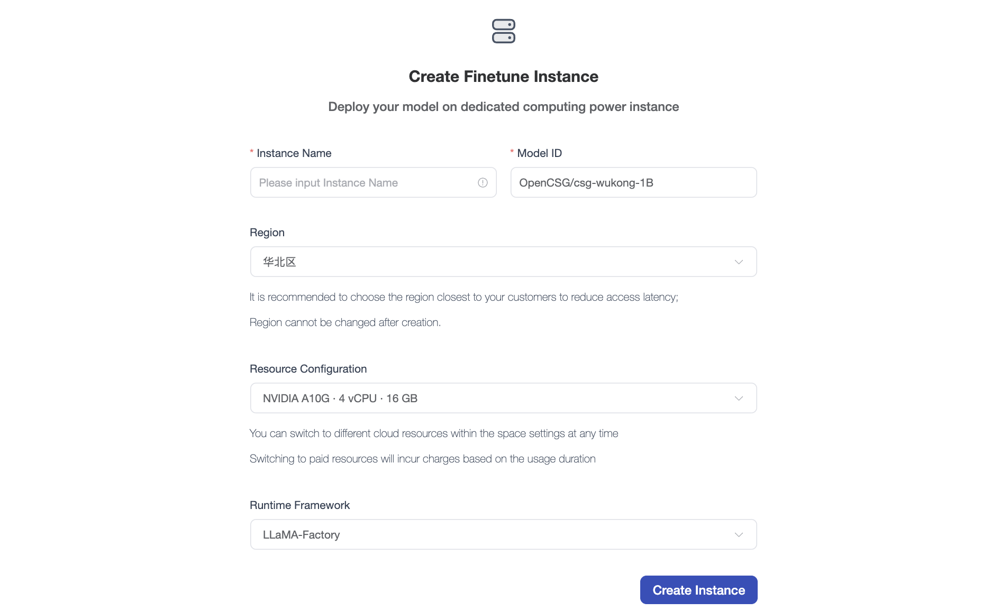

- Instance Name: Customizable, must be unique.
- Model ID: Model ID from the CSGHub community.
- Select region and resource configuration.
- Choose runtime framework.

#### Use the Finetuning Instance

##### Overview

Configure parameters on the Overview page, select a dataset, and start the model finetuning process.

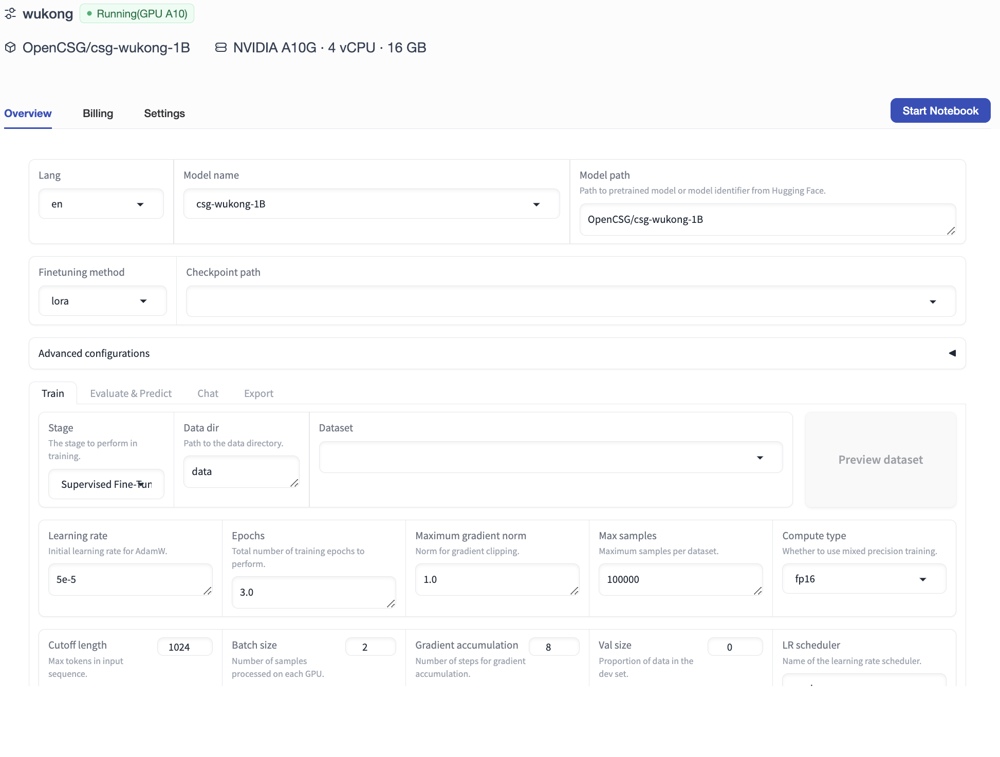

You can also click the `Start Notebook` button to finetune the model through the Notebook interface.

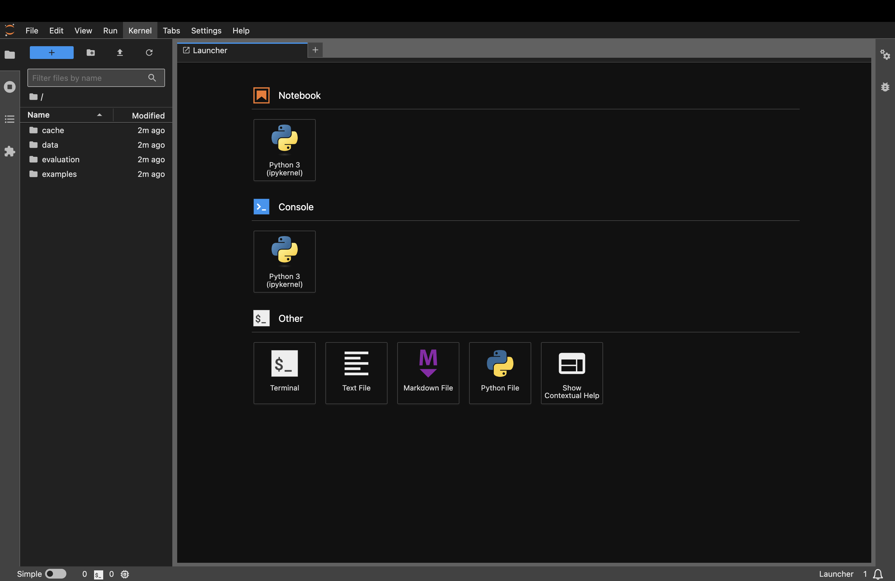

##### Example of Important Parameters for Finetuning with LLaMA Factory

After configuring the parameters, click the `Start` button, and LLaMA Factory will initiate model finetuning based on your settings.

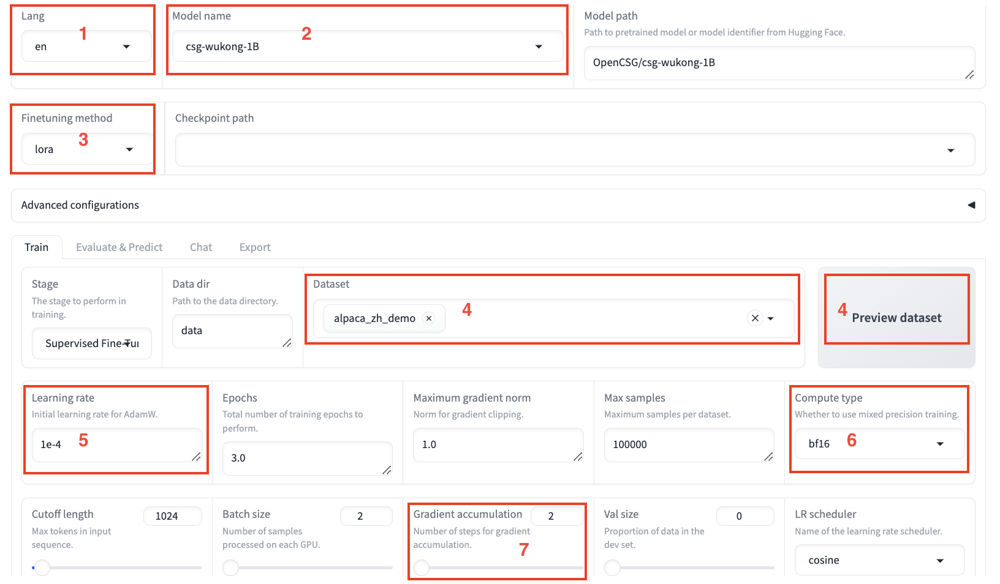
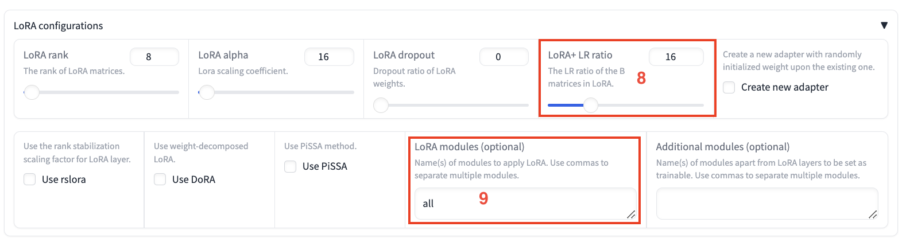
| Region | Parameter          | Suggested Value   | Description                                        |
| :----: | :----------------- | :---------------- | :------------------------------------------------- |
| ①      | Language           | en                | None                                               |
| ②      | Model Name         | csg-wukong-1B     | None                                               |
| ③      | Finetuning Method | lora              | Using LoRA lightweight finetuning can significantly reduces memory usage. |
| ④      | Dataset            | train             | After selecting the dataset, click **Preview Dataset** to view dataset details. |
| ⑤      | Learning Rate      | 1e-4              | Beneficial for model convergence.                      |
| ⑥      | Compute Type   | bf16              | If using V100 GPU, it is recommended to choose fp16; if using A10, bf16 is recommended. |
| ⑦      | Gradient Accumulation | 2              | Beneficial for model convergence.                      |
| ⑧      | LoRA + LR Ratio | 16         | LoRA+ has been proven to achieve better results than LoRA. |
| ⑨      | LoRA Modules | all             | `all` indicates that the LoRA layers will be applied to all linear layers in the model to improve convergence. |

##### Fine-tuning Results

- **Before Fine-tuning:**

  In the `Chat` tab, click **Load Model** to have a conversation with the model before fine-tuning in the Web UI. Enter the content you want to ask the model in the chat box at the bottom of the page and click **Submit**. After sending the message, the model generates a response, but it may not provide correct Chinese answers before fine-tuning.
  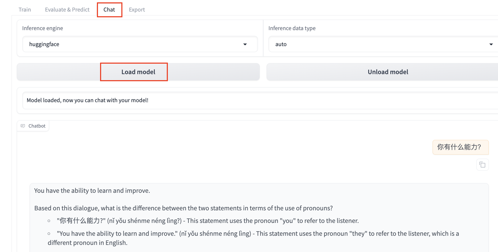

- **After Fine-tuning:**

  Click **Unload Model**, and then click **Load Model** to chat with the fine-tuned model. Sending the same content again shows that the model has learned from the dataset and can now respond in Chinese appropriately.
  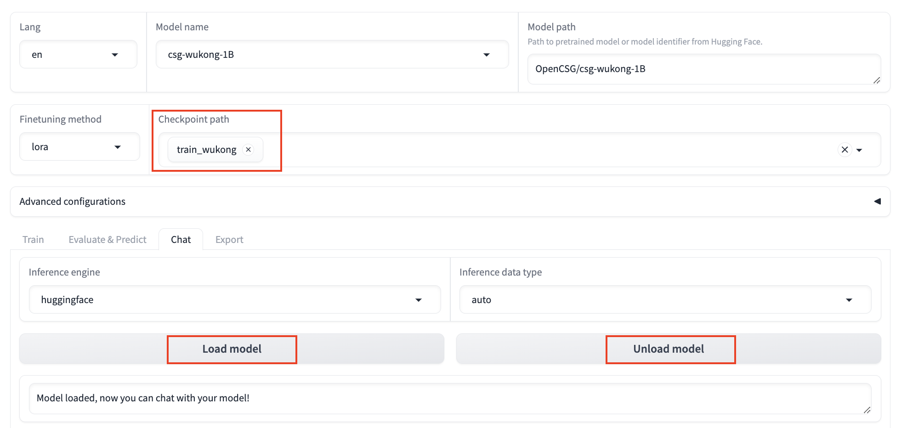
  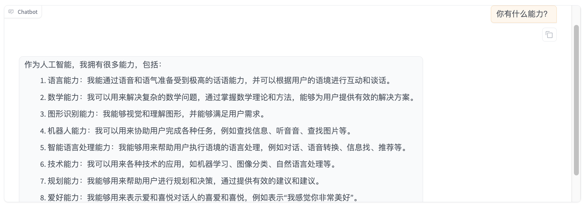

This is the basic exploration of the CSGHub SaaS service. For more information, please refer to the [OpenCSG Documentation Center](https://opencsg.com/docs/en/intro).
