# CSGHub SaaS 版本快速使用指南

## 平台注册与基础设置

### 注册与登录

**1. 访问 CSGHub SaaS 服务：**

- 打开 [OpenCSG 首页](https://opencsg.com/)体验 CSGHub SaaS 版本。

**2. 注册账号：**

- 点击页面右上角的`登录/注册`按钮。
- 填写账号信息（用户名、密码、手机号和电子邮箱），完成注册。

**3. 登录：**

- 使用用户名和密码进行登录。

### 配置 SSH Key（可选）

**1. 添加 SSH Key：**

- 进入“账号设置 > SSH Keys”页面，点击`添加 SSH Key`。
- 粘贴您的 SSH 公钥并保存。

**2. 使用 Git 命令操作：**

- 配置完成后，可通过 Git 推送和拉取仓库内容。

## 模型管理：创建、上传与下载

### 创建模型仓库

登录平台后，点击个人头像会出现`新建模型`按钮，点击进入模型仓库创建页面。填写以下基本信息后进行创建。

- 模型仓库的所有者默认是Owner的用户名，下拉可选择组织的名称。
- 模型名称和简介。
- 选择许可证类型。
- 选择是否公开您的模型。

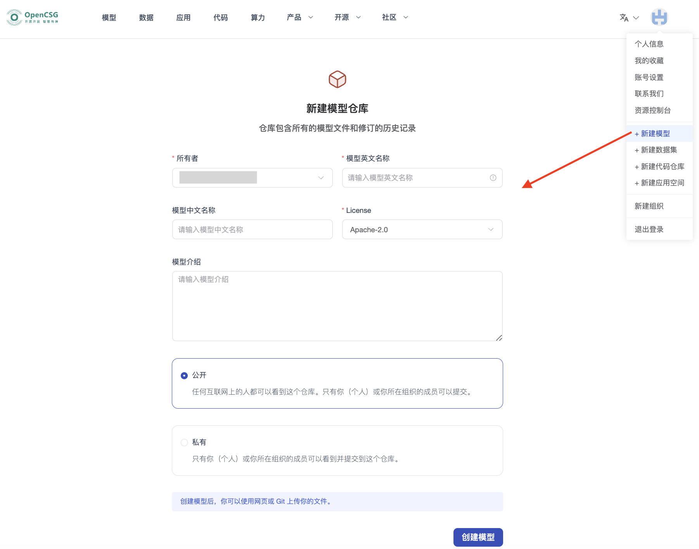

### 上传模型文件

- **使用 Web 端上传：**
  点击`添加文件`，可以选择“创建新文件”或者“上传文件”两种方式。
  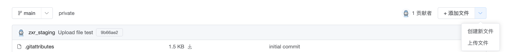

- **使用 Git 上传：**
请确保您已经在本地安装了Git，并且已经配置了您的Git账户信息。然后，您可以通过以下步骤进行操作：

  - 1. 请先通过Git方式下载模型仓库，然后将需要上传的模型文件拷贝到对应仓库中。
  - 2. 假设您的模型文件位于/work/my_model_dir本地目录下，您可以通过执行以下命令将本地模型文件上传到在平台创建的模型仓库中：
    ```
    cd test_model
    cp -rf /work/my_model_dir/* .
    git add .
    git commit -m "commit message"
    git push
    ```

### 下载模型

- **使用 Web 端下载：**
  在文件列表页点击下载按钮可直接下载文件。
  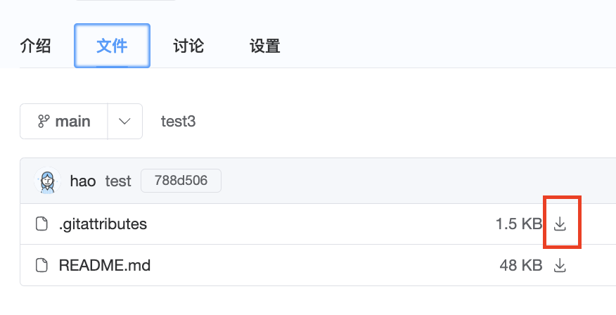

- **使用 Git 下载：**

  - 1. 您可以通过 **HTTP** 下载：
    ```
    git lfs install
    git clone https://opencsg.com/models/demo/test_model.git
    ```

  - 2. 也可以通过 **SSH** 下载：
    ```
    git lfs install
    git clone git@hub.opencsg.com/models/demo/test_model.git
    ```

- **使用 SDK 下载：**
  [CSGHub SDK](https://github.com/OpenCSGs/csghub-sdk) 提供了一个 Python Libaray，可以在代码中通过SDK下载数据。
  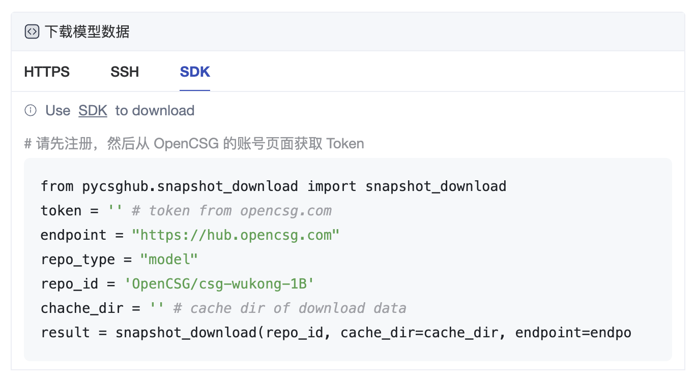

## 模型推理与微调

### 模型推理

#### 创建专属实例

选择一个模型，在模型页面点击`部署`，下拉菜单中选择“专属实例”，点击后跳转创建页面。
> 注意：仅部分模型支持创建专属实例，如您想要使用的模型没有“专属实例”选项，请联系我们 <contact@opencsg.com>。

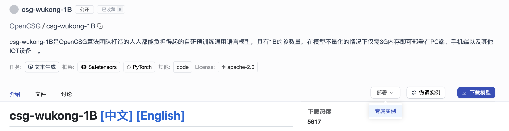

进入专属实例创建页面，填写以下基本信息，然后点击`新建实例`按钮进行创建。
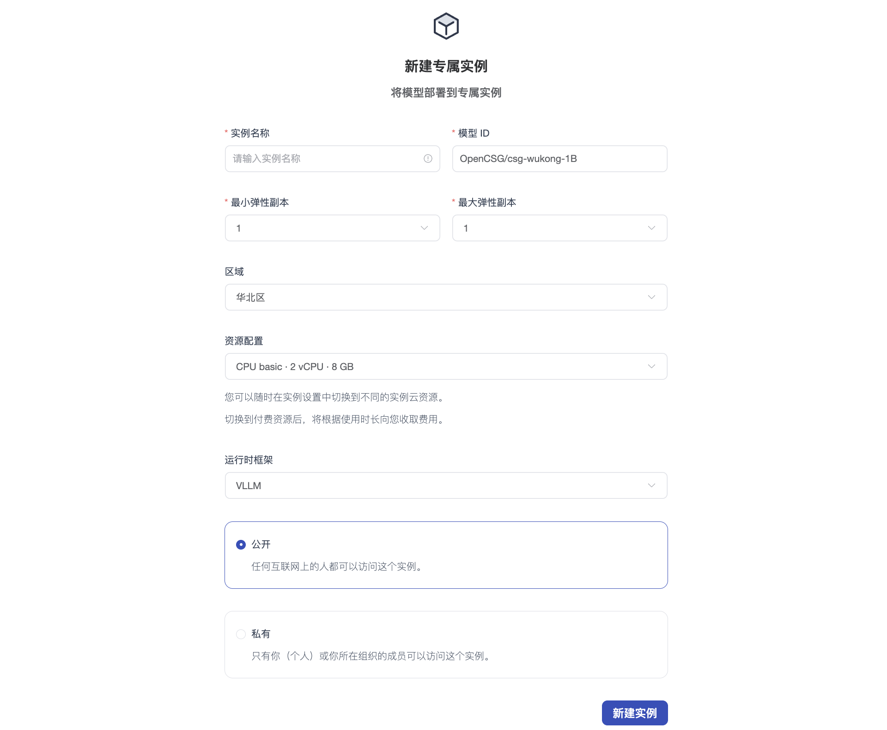

- 实例名称：自定义，不能重复
- 模型 ID：CSGHub 社区的模型 ID
- 弹性副本范围：1~5
- 选择区域和算力资源配置
- 选择推理框架
- 选择是否公开实例

#### 使用专属实例

##### 概览

概览页中可以查看专属实例的URL及运行状态。使用URL可以调用该专属实例。

##### 沙盒

沙盒模块允许用户在无需编写代码的情况下，直接通过图形界面与模型进行交互，测试模型的推理效果。
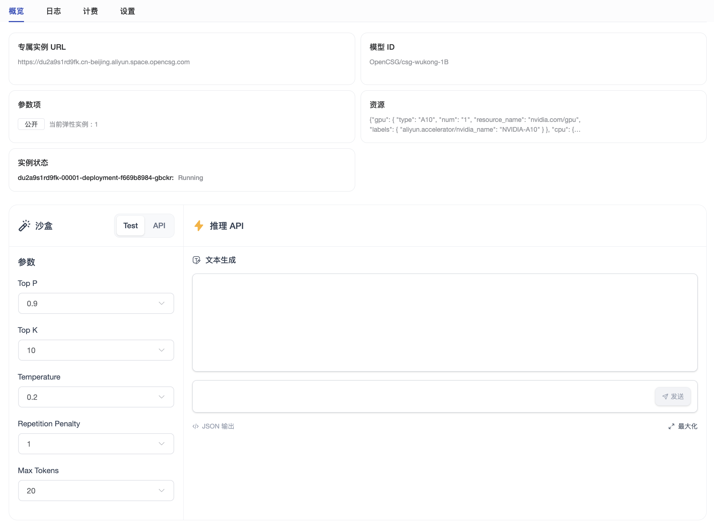

### 模型微调

#### 创建微调实例

在模型页面点击`微调实例`，点击后跳转创建页面。
> 注意：仅部分模型支持创建微调实例，如您想要使用的模型没有“微调实例”选项，请联系我们 <contact@opencsg.com>。

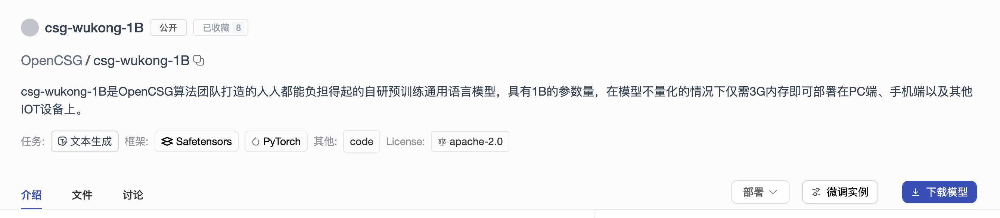

进入微调实例创建页面，填写以下基本信息，然后点击“创建实例”按钮进行创建。
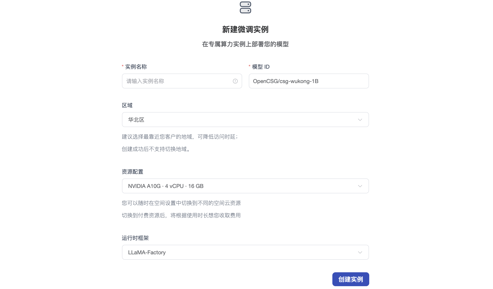

- 实例名称：自定义，不能重复
- 模型 ID：CSGHub 社区的模型 ID
- 选择区域和算力资源配置
- 选择微调框架

#### 使用微调实例

##### 概览

在概览页中配置参数，选择数据集，启动模型微调。

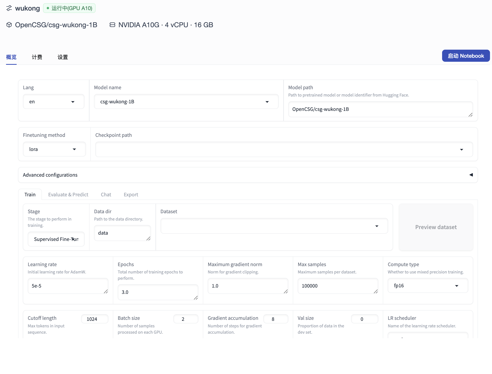

也可以点击`启动 Notebook`按钮，通过Notebook来微调模型。

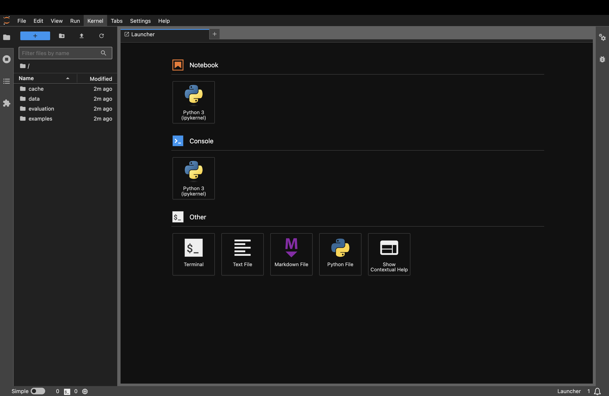

##### 使用 LLaMA Factory 进行微调重要参数示例

配置好参数后，点击`开始`按钮，LLaMA Factory 会根据您设置的参数启动模型微调。

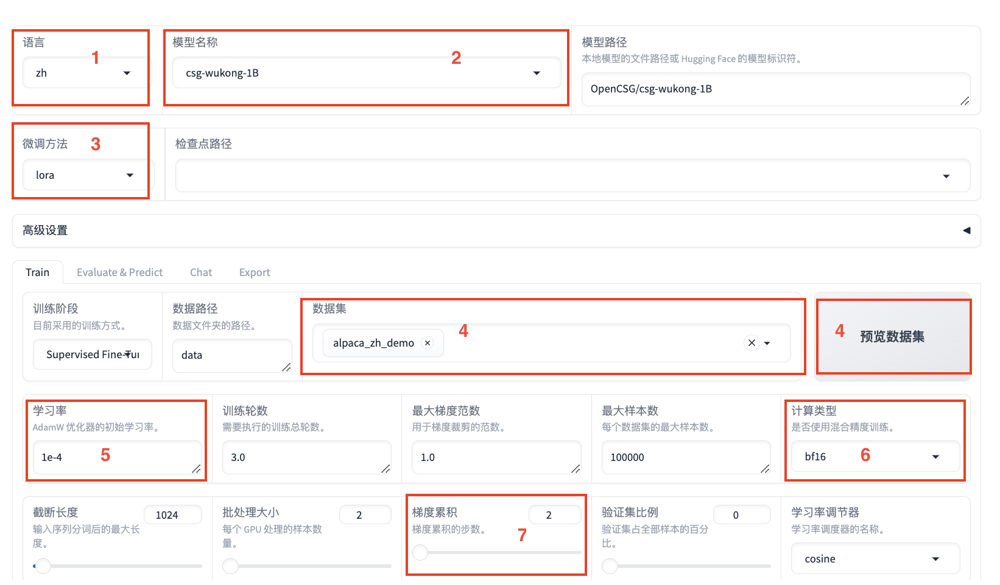
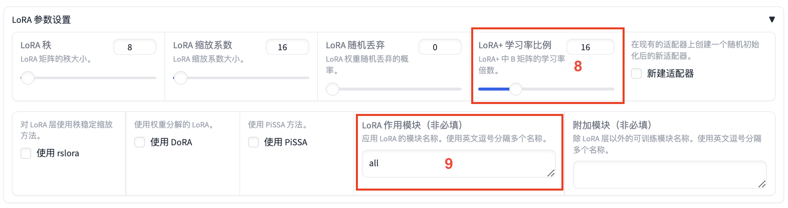
| 区域 | 参数               | 建议取值           | 说明                                               |
| :--: | :---------------- | :---------------- | :------------------------------------------------- |
| ①    | 语言               | zh                | 无                                                 |
| ②    | 模型名称           | csg-wukong-1B    | 无                                                 |
| ③    | 微调方法           | lora              | 使用LoRA轻量化微调方法能在很大程度上节约显存。     |
| ④    | 数据集             | train             | 选择数据集后，可以单击**预览数据集**查看数据集详情。|
| ⑤    | 学习率             | 1e-4              | 有利于模型拟合。                                   |
| ⑥    | 计算类型           | bf16              | 如果显卡为V100，建议计算类型选择fp16；如果为A10，建议选择bf16。|
| ⑦    | 梯度累计           | 2                 | 有利于模型拟合。                                   |
| ⑧    | LoRA+学习率比例    | 16                | 相比LoRA，LoRA+续写效果更好。                      |
| ⑨    | LoRA作用模块       | all               | all表示将LoRA层挂载到模型的所有线性层上，提高拟合效果。|

##### 微调结果展示

- **微调前：**

  在 `Chat` 页签中，单击**加载模型**，即可在 Web UI 中和微调前的模型进行对话。在页面底部的对话框输入想要和模型对话的内容，单击**提交**，即可发送消息。发送后从模型生成的回答中可以发现模型无法生成正确的中文回答。
  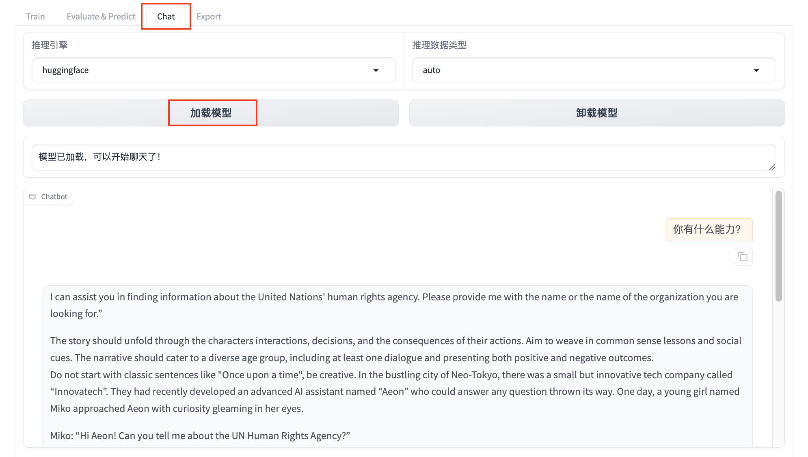

- **微调后：**

  单击**卸载模型**，单击**加载模型**，即可在 Web UI中 和微调后的模型进行对话。重新向模型发送相同的内容，发现模型学习到了数据集中的内容，能够恰当地用中文回答问题。
  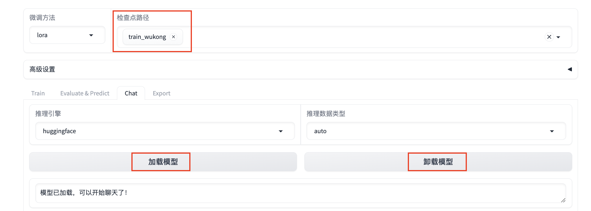
  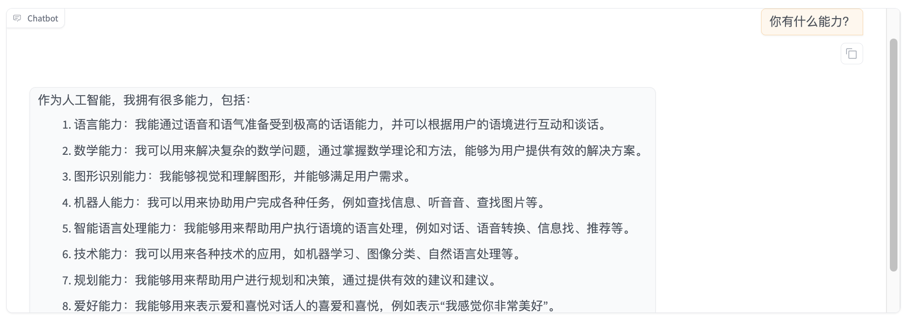

以上为 CSGHub SaaS 版本的基本功能体验，更多信息请参阅 [OpenCSG 文档中心](https://opencsg.com/docs/intro)。
