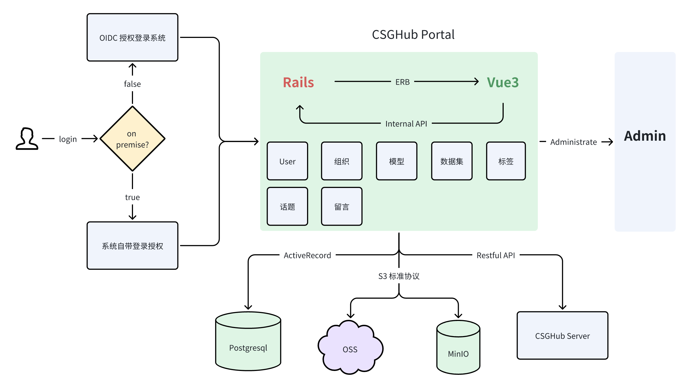
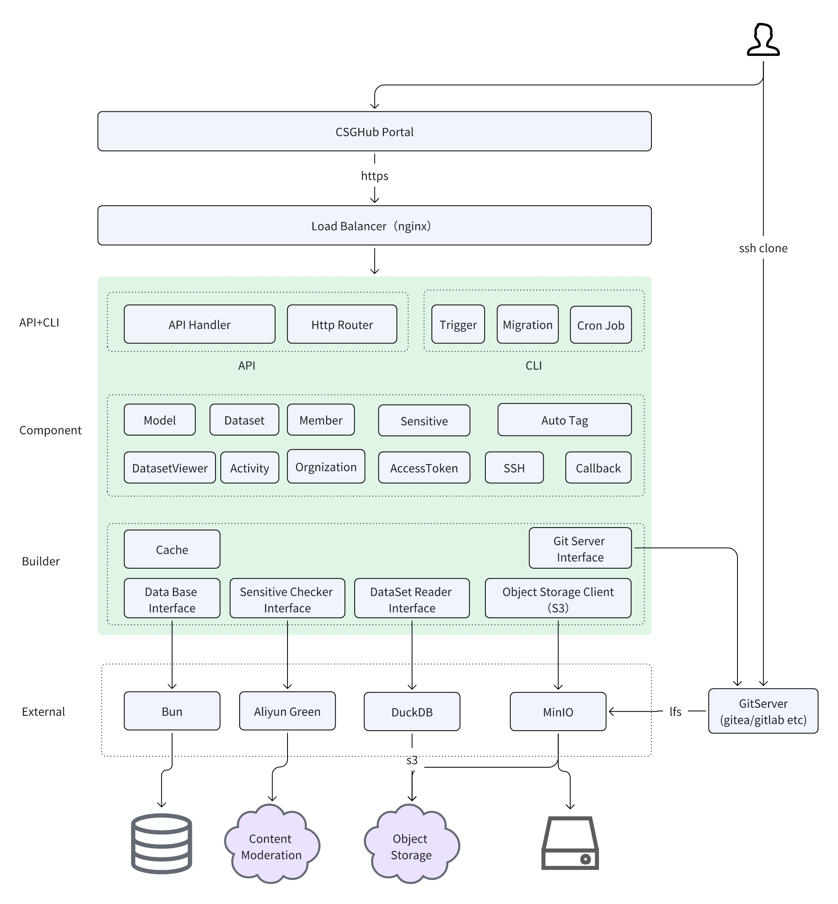

# CSGHub 功能与架构详解  

在大语言模型（LLM）时代，数据和模型已成为企业及个人用户的核心数字资产。然而，管理工具的分散、管理方式的局限性以及本地化等问题，不仅威胁到安全运营，还可能影响企业级模型的更新迭代。如果您相信大模型将成为未来变革的关键驱动力，那么如何高效、安全地管理模型、数据及大模型应用代码等核心资产，可能正是您关注的问题。CSGHub 正是为解决这些问题而设计的开源项目。  

## CSGHub 核心功能  

- **统一管理大模型资产**：  
  提供一站式模型、数据集和代码的管理，支持存储、版本控制、修改和查询。支持超大文件的上传与下载，以及 Web 端在线编辑和预览，提升开发协作效率。  

- **灵活兼容的开发生态系统**：  
  支持 HTTPS 和 SSH 协议，方便用户通过 Git 命令或网页界面进行操作。平台集成 Gradio 和 Streamlit 等热门 SDK，简化 AI 应用开发，并提供一键模型推理和微调服务，自动优化环境，确保高效部署和运行。  

- **大模型能力扩展**：  
  支持全面的版本管理、模型格式转换和自动数据处理，以及 CSV、JSON 等常见数据格式的转换工具，并在 Web 端预览 Parquet 格式数据集，方便用户快速检查数据。  

- **应用空间与资产管理助手（Copilot）**：  
  用户可通过应用空间展示模型能力，搭建应用原型，并进行灵活的增删改查操作。Copilot 助手简化资产管理，并提供私有化版本以支持企业本地部署。  

- **多源数据同步与推荐**：  
  与 OpenCSG 社区集成，支持同步社区中模型和数据集，并根据业务场景提供个性化推荐，助力企业开发适配场景的 AI 方案。  

- **完善的权限与安全管控**：  
  支持与企业用户系统集成、支持资产可见范围设置、外内部接口鉴权设计，并通过许可证合规性检查和溯源确保模型符合法律要求。  

- **支持私有化部署**：  
  无需依赖云服务即可一键实现私有化部署，保障企业数据的自主控制和安全。  

- **一站式数据处理与智能标注系统**：  
  提供可定制的数据处理 Pipeline，支持复杂数据清洗与转换，并利用并行处理加速任务。还具备智能标注系统，支持多用户协作和审核，确保数据质量。  

- **高可用与灾难恢复设计**：  
  采用高可用系统架构，支持负载均衡和资源调度，确保高并发下的稳定性。通过冗余备份和快照技术实现灾难恢复，保障业务连续性。  

## CSGHub 技术方案  

CSGHub 的技术方案包括以下内容：  

- CSGHub 集成了 Git 服务器、Git LFS（大文件存储）协议和对象存储服务（OSS），提供了稳固的数据存储层、灵活的基础设施访问层，并对开发工具提供全面支持。  
- CSGHub 采用面向服务的架构，通过 CSGHub Server 提供后端服务，并通过 CSGHub Web Service 提供管理界面。普通用户可以使用 Docker Compose 或 Kubernetes Helm Chart 快速启动服务，实现企业级资产管理。而具备开发能力的用户可利用 CSGHub Server 进行二次开发，将管理功能集成到外部系统或自定义更多高级功能。  
- 利用 Apache Arrow 和 DuckDB 等出色的开源项目，CSGHub 支持 Parquet 数据文件格式的预览，方便研究人员和普通用户管理本地化数据集。  
- CSGHub 提供简洁直观的 Web 界面和符合企业组织结构的权限设计。用户可以通过 Web UI 实现版本控制、在线浏览和下载，设置数据集和模型文件的可见范围，实现数据隔离安全，还可以围绕模型和数据集发起主题讨论。  

我们的研发团队专注于 AI + DevOps，希望通过 CSGHub 项目解决大模型开发中的难点。我们鼓励大家提供优质的开发和运维文档，共同完善平台，打造更加丰富、高效的大模型资产。  

## CSGHub 架构设计  

CSGHub 包含两个核心部分：门户（Portal）和服务器（Server）。此代码库对应 CSGHub Portal，而 CSGHub Server 则是用 Golang 实现的高性能后端项目。  

如果您想深入了解 CSGHub Server 的架构细节，或希望将 Server 与您的前端系统集成，可以查看 [CSGHub Server 开源项目](https://github.com/OpenCSGs/csghub-server)。  

### CSGHub Portal 架构  

### CSGHub Server 架构  

