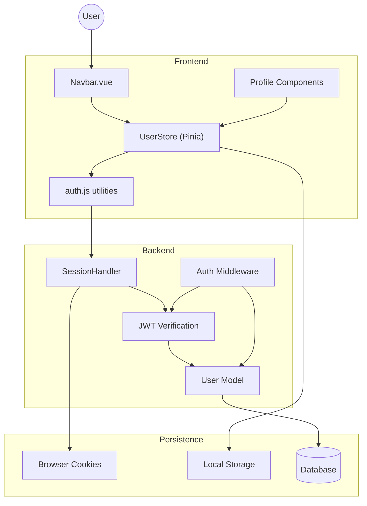
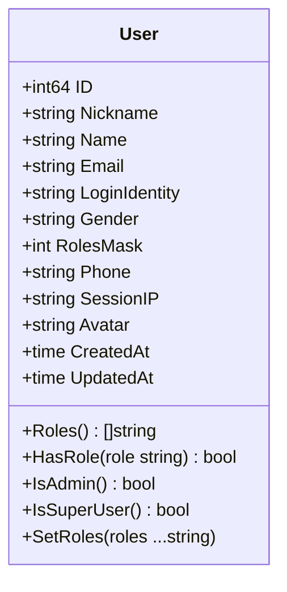
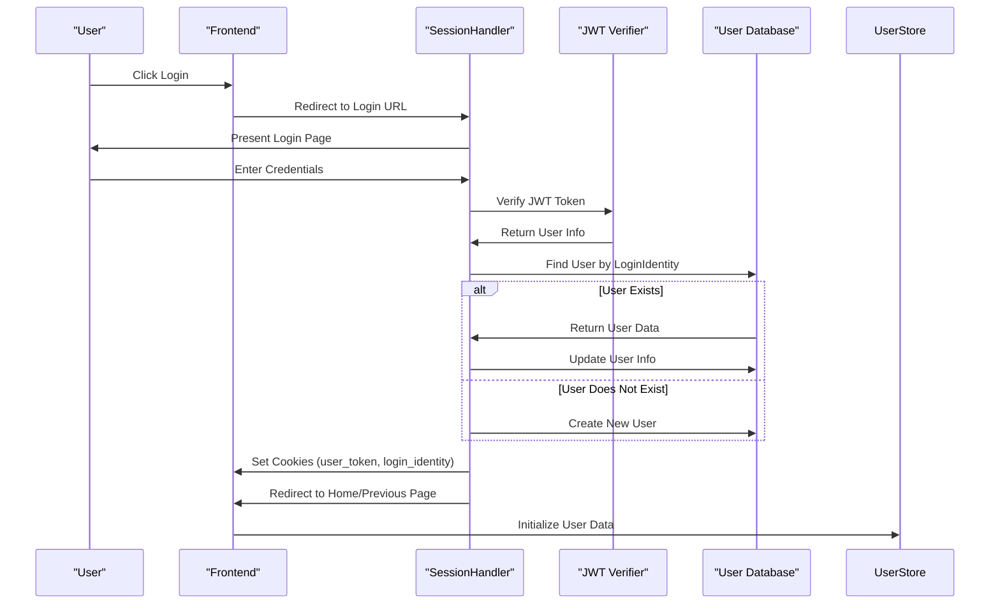
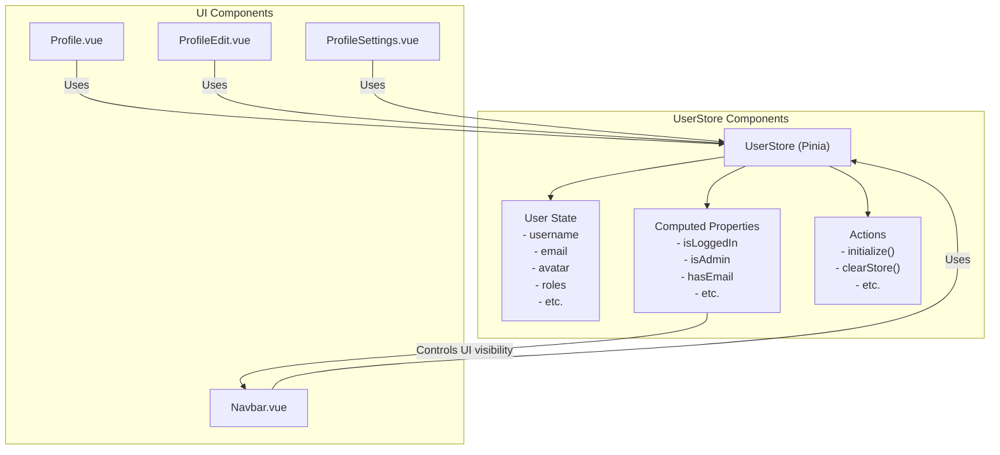

# User and Authentication System

This document provides a comprehensive overview of the user management and authentication architecture in CSGHub. It covers the authentication flow, session management, user roles, and profile management functionality.

For information on organization management and collections, see [Organizations and Collections](#4.3).

## 1. System Overview

The User and Authentication System in CSGHub is responsible for managing user identities, authentication, sessions, and access control. It implements a JWT (JSON Web Token)-based authentication mechanism with role-based access control.

## 2. User Model and Database Schema

The user model defines the structure and behavior of user entities in the system, including their roles and permissions.

### 2.1. Core User Entity

The `User` struct is the primary data structure for user information:

### 2.2. Role-Based Access Control

The system implements role-based access control using a bitmask approach:

| Role Constant | Bitmask Value | Description |
|---------------|---------------|-------------|
| `RoleSuperUser` | 1 (1 << 0) | Super user with full access |
| `RoleAdmin` | 2 (1 << 1) | Admin with administrative access |
| `RolePersonalUser` | 4 (1 << 2) | Standard personal user |
| `RoleCompanyUser` | 8 (1 << 3) | Corporate user |

The `User` struct provides methods to check and manage roles:
- `Roles()`: Returns all roles as string array
- `HasRole(role)`: Checks if user has specific role
- `IsAdmin()`: Checks if user has admin privileges
- `IsSuperUser()`: Checks if user has super user privileges

## 3. Authentication Flow

The authentication process in CSGHub utilizes JWT (JSON Web Token) for secure user authentication.

### 3.1. Login Process

1. User initiates login by clicking the login button in the navbar
2. User is redirected to the login URL defined in the configuration
3. After successful authentication, a JWT token is generated
4. The `SessionHandler.Create` method verifies the JWT token
5. The system creates a new user record if the user doesn't exist, or updates existing user information
6. User session information is stored in cookies
7. User is redirected to the home page or a previously accessed page

### 3.2. Logout Process

1. User initiates logout from the navbar dropdown
2. The `clearCookies` method in the Navbar component calls the logout function
3. All cookies are removed, including login tokens
4. User is redirected to the home page

## 4. Session Management

CSGHub manages user sessions through cookies and local storage persistence.

### 4.1. Cookie Management

The system uses several cookies to manage user sessions:

| Cookie Name | Purpose | Expiration |
|-------------|---------|------------|
| `user_token` | Stores the JWT token | 7 days |
| `login_identity` | Stores the user's unique identifier (UUID) | 7 days |
| `can_change_username` | Indicates if the user can change their username | 7 days |
| `previous_path` | Stores the last visited path for redirection after login | Session |
| `locale` | Stores the user's language preference | Persistent |

### 4.2. Frontend State Persistence

The frontend uses Pinia with a custom persistence plugin to maintain user state across page reloads:

1. User data is stored in the browser's local storage with a 2-minute expiration time
2. On page load, the system checks if the stored state is still valid
3. If valid, the user state is restored; otherwise, it's cleared
4. This persistence layer works alongside cookies to provide a seamless user experience

## 5. User Store and Frontend Integration

The frontend maintains user state using Pinia, a state management library for Vue.js.

### 5.1. Key Features of the User Store

1. **Basic User Data Storage**:
   - Personal information: username, nickname, email, phone
   - Profile data: avatar, homepage, bio
   - System information: uuid, roles, timestamps

2. **Computed Properties for Access Control**:
   - `isLoggedIn`: Determines if user is authenticated
   - `isAdmin`: Checks if user has admin privileges
   - `isSuperUser`: Checks if user has super user privileges
   - `actionLimited`: Determines if user actions should be restricted (e.g., missing email or required username change)

3. **Persistence**:
   - User data is persisted in local storage
   - Short expiration time (2 minutes) to ensure data freshness
   - Synchronized with server on page load

## 6. User Interface Components

The user interface for authentication and profile management is primarily implemented through several Vue components.

### 6.1. Navbar Component

The Navbar component is the main entry point for user authentication interactions:

1. Displays login/register button for unauthenticated users
2. Shows user avatar and dropdown menu for authenticated users
3. Provides access to user profile, settings, and other user-specific features
4. Handles logout process
5. Displays notifications for missing email or required username changes

### 6.2. Profile Management Components

Several components handle user profile management:

| Component | Purpose |
|-----------|---------|
| `Profile.vue` | Displays user profile information |
| `ProfileEdit.vue` | Allows editing of user profile data |
| `ProfileSettings.vue` | Manages user settings |
| `AccessTokenSettings.vue` | Manages API access tokens |
| `SshKeySettings.vue` | Manages SSH keys for Git operations |

These components are registered in the main application entry point and rendered based on the current route.

## 7. System Configuration and Initialization

The authentication system is initialized during application startup.

### 7.1. Backend Initialization

1. The application loads configuration via `config.LoadConfig()`
2. The database connection is initialized through `models.InitDB()`
3. A service context is created with `svc.NewServiceContext()`
4. Routes are initialized including authentication middleware
5. The HTTP server is started to handle requests

### 7.2. Frontend Initialization

1. The main application is created using Vue.js
2. Pinia store is initialized with custom persistence plugin
3. User components are registered
4. Internationalization (i18n) is set up with cookie-based locale detection
5. Router is configured for navigation
6. The application is mounted to the DOM

## 8. Admin User Management

The system includes specialized admin interfaces for user management:

1. Admin panel accessible only to users with admin privileges
2. User listing and management capabilities
3. System configuration settings
4. Additional management features for admin users

## Summary

The User and Authentication System in CSGHub provides a comprehensive solution for user management, authentication, and authorization. It uses JWT for secure authentication, implements role-based access control, and provides a seamless user experience through persistent state management.

Key features include:
- JWT-based authentication
- Role-based access control
- Cookie and local storage persistence
- User profile management
- Admin interfaces for user administration

This system forms the foundation for user interactions throughout the CSGHub platform, ensuring secure and personalized access to resources.