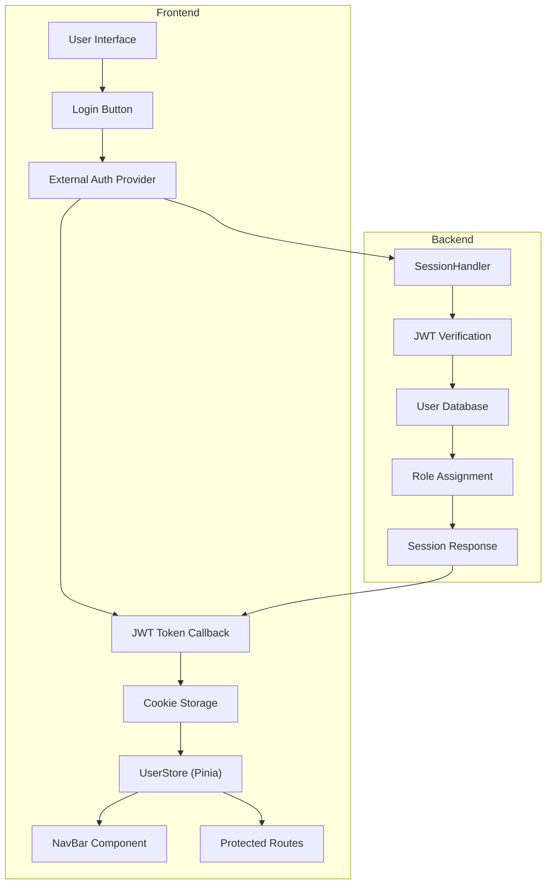
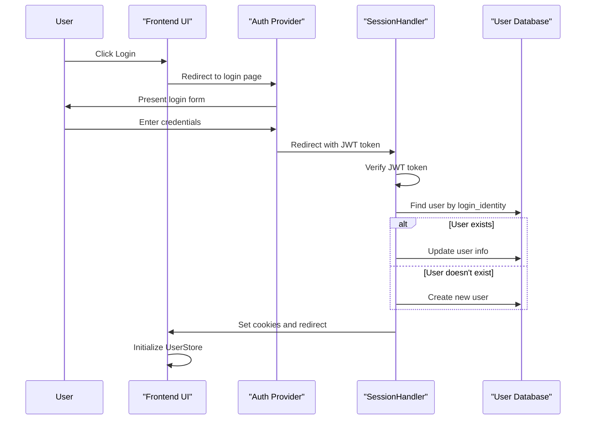
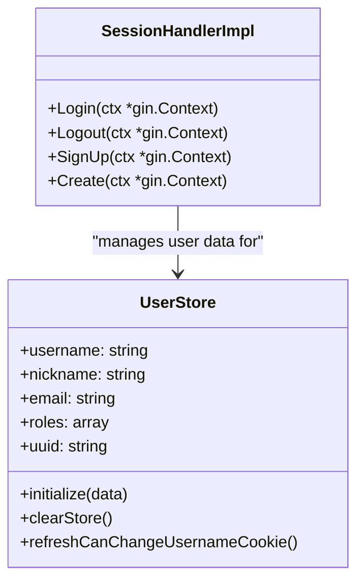
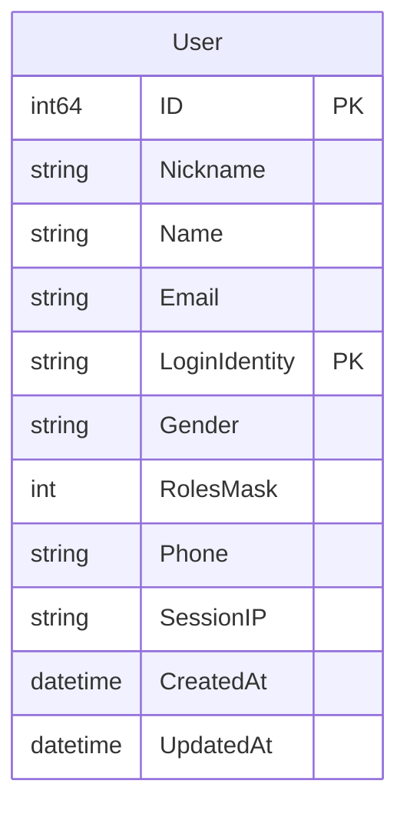
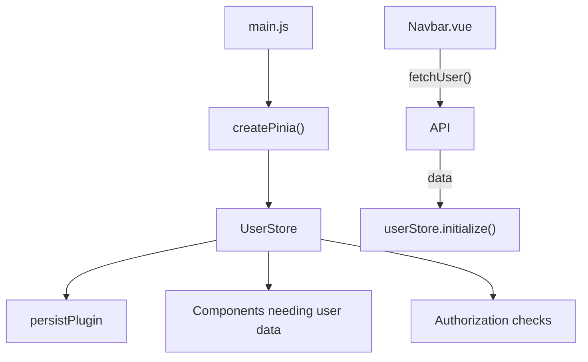

# User Authentication and Session Management

This document provides a technical overview of the authentication system and session management implementation in CSGHub. It covers the authentication flow, JWT token handling, user session management, and the role-based access control mechanisms. For information about user profiles and settings, see [User Profile and Settings](#4.2).

## 1. Authentication Architecture Overview

CSGHub implements a cookie-based authentication system using JWT (JSON Web Tokens) for secure user identity verification. The system maintains user state between sessions using browser cookies and client-side state management.

## 2. Authentication Flow

### 2.1 Login Process

1. The user initiates login from the Navbar component
2. The system redirects to the external login page (defined in config)
3. After successful authentication, the external system redirects back with a JWT token
4. The SessionHandler verifies the JWT and creates/updates the user record
5. Cookies are set for maintaining the session
6. The user is redirected to the requested page or home page

### 2.2 JWT Token Handling

The JWT token contains user identity information and roles. The backend verifies this token for authenticity and then uses it to:

1. Identify the user
2. Determine user roles and permissions
3. Maintain session state

The token is stored in cookies:
- `user_token`: Contains the actual JWT token
- `login_identity`: Contains the user's UUID
- `can_change_username`: Indicates if the user needs to update their username

## 3. Session Management

### 3.1 Cookie-Based Session

CSGHub uses HTTP cookies to maintain user sessions with the following characteristics:

- **Cookie Duration**: 7 days (defined by `cookieMaxAge = 3600 * 24 * 7`)
- **Cookie Types**: 
  - `user_token`: The JWT token
  - `login_identity`: User UUID
  - `can_change_username`: Username modification flag
  - `locale`: User's preferred language

### 3.2 Logout Process

The logout process:
1. Clears all cookies by setting them with a negative expiration time
2. Clears the UserStore state using the clearStore action
3. Redirects the user to the home page or a specified redirect path

### 3.3 Session State Management

The frontend uses Pinia for state management with the following features:

- **Persistence**: Session state is saved to localStorage with a 2-minute expiration
- **State Properties**: User details, roles, login status, and action limitations
- **Computed Properties**: Authorization flags like `isAdmin`, `isLoggedIn`, `actionLimited`

## 4. User Model and Roles

### 4.1 User Database Model

The User model stores essential user information:

### 4.2 Role-Based Access Control

CSGHub implements bit-masked roles for flexible permission management:

| Role | Bit Value | Description |
|------|-----------|-------------|
| Super User | 1 (1 << 0) | Highest level system administrator |
| Admin | 2 (1 << 1) | Platform administrator |
| Personal User | 4 (1 << 2) | Standard individual user |
| Company User | 8 (1 << 3) | Business/organizational user |

Role checks are implemented in both backend and frontend:

- Backend: Using bit operations on the `RolesMask` field
- Frontend: Using computed properties from UserStore

The frontend UI adapts based on the user's roles, showing or hiding specific menu items and functionality.

## 5. Frontend Implementation Details

### 5.1 Navbar and User Menu

The Navbar component displays different UI elements based on the user's authentication state:

- **Logged Out**: Shows login/register button
- **Logged In**: Shows user avatar and dropdown menu with:
  - Profile link
  - Settings
  - Resource console (if not action limited)
  - Admin panel (for admins)
  - Repository creation options
  - Logout option

The component also displays warning banners when:
- Email is missing
- Username needs to be changed
- Both email and username need attention

### 5.2 User Store Integration

The UserStore is integrated throughout the application:
1. Initialized in the Navbar on load if the user is logged in 
2. Used by components to check user permissions
3. Updated when user profile changes

## 6. Security Considerations

- JWT tokens are verified on the backend for authenticity
- Sessions expire after 7 days (cookie expiration)
- User state in localStorage has a 2-minute expiration as an additional safeguard
- Role checks are performed on both client and server sides
- Action limitations are implemented for users with incomplete profiles

## 7. Session Initialization Process

The session initialization follows these steps:

1. On application startup, the UserStore checks for existing saved state in localStorage
2. If the user has a valid `login_identity` cookie but the store is not initialized:
   - The Navbar component makes an API call to fetch user data
   - The UserStore is initialized with the fetched data
3. Protected routes and components check the UserStore to determine access rights
