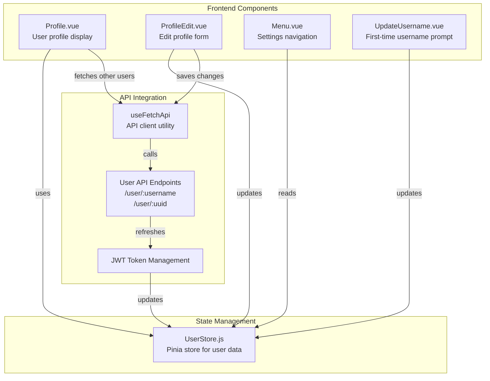
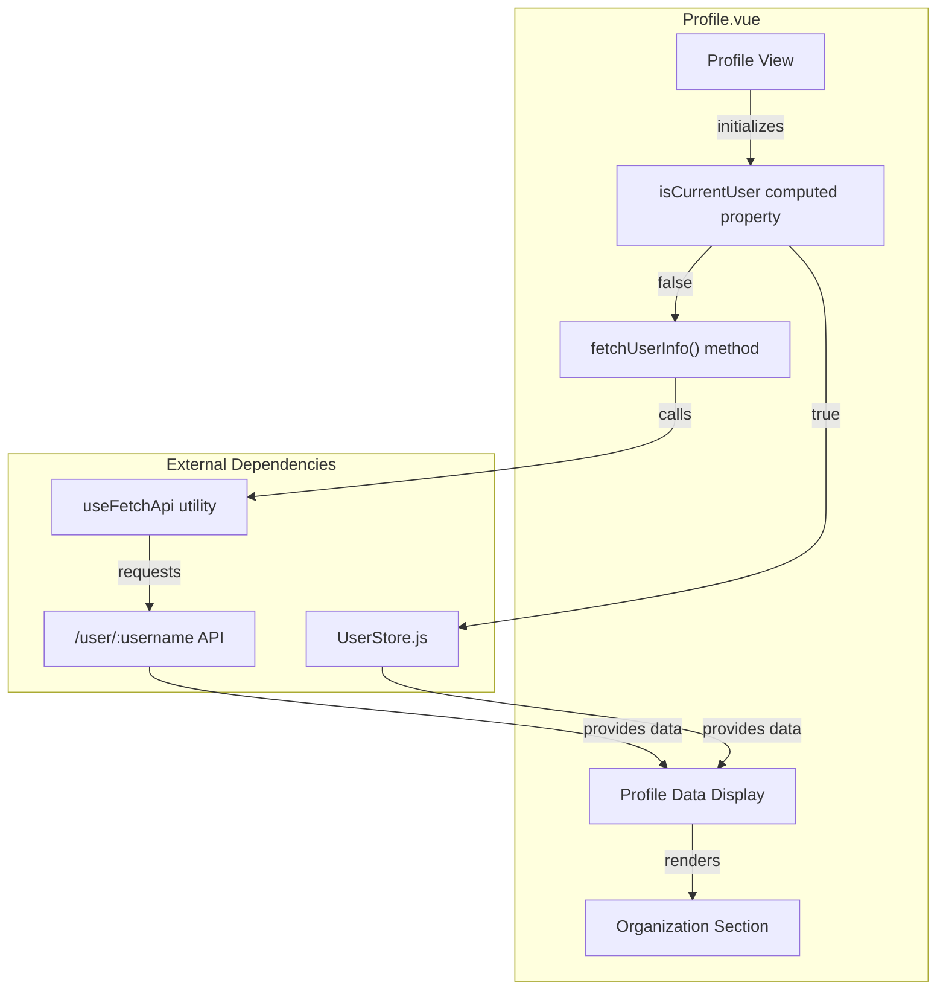
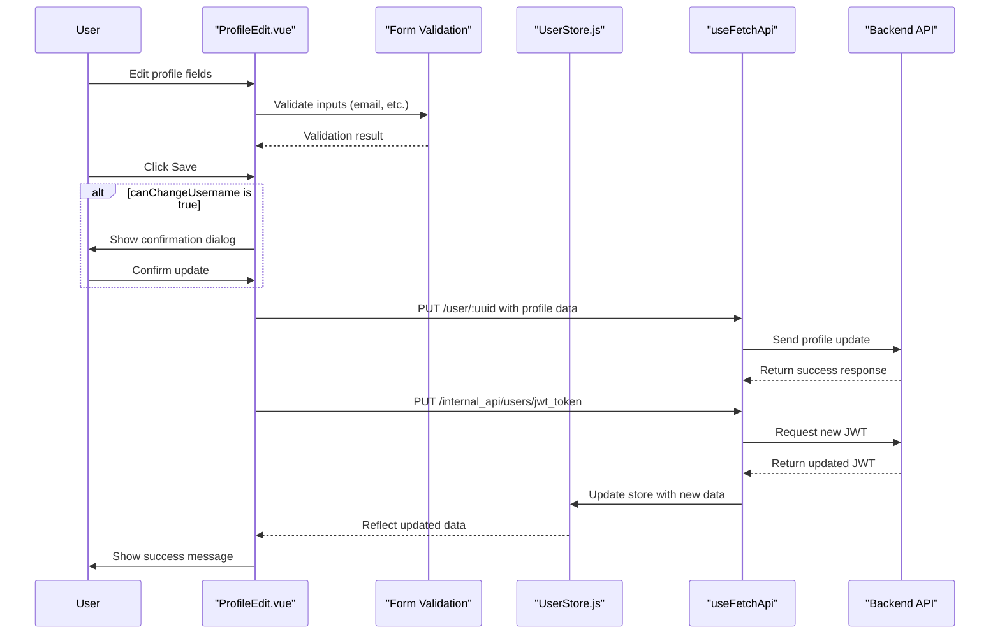
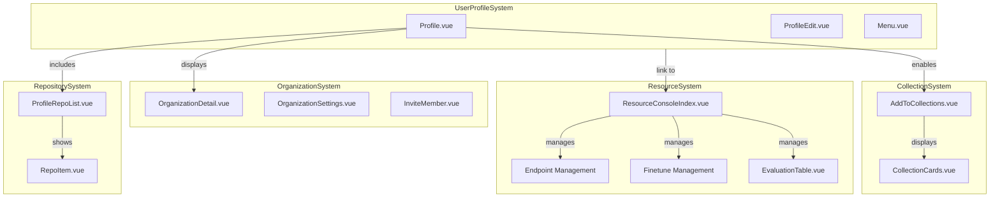

# User Profile and Settings

This document provides a technical overview of the User Profile and Settings system in CSGHub. This system allows users to view and edit their profile information, manage account settings, and configure authentication options.

For information about authentication mechanisms and session management, see [User Authentication and Session Management](#4.1).

## 1. Component Architecture

The User Profile and Settings system consists of several Vue components that handle different aspects of user profile management.

### User Profile Component Structure

### Profile Display Component

The `Profile.vue` component displays user profile information. Key features include:

- Dynamic display based on whether viewing own profile or another user's profile
- Avatar and user information display
- Organization membership list
- Contact information display (when available)

The component uses the `isCurrentUser` computed property to determine whether to load data from the `UserStore` (for current user) or fetch it from the API (for other users).

## 2. Profile Editing System

The profile editing functionality is implemented in `ProfileEdit.vue` and provides a form for users to update their profile information.

### ProfileEdit Component Structure

The `ProfileEdit.vue` component contains:

- Avatar upload and removal functionality
- Username field (with special handling for first-time users)
- Email validation with regex pattern
- Form fields for phone, nickname, homepage, and bio
- Profile update API integration

Profile updates follow this workflow:

### Avatar Management

The `ProfileEdit.vue` component provides methods for avatar management:

- `uploadImage()`: Opens file selection dialog
- `removeImage()`: Clears avatar image
- `uploadAvatar()`: Sends avatar to server using FormData

The avatar is uploaded to `/internal_api/upload` endpoint using `csrfFetch` to include CSRF protection.

## 3. Username Management

CSGHub implements special handling for username updates, particularly for first-time users.

### Username Update Workflow

First-time users are prompted to set their username using the `UpdateUsername.vue` component, which displays as a modal dialog. The ability to change username is controlled through the `can_change_username` cookie.

Key elements of username management:

- Username validation including length, character restrictions, and pattern matching
- Special confirmation dialog for username changes
- Cookie-based tracking of username change capability
- JWT token refresh after username update

The username validation includes multiple rules:
1. Required field validation
2. Length limits (2-64 characters)
3. Must start with a letter
4. Must end with a letter or number
5. Only allows letters, numbers, and specific special characters (-_.)
6. No consecutive special characters

## 4. Settings Navigation

The `Menu.vue` component provides navigation within the User Settings section and displays user information.

### Settings Menu Features

- User avatar and name display at the top
- Navigation links to different settings sections
- Responsive design with tabs for mobile view
- Confirmation dialog for unsaved changes
- Conditional display of advanced options based on user permissions

The menu offers different navigation options:
1. Profile settings (`/settings/profile`)
2. Access tokens (`/settings/access-token`) - only for non-limited users
3. SSH keys (`/settings/ssh-keys`) - only for non-limited users

## 5. Integration with Other Systems

The User Profile and Settings system integrates with several other components of CSGHub.

### System Integration Map

### Organization Integration

Users can belong to organizations, and the profile system displays organization membership:
- `Profile.vue` displays organization logos and links
- Organization role information (admin, write, read) affects available actions
- Organization details are retrieved via `/organization/:name` endpoint

### Collections Integration

The profile system allows users to add repositories to their collections:
- Collections are displayed in the `ProfileRepoList.vue` component
- The `AddToCollections.vue` component enables adding repositories to collections
- Collection management is integrated with the user profile system via the UserStore

### Resource Console Integration

The user profile links to the Resource Console for managing AI resources:
- Endpoints (model deployment)
- Finetunes (model training)
- Evaluations (model testing)

## 6. Internationalization

The User Profile and Settings system supports internationalization through Vue i18n:

### Profile Localization

- User interface text is defined in locale files
- Text elements use the `$t()` function for translations
- English and Chinese translations are provided
- Localization covers all user-facing text in profile components

Key localization files:
- English: [frontend/src/locales/en_js/profile.js]()
- Chinese: [frontend/src/locales/zh_js/profile.js]()

Example of localized elements:
- Account settings title
- Form field labels
- Button text
- Validation messages
- Confirmation dialogs

## 7. UI Components and Data Flow

The User Profile and Settings system uses Element Plus UI components and follows a structured data flow pattern.

### Key UI Components

- `el-avatar`: Displays user profile image
- `el-input`: Form input fields
- `el-form` and `el-form-item`: Form structure with validation
- `el-dialog`: Modal dialogs
- `el-tooltip`: Information tooltips
- `el-tabs`: Mobile navigation

### Data Flow Pattern

1. Component initialization
   - Load data from UserStore (for current user)
   - Fetch data from API (for other users)
   
2. Form interaction
   - Two-way binding with v-model
   - Input validation on change
   - Track unsaved changes
   
3. Data submission
   - Validate form data
   - Submit to API endpoint
   - Update UserStore
   - Show success/error notifications

4. JWT Token Refresh
   - After successful profile update
   - Maintains session with updated information

The User Profile and Settings system provides a comprehensive interface for users to manage their personal information and account settings while integrating seamlessly with other components of the CSGHub platform.