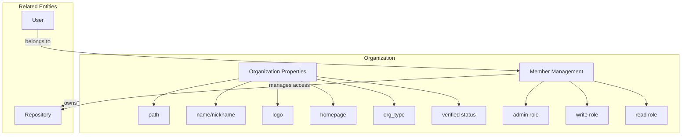
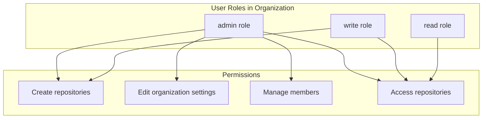
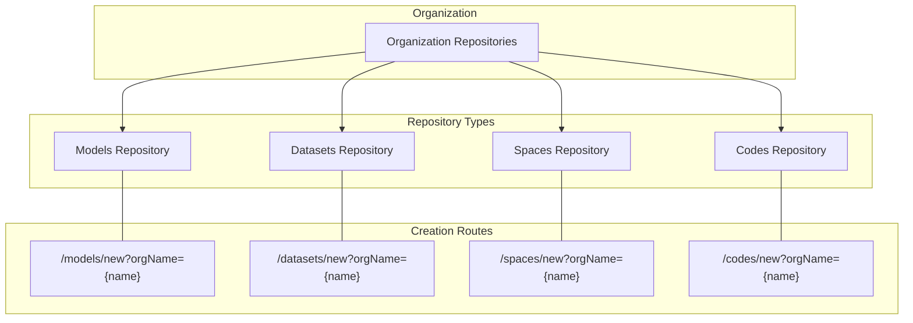
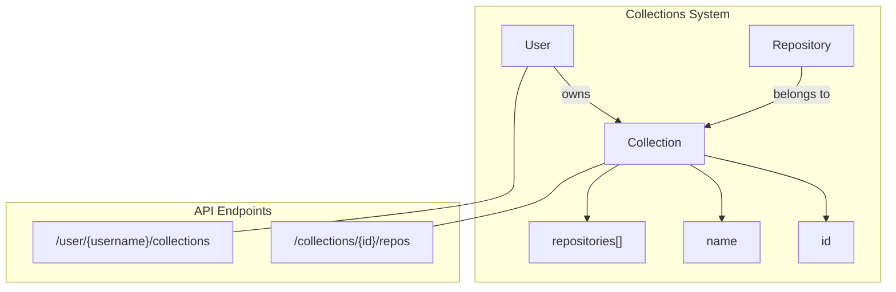
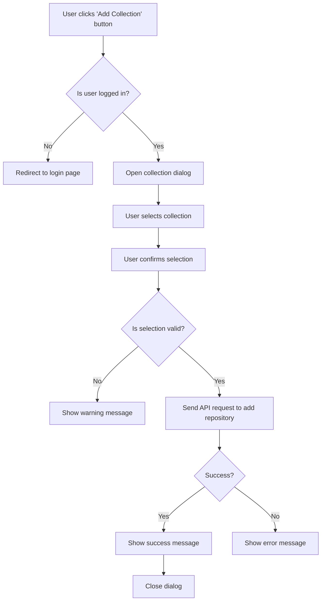
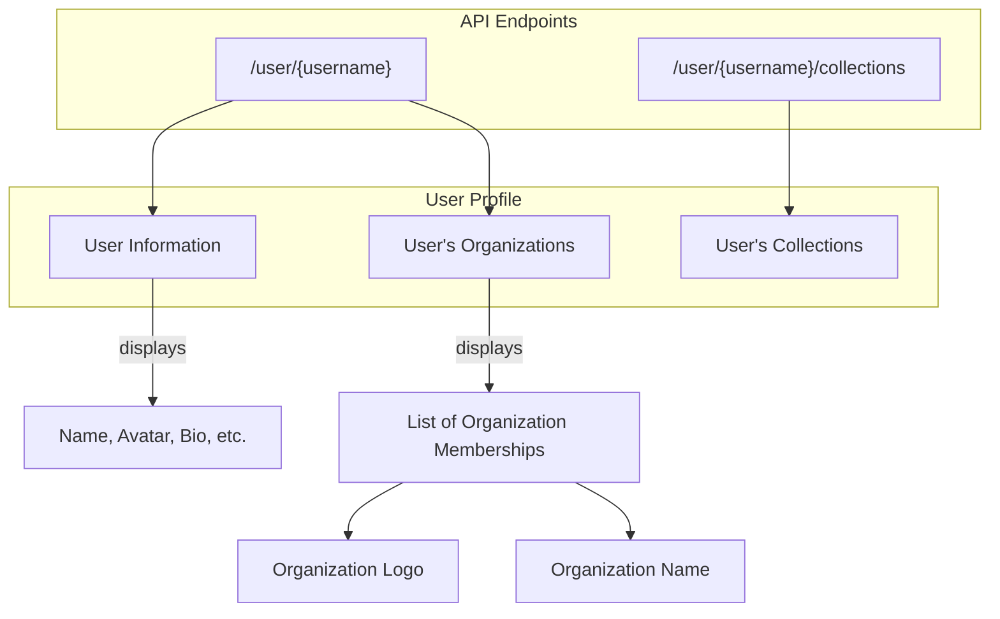

# Organizations and Collections

This document explains the organization and collection management features of CSGHub. Organizations provide a way to group users with shared access to repositories, while collections enable users to organize repositories into custom groups. For information about user authentication and profile management, see [User Authentication and Session Management](#4.1) and [User Profile and Settings](#4.2).

## 1. Organizations

Organizations in CSGHub represent teams, companies, or communities that collaborate on repositories. They enable centralized management of members, repositories, and permissions.



Sources: [frontend/src/components/organizations/OrganizationDetail.vue:6-14](), [frontend/src/components/organizations/OrganizationSettings.vue:46-53]()

### 1.1 Organization Structure and Properties

Organizations have several key properties:

| Property | Description |
|----------|-------------|
| path     | Unique identifier used in URLs (e.g., `/organizations/{path}`) |
| name     | Display name shown in the interface |
| nickname | Alternative display name |
| logo     | Organization's avatar image |
| homepage | External website URL |
| org_type | Classification of organization (e.g., "社区组织" - Community Organization) |
| verified | Boolean indicating official verification status |

Organization data is fetched from the backend API endpoint `/organization/{name}` which returns the organization details.

Sources: [frontend/src/components/organizations/OrganizationDetail.vue:132-143](), [frontend/src/components/organizations/OrganizationSettings.vue:57-71]()

### 1.2 Organization Membership and Roles

Organizations have a hierarchical role system that controls access levels:



Sources: [frontend/src/components/organizations/OrganizationDetail.vue:21-68](), [frontend/src/components/organizations/OrganizationDetail.vue:156-165]()

Users can have one of the following roles in an organization:

1. **admin** - Can manage organization settings, members, and create repositories
2. **write** - Can create repositories and access organization content
3. **read** - Can access organization content but cannot create repositories

The current user's role in an organization is determined by calling the API endpoint `/organization/{name}/members/{username}`.

Organization members are displayed in the organization detail view with their roles. The organization admin can invite new members through the `InviteMember` component.

Sources: [frontend/src/components/organizations/OrganizationDetail.vue:81-97](), [frontend/src/components/organizations/OrganizationDetail.vue:146-155]()

### 1.3 Organization Repository Management

Organizations can own repositories of various types:



Sources: [frontend/src/components/organizations/OrganizationDetail.vue:27-63]()

Users with admin or write permissions can create repositories under the organization. The repository creation UI includes options to specify the organization as the owner. When creating a repository through the organization interface, the organization name is automatically passed as a URL parameter.

## 2. Collections

Collections provide a way for users to group related repositories together, regardless of ownership. Unlike organizations which primarily focus on user grouping and permissions, collections focus on repository grouping for organizational purposes.



Sources: [frontend/src/components/collections/AddToCollections.vue:97-106](), [frontend/src/components/collections/AddToCollections.vue:129-146]()

### 2.1 Collection Management

Collections are user-specific organizational tools. Each user can create and manage their own collections, which are accessible via the API endpoint `/user/{username}/collections`.

The key operations for collections include:

1. **Viewing collections**: Fetching collections for a user
2. **Adding repositories to collections**: Adding one or more repositories to a collection

Sources: [frontend/src/components/collections/AddToCollections.vue:97-106]()

### 2.2 Adding Repositories to Collections

The "Add to Collection" workflow is implemented in the `AddToCollections` component:



Sources: [frontend/src/components/collections/AddToCollections.vue:108-146]()

The process of adding a repository to a collection involves:

1. Opening the "Add to Collection" dialog
2. Fetching the user's collections
3. Selecting a collection
4. Sending a request to the API endpoint `/collections/{id}/repos` with the repository ID
5. Displaying a success message on completion

The data structure for adding a repository to a collection is:

```json
{
  "repo_ids": ["repository-id"]
}
```

Sources: [frontend/src/components/collections/AddToCollections.vue:130-135]()

### 2.3 Collection Integration

Collections are integrated with repository views. Users can add repositories to collections directly from repository interfaces through the `AddToCollections` component. This component displays a button that opens a dialog for selecting a collection.

Collections are displayed in user profiles, allowing users to quickly access their organized repository groups.

Sources: [frontend/src/components/collections/AddToCollections.vue:1-5]()

## 3. Integration with User Profiles

Both organizations and collections are displayed in user profiles, showing the user's affiliations and organizational structure.



Sources: [frontend/src/components/user_settings/Profile.vue:43-66]()

The user profile displays organization memberships, showing organization logos with tooltips containing organization names. When a user views their own profile, the organization data is retrieved from the user store, while for other users' profiles, it's fetched from the API endpoint `/user/{username}`.

Sources: [frontend/src/components/user_settings/Profile.vue:100-114]()

## 4. Summary

Organizations and collections provide two complementary approaches to structure in CSGHub:

| Feature | Organizations | Collections |
|---------|--------------|------------|
| **Primary purpose** | Team collaboration | Repository organization |
| **Permission control** | Yes - role-based | No - personal only |
| **Repository ownership** | Yes | No |
| **Member management** | Yes | No |
| **User affiliation** | Yes | No |
| **Custom grouping** | No | Yes |
| **Visibility in profile** | Yes | Yes |

Organizations focus on team collaboration with hierarchical permissions, while collections provide personal organization of repositories across different owners and organizations. Together, they provide comprehensive tools for managing repository access and organization in CSGHub.