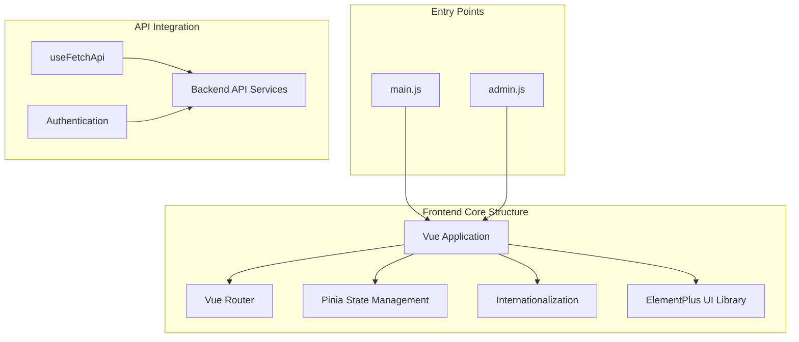
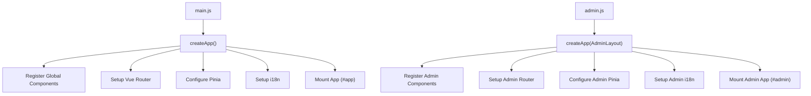
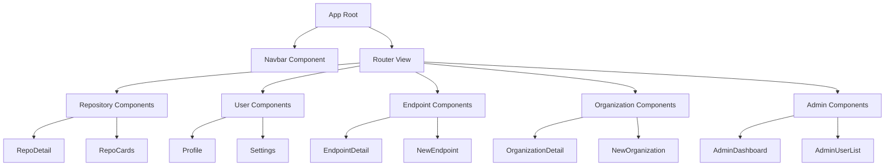
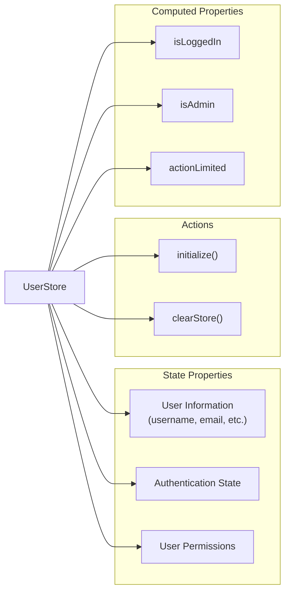
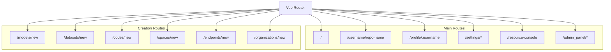
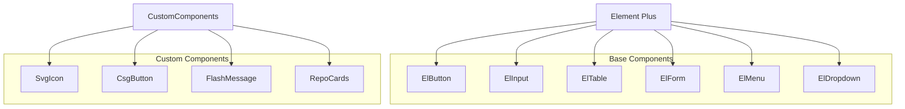
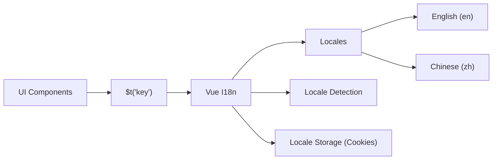
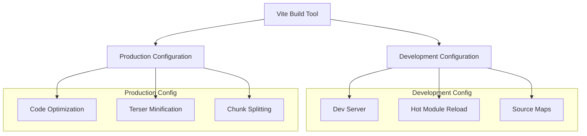
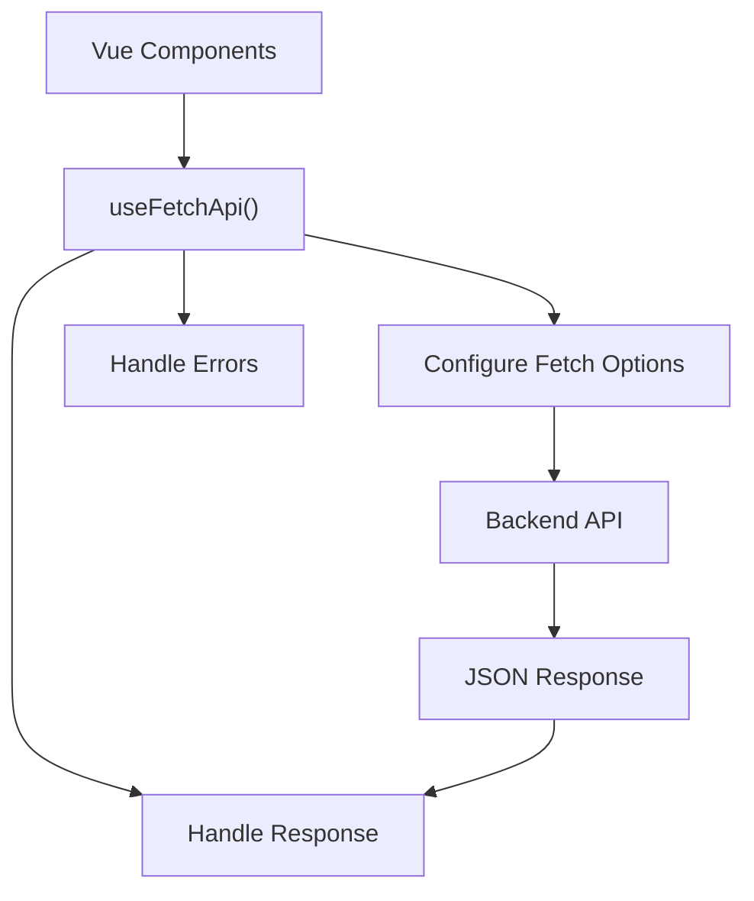
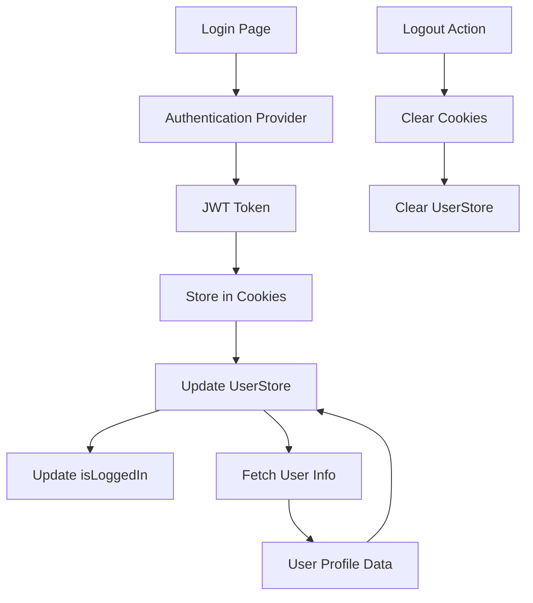

# Frontend Architecture

This document provides an overview of the frontend architecture for CSGHub, explaining the core structure, key components, and design patterns used throughout the client-side application. For information about specific components like repositories or endpoints, see [Repository Management System](#2) or [Model Deployment and Fine-tuning](#3).

## Overview

CSGHub's frontend is built as a single-page application (SPA) using Vue.js 3, leveraging modern frontend technologies and architectural patterns. The application provides interfaces for managing LLM assets, including repositories, models, datasets, endpoints, and evaluations.

Sources: [frontend/src/main.js:1-167](), [frontend/src/admin.js:1-70](), [frontend/package.json:1-55]()

## Core Technologies

The frontend application is built using the following key technologies:

| Technology | Purpose | Implementation |
|------------|---------|----------------|
| Vue.js 3 | Core framework | Composition API and Options API |
| Vue Router | Page navigation | Route configuration in main.js |
| Pinia | State management | Store pattern with persistence |
| Element Plus | UI component library | Styled components with custom theming |
| i18n | Internationalization | English and Chinese language support |
| Vite | Build tool | Development and production builds |

Sources: [frontend/package.json:14-42](), [frontend/src/main.js:1-9]()

## Application Architecture

### Entry Points and Initialization

The application has two main entry points:

1. **Main Application**: Initializes the primary user interface
2. **Admin Application**: Initializes the administration panel

Sources: [frontend/src/main.js:75-167](), [frontend/src/admin.js:46-70]()

### Component Structure

The application follows a hierarchical component structure organized by feature domains:

Sources: [frontend/src/main.js:16-69](), [frontend/src/main.js:146-158]()

## State Management

The application uses Pinia for state management with a custom persistence layer for maintaining state between sessions.

### UserStore

The UserStore is a central store that manages user authentication state and profile information:

Sources: [frontend/src/stores/UserStore.js:1-95](), [frontend/src/packs/persistPinia.js:1-20]()

### State Persistence

A custom persistence plugin ensures that state is preserved across page reloads, with automatic expiration:

1. State is stored in localStorage with a timestamp
2. On initialization, checks if stored state is still valid (within expiration window)
3. Subscribes to store changes and updates localStorage

Sources: [frontend/src/packs/persistPinia.js:1-20]()

## Routing and Navigation

The application uses Vue Router to manage navigation between different views:

Sources: [frontend/src/main.js:146-158]()

## UI Component System

The application leverages Element Plus as the primary UI component library, with custom styling and additional components:

Sources: [frontend/src/main.js:160-162](), [frontend/src/admin.js:51-52]()

## Internationalization (i18n)

The application supports multiple languages through Vue i18n:

1. Default language detection based on browser settings
2. User-selectable language preference stored in cookies
3. Translation files for English and Chinese

Sources: [frontend/src/main.js:132-139](), [frontend/src/admin.js:29-36]()

## Build and Development System

The application uses Vite for building and serving the application in both development and production environments:

Sources: [frontend/vite.config.js:32-118]()

### Build Configuration

The build system is configured to optimize the application differently for development and production:

1. **Development**: Optimized for fast rebuilds and debugging
   - No minification
   - Source maps enabled
   - Treeshake disabled

2. **Production**: Optimized for performance and size
   - Terser minification
   - Console logs removed
   - Optimized chunk splitting

Sources: [frontend/vite.config.js:32-76](), [frontend/vite.config.js:78-118]()

## API Integration

The frontend integrates with backend services through a centralized API utility:

Sources: [frontend/src/main.js:324](), [frontend/src/navbar/Navbar.vue:372]()

## Authentication Flow

The authentication system integrates with the backend through JWT tokens and cookies:

Sources: [frontend/src/navbar/Navbar.vue:379-382](), [frontend/src/stores/UserStore.js:25-33]()

## Responsive Design

The frontend implements responsive design through Tailwind CSS and media queries:

1. Page layout adapts to different screen sizes
2. Mobile-specific navigation for smaller screens
3. Responsive components that adjust to container width

Sources: [frontend/src/navbar/Navbar.vue:3-255](), [frontend/package.json:51]()

## Performance Optimizations

The application includes several performance optimizations:

1. **Code Splitting**: Separates vendor code from application code
2. **Lazy Loading**: Loads components only when needed
3. **Chunk Optimization**: Organizes code into logical chunks
4. **CSS Optimization**: Uses Tailwind CSS for efficient styling

Sources: [frontend/vite.config.js:83-101]()

## Security Considerations

The frontend implements several security best practices:

1. JWT token-based authentication
2. Session expiration
3. Protected routes requiring authentication
4. Input validation for user inputs

Sources: [frontend/src/stores/UserStore.js:51-58]()

## Conclusion

The CSGHub frontend architecture follows modern best practices for Vue.js applications, with a component-based structure, efficient state management, and robust internationalization. The application is built to be maintainable, scalable, and performant while providing a rich user interface for managing machine learning assets.