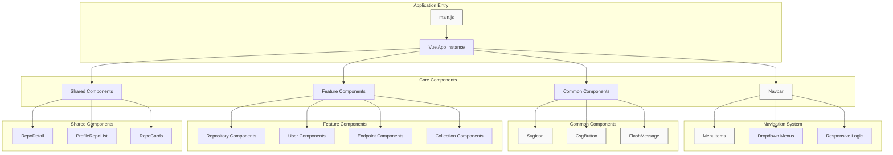
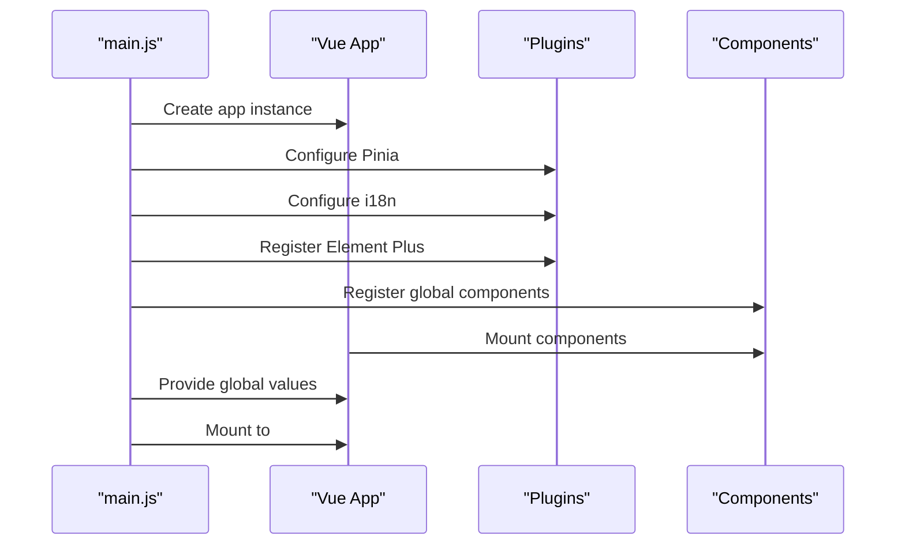
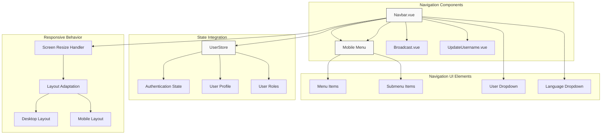
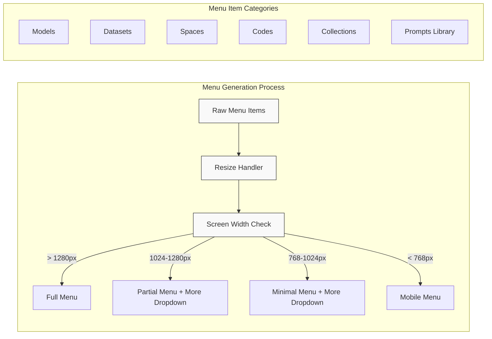
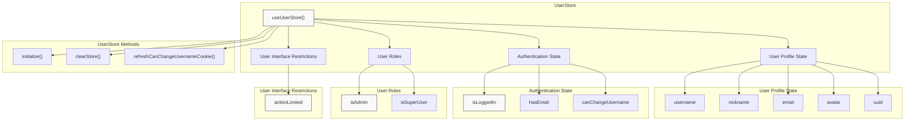
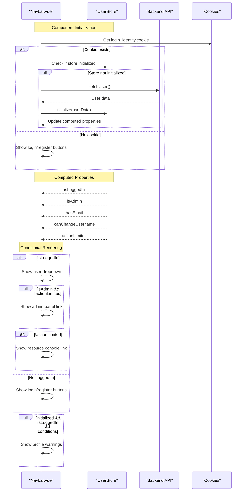
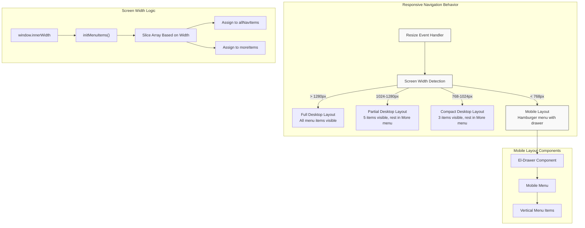
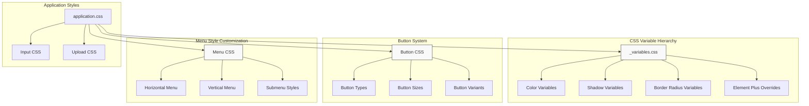
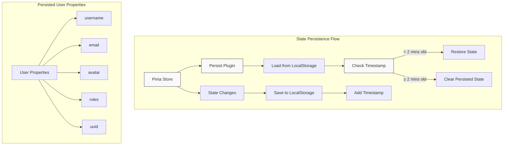
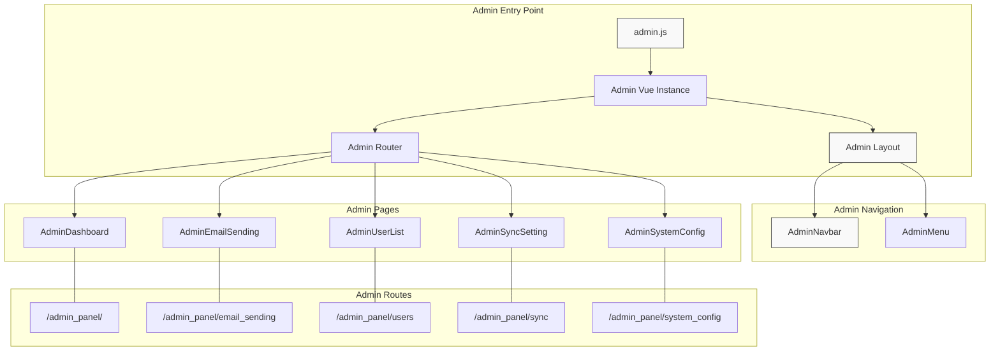

# Component System and Navigation

This document details the component architecture and navigation system of the CSGHub platform. It explains how the frontend components are organized, how the navigation system works across different screen sizes, and how user state affects navigation options. For information about internationalization specifically, see the [Internationalization (i18n)](#5.2) page.

## 1. Frontend Component Architecture

The CSGHub frontend is built using Vue 3 with the Composition API, using a modular component architecture that separates concerns by feature areas.

### 1.1 Core Component Structure




### 1.2 Component Registration and Initialization

The main application initializes the component system through global registration of core components and setting up Vue plugins:

1. **Global Component Registration**: Frequently used components like `SvgIcon` and `CsgButton` are registered globally
2. **Plugin Integration**: Element Plus UI library, Vue Router, i18n, and Pinia state management
3. **Provider Values**: Global configuration values provided to all components




## 2. Navigation System

The navigation system provides the primary user interface for moving between different sections of the application. It adapts to both desktop and mobile screen sizes.

### 2.1 Navigation Components Hierarchy




### 2.2 Menu Structure and Generation

The navigation menu items are dynamically generated and organized based on screen size. On smaller screens, some items are moved to a "More" dropdown menu.




## 3. User State Integration with Navigation

The navigation system adapts based on the user's authentication state and profile. The Pinia store manages this state and provides it to the navigation components.

### 3.1 User Store Structure




### 3.2 Navigation State Flow

The navigation system uses the user state to conditionally render different menu options and UI elements:




## 4. Responsive Design and Styling

The CSGHub navigation system is designed to be responsive across different device sizes, with distinct layouts for desktop and mobile views.

### 4.1 Responsive Breakpoints

The application uses Tailwind CSS with custom breakpoints to manage responsive layouts:

| Breakpoint | Screen Width | Description |
|------------|--------------|-------------|
| 3xl        | ≥ 1536px     | Extra large desktop |
| 2xl        | < 1536px     | Large desktop |
| xl         | < 1280px     | Medium desktop |
| lg         | < 1024px     | Small desktop/Tablet landscape |
| md         | < 768px      | Tablet portrait |
| sm         | < 640px      | Mobile |


### 4.2 Navigation Layout Changes

The navigation system adapts its layout based on screen size:




## 5. Styling System and UI Components

The navigation system utilizes a combination of Element Plus UI components and custom styling with Tailwind CSS.

### 5.1 UI Component Theming

The application implements a comprehensive design system with custom CSS variables for colors, shadows, and border radii that are applied to Element Plus components.




### 5.2 Responsive Width Utility

The application uses a custom utility class for responsive container widths:

```css
.page-responsive-width {
  @apply 3xl:w-[1536px] 2xl:w-[1280px] xl:w-[1024px] lg:w-[768px] md:w-[640px] sm:w-full mx-auto;
}
```

This class is used in the navigation component to ensure proper width at different screen sizes:

```html
<div class="page-responsive-width flex text-gray-700 justify-between items-center h-20 sm:h-15 gap-6 md:px-5">
```


## 6. State Persistence

The navigation system relies on persistent user state for displaying the correct UI options. This is implemented using the Pinia store with a custom persistence plugin.

### 6.1 State Persistence Mechanism




## 7. Admin Navigation Integration

The CSGHub platform includes a separate administration interface with its own navigation system that integrates with the main component architecture.

### 7.1 Admin Navigation Structure




## 8. Component Reusability

The CSGHub platform employs several strategies to enhance component reusability across the application.

### 8.1 Shared Components

The platform registers key components globally to ensure they're available throughout the application without requiring imports in each component:

```javascript
// SvgIcon component for consistent icon usage
app.component('SvgIcon', SvgIcon)

// CsgButton component for consistent button styling
app.component('CsgButton', CsgButton)

// FlashMessage component for user notifications
app.component('FlashMessage', FlashMessage)
```


### 8.2 Element Plus Integration

The navigation system extensively uses Element Plus components with custom styling to maintain consistency while benefiting from the functionality of a mature UI library:

1. `el-menu` and `el-menu-item` for the main navigation
2. `el-dropdown` for user and language menus
3. `el-drawer` for the mobile navigation menu
4. `el-alert` for user notifications

These components are customized using CSS variables and custom styles to match the application's design language.

