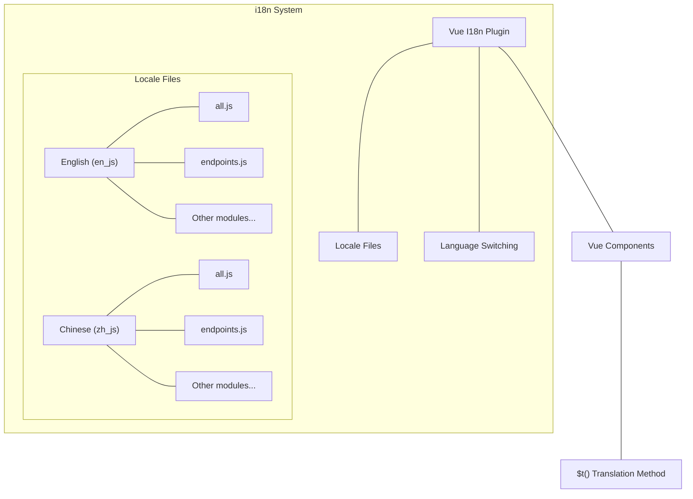
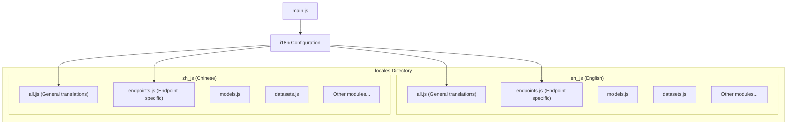
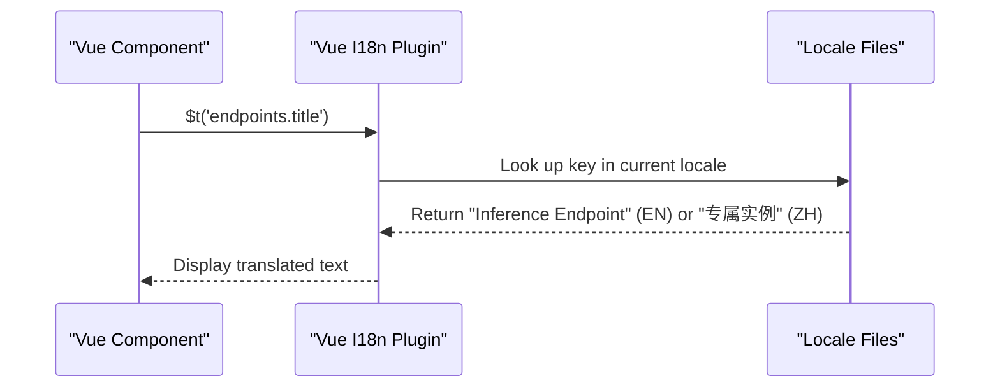
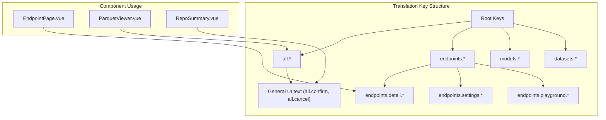
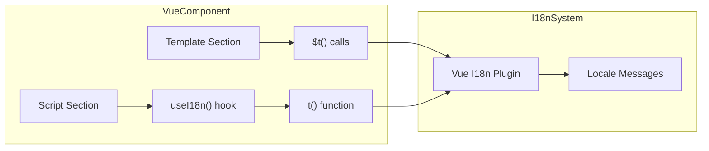

# Internationalization (i18n)

This document describes the internationalization (i18n) system used in CSGHub, which provides multi-language support throughout the application. The system enables the application to display text content in different languages based on user preferences.

## Overview

CSGHub implements internationalization using Vue I18n, a plugin that provides localization capabilities for Vue.js applications. The system currently supports English and Chinese languages, with a modular structure for organizing translation strings across different features of the application.



Sources: [frontend/src/locales/en_js/all.js](), [frontend/src/locales/zh_js/all.js](), [frontend/src/locales/en_js/endpoints.js](), [frontend/src/locales/zh_js/endpoints.js]()

## Translation File Structure

The translation files are organized in a modular way, with separate JavaScript files for different functional areas of the application. Each language has its own directory with equivalent translation files.



Sources: [frontend/src/locales/en_js/all.js](), [frontend/src/locales/zh_js/all.js](), [frontend/src/locales/en_js/endpoints.js](), [frontend/src/locales/zh_js/endpoints.js]()

### Translation Files Content

Each translation file exports JavaScript objects containing key-value pairs. The keys serve as identifiers for the text content, while the values contain the translated text in the respective language.

For example, the English general translations file contains:

```javascript
export const all = {
  all: 'All',
  defaultText: "```\nREADME file is empty, please download the file and add description content.\n```",
  tip: "tip",
  summary: "Summary",
  files: "Files",
  // ...many more translations
}
```

While the Chinese equivalent contains:

```javascript
export const all = {
  all: '全部应用',
  defaultText: "```\nREADME文件内容为空，请下载文件，补充描述内容。\n```",
  tip: "提示",
  summary: "介绍",
  files: "文件",
  // ...many more translations
}
```

More specific modules like `endpoints.js` contain translations related to a specific feature:

```javascript
export const endpoints = {
  title: "Inference Endpoint",
  resourceType: 'Resource Type',
  replica: "Replica",
  // ...more endpoint-specific translations
}
```

Sources: [frontend/src/locales/en_js/all.js:1-118](), [frontend/src/locales/zh_js/all.js:1-118](), [frontend/src/locales/en_js/endpoints.js:1-90](), [frontend/src/locales/zh_js/endpoints.js:1-90]()

## Using Translations in Components

Components can access translations using the `$t()` function provided by Vue I18n. The function takes a string key that references a specific translation.

### Key-to-Component Flow



### Examples in Components

Here's how translations are used in actual components:

1. Basic text translation:

```vue
<p class="flex justify-start items-center text-sm text-gray-700 font-medium text-ellipsis overflow-hidden whitespace-nowrap">
  <svg-icon name="admin-menu-cloud" class="w-4 h-4 mr-2" />
  {{ $t('endpoints.detail.endpointUrl') }}
</p>
```

2. Dynamic translations with parameters:

```vue
<p class="pleaseSelect">{{ $t('all.pleaseSelect', { value: 'username' }) }}</p>
```

3. Using translations in script blocks:

```javascript
ElMessage.warning(error.value.msg || t('all.fetchError'))
```

Sources: [frontend/src/components/endpoints/EndpointPage.vue:6-7](), [frontend/src/components/datasets/ParquetViewer.vue:10-11](), [frontend/src/components/datasets/ParquetViewer.vue:44-45]()

## Translation Key Organization

Translation keys are organized hierarchically to maintain a logical structure. This helps with organization and reduces the chance of key conflicts.



Sources: [frontend/src/locales/en_js/all.js:1-118](), [frontend/src/locales/en_js/endpoints.js:1-90](), [frontend/src/components/endpoints/EndpointPage.vue:1-142]()

## Adding New Translations

To add new translations to the system, developers need to:

1. Identify the appropriate module file for the new translation
2. Add the new key-value pair to all supported language files
3. Use the new key in components with the `$t()` function

### Translation Key Patterns

The system uses consistent naming patterns for translation keys:

| Pattern | Purpose | Example |
|---------|---------|---------|
| `module.noun` | General terms | `all.summary`, `all.files` |
| `module.verb` | Action labels | `all.add`, `all.update` |
| `module.section.item` | UI section items | `endpoints.detail.endpointUrl` |
| `module.section.action` | Section-specific actions | `endpoints.settings.changeVisibility` |

Sources: [frontend/src/locales/en_js/all.js:1-118](), [frontend/src/locales/en_js/endpoints.js:1-90]()

## Implementation in Components

Here's a detailed look at how i18n is implemented in components:

### Component Integration



In Vue components, i18n can be used in both the template section via `$t()` and in the script section via the `useI18n()` hook:

1. Template usage:
```vue
<div class="text-gray-700 text-base font-medium text-md leading-[22px] md:pl-0">
  {{ $t('all.downloadCount') }}
</div>
```

2. Script usage:
```javascript
import { useI18n } from 'vue-i18n'

// In setup()
const { t } = useI18n()
ElMessage.warning(error.value.msg || t('all.fetchError'))
```

Sources: [frontend/src/components/shared/RepoSummary.vue:18-19](), [frontend/src/components/shared/RepoSummary.vue:121](), [frontend/src/components/datasets/ParquetViewer.vue:236]()

### Dynamic Content with i18n

Some components like `ParquetViewer.vue` use i18n with dynamic data, combining translated labels with application data:

```vue
<p>{{ $t('all.subset') }}（{{ numSubsets }}）</p>
```

Sources: [frontend/src/components/datasets/ParquetViewer.vue:44]()

### Loading Indicators with i18n

Internationalized loading messages are used in components:

```vue
<div v-else-if="['Building','Deploying','Startup'].includes(appStatus)">
  <InstanceInBuilding :loadingText="$t('all.deployLoadingText')" />
</div>
```

Sources: [frontend/src/components/endpoints/EndpointPage.vue:71-73]()

## Testing i18n Implementation

The codebase includes tests for components that use i18n functionalities:

```javascript
// Component test example
describe("EndpointSettings", () => {
  it("mounts correctly", () => {
    const wrapper = createWrapper();
    expect(wrapper.exists()).toBe(true);
  });
});
```

When testing components that use i18n, the testing framework must include the i18n plugin setup to properly render translated content.

Sources: [frontend/src/components/__tests__/endpoints/EndpointSettings.spec.js:109-114]()

## Conclusion

The internationalization system in CSGHub provides a robust framework for supporting multiple languages throughout the application. The modular approach to organizing translation files allows for easy maintenance and extension of the language support. The consistent use of the `$t()` function in components ensures that all user-facing text can be translated seamlessly.

For information about the overall frontend architecture, see [Frontend Architecture](#5).

For details about API integration that works alongside the i18n system, see [API Integration and Data Fetching](#5.3).