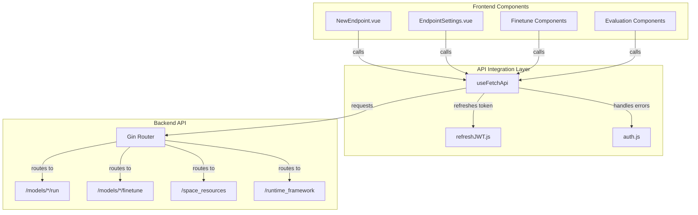
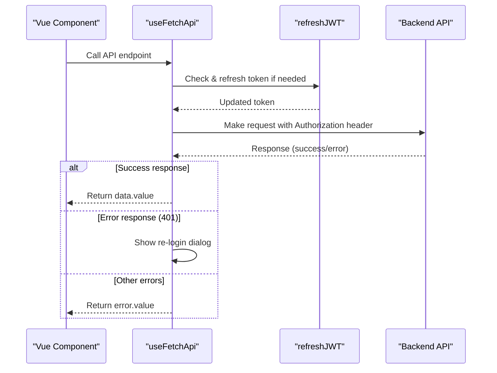
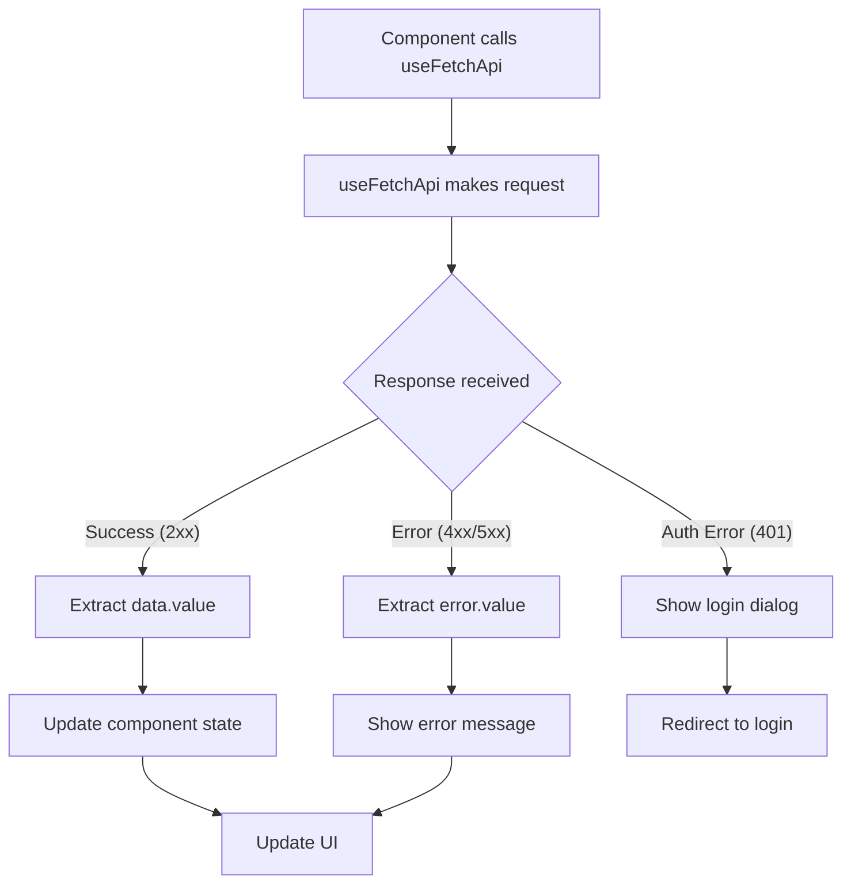
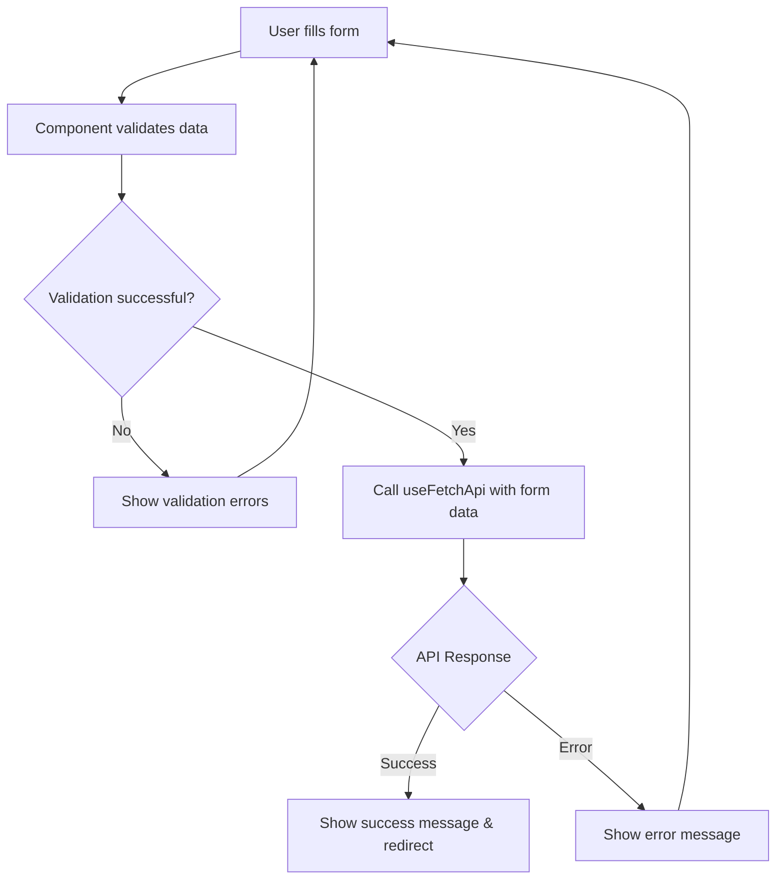
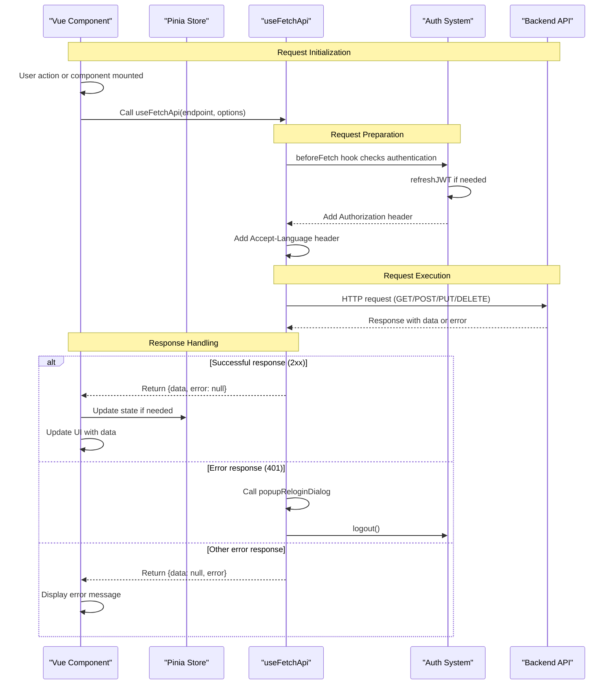
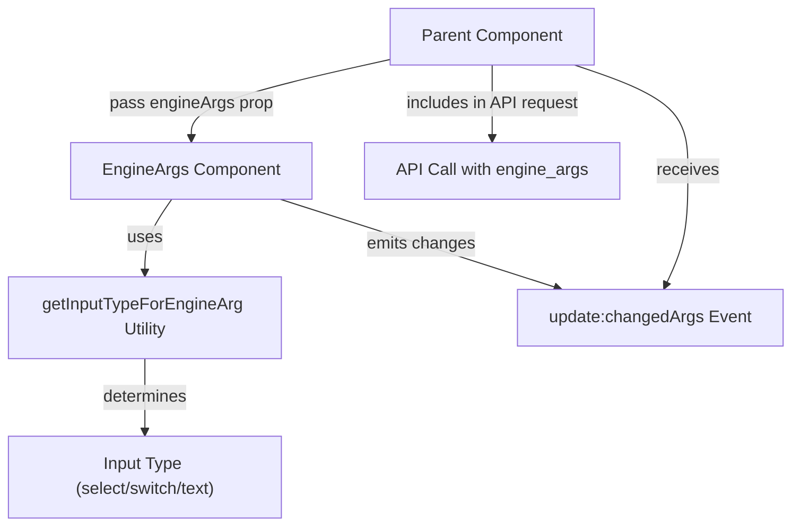

# API Integration and Data Fetching

This page documents the API integration system and data fetching patterns used in the CSGHub frontend. It focuses on how frontend components communicate with the backend API, including the core utilities, authentication handling, and common data fetching patterns.

## Core API Integration System

The CSGHub frontend uses a centralized API client built on top of @vueuse/core's `createFetch`. This system provides a consistent interface for all API requests, handling authentication, error management, and localization automatically.



Sources:
- [frontend/src/packs/useFetchApi.js:1-90]()
- [frontend/src/packs/auth.js:1-41]()

### The useFetchApi Utility

The `useFetchApi` utility centralizes all API communication, providing several key features:

- **Automatic JWT token handling**: Refreshes tokens before requests
- **Internationalization support**: Passes user language preferences
- **Standardized error handling**: Consistent approach to error reporting
- **Session management**: Handles expired sessions with re-login prompts



Sources:
- [frontend/src/packs/useFetchApi.js:32-76]()

## Common Data Fetching Patterns

CSGHub implements several common patterns for data fetching that are reused across components.

### Resource Fetching

The `fetchResourcesInCategory` function retrieves cloud resources available for different deployment types, organizing them by payment mode and formatting them for display.

```javascript
// Example of how components use the fetchResourcesInCategory utility
const fetchResources = async () => {
  const categoryResources = await fetchResourcesInCategory(dataForm.value.cluster_id)
  const firstAvailableResource = categoryResources.flatMap(item => item.options)
    .find((item) => item.is_available)
  // ... further processing of resources
}
```

Sources:
- [frontend/src/components/shared/deploy_instance/fetchResourceInCategory.js:1-53]()
- [frontend/src/components/endpoints/NewEndpoint.vue:397-408]()

### Request-Response Structure

All API calls follow a consistent pattern for handling responses and errors:



Sources:
- [frontend/src/components/endpoints/NewEndpoint.vue:551-566]()
- [frontend/src/packs/useFetchApi.js:64-77]()

## Component API Integration Examples

The following sections demonstrate how different components integrate with the API.

### Creating Resources (Endpoints, Finetunes, Evaluations)

Resource creation components follow a similar pattern:

1. Collect user input in a form
2. Validate the form data
3. Submit the data to the appropriate API endpoint
4. Handle the response (success/failure)
5. Redirect on success or display error

This pattern is evident in components like NewEndpoint, NewFinetune, and NewEvaluation.



Sources:
- [frontend/src/components/endpoints/NewEndpoint.vue:511-567]()
- [frontend/src/components/finetune/NewFinetune.vue:333-367]()
- [frontend/src/components/evaluations/NewEvaluation.vue:453-488]()

### Managing Resources (Settings/Updates)

Components that manage existing resources typically:

1. Fetch current resource data on mount
2. Allow users to modify settings
3. Submit updates through API calls
4. Handle success/failure states

Below is an example from the EndpointSettings component:

| API Operation | Endpoint | Method | Purpose |
|---------------|----------|--------|---------|
| Stop Endpoint | `/models/${modelId}/run/${endpointId}/stop` | PUT | Pause an endpoint |
| Restart Endpoint | `/models/${modelId}/run/${endpointId}/start` | PUT | Resume a stopped endpoint |
| Update Endpoint | `/models/${modelId}/run/${endpointId}` | PUT | Modify endpoint settings |
| Delete Endpoint | `/models/${modelId}/run/${endpointId}` | DELETE | Remove an endpoint |

Sources:
- [frontend/src/components/endpoints/EndpointSettings.vue:397-563]()
- [frontend/src/components/finetune/FinetuneSettings.vue:284-379]()

## The API Request Lifecycle

The following diagram illustrates the complete lifecycle of an API request within the CSGHub frontend, from component initiation to UI updates:



Sources:
- [frontend/src/packs/useFetchApi.js:43-77]()
- [frontend/src/components/endpoints/NewEndpoint.vue:526-566]()

## Common API Endpoints and Their Usage

The CSGHub frontend interacts with several key API endpoints for different operations:

| Category | Endpoint Pattern | Purpose | Example Component |
|----------|-----------------|---------|-------------------|
| Endpoints | `/models/{model_id}/run` | Create/manage inference endpoints | NewEndpoint, EndpointSettings |
| Finetunes | `/models/{model_id}/finetune` | Create/manage model fine-tuning | NewFinetune, FinetuneSettings |
| Evaluations | `/evaluations` | Create/manage model evaluations | NewEvaluation |
| Resources | `/space_resources` | Fetch available compute resources | Multiple components |
| Frameworks | `/models/{model_id}/runtime_framework` | Get compatible frameworks | Multiple components |
| Clusters | `/cluster` | List available clusters | Multiple components |
| Models | `/runtime_framework/models` | Search for models | Multiple components |

Sources:
- [frontend/src/components/endpoints/NewEndpoint.vue:550-551]()
- [frontend/src/components/finetune/NewFinetune.vue:353-357]()
- [frontend/src/components/evaluations/NewEvaluation.vue:472-473]()
- [frontend/src/components/shared/deploy_instance/fetchResourceInCategory.js:19-20]()

## Special Feature: Engine Arguments Management

The system includes specialized handling for engine arguments used to configure model runtime behavior. This is implemented through the EngineArgs component and its supporting utility.



Sources:
- [frontend/src/components/endpoints/EngineArgs.vue:1-127]()
- [frontend/src/packs/useEngineArgs.js:1-55]()
- [frontend/src/components/endpoints/NewEndpoint.vue:542-544]()

This specialized system provides appropriate input controls based on parameter type and tracks changes to include only modified parameters in API requests.

## Error Handling and Authentication

The API integration system includes robust error handling, particularly for authentication issues:

1. **401 Unauthorized Errors**: Trigger a re-login dialog
2. **Other Error Status Codes**: Return error information to the component
3. **Network Failures**: Captured and returned as errors

For authentication, the system automatically:
- Refreshes JWT tokens before requests
- Handles token expiration
- Manages user logout

Sources:
- [frontend/src/packs/useFetchApi.js:13-30]()
- [frontend/src/packs/useFetchApi.js:64-77]()
- [frontend/src/packs/auth.js:28-38]()

## Summary

The CSGHub API integration and data fetching system provides a consistent, robust approach to communicating with the backend. By centralizing core functionality in the `useFetchApi` utility, the system ensures consistent error handling, authentication, and response processing across all components.

Components follow established patterns for resource creation, management, and deletion, with specialized utilities for common operations like resource fetching. This design promotes code reuse and maintainability while providing a consistent user experience for handling success and error states.