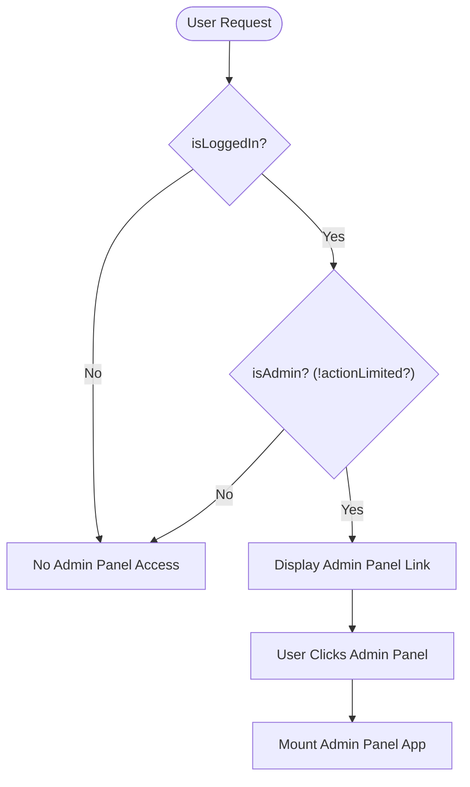
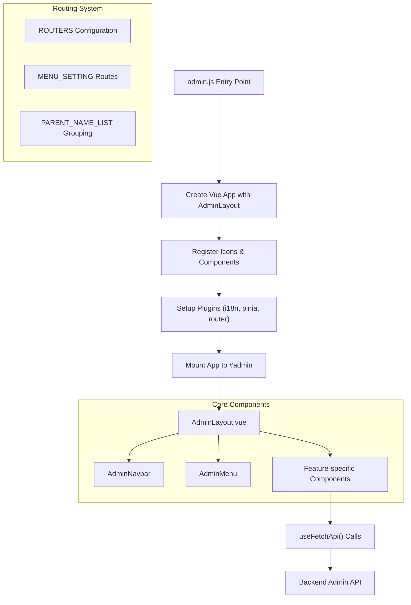
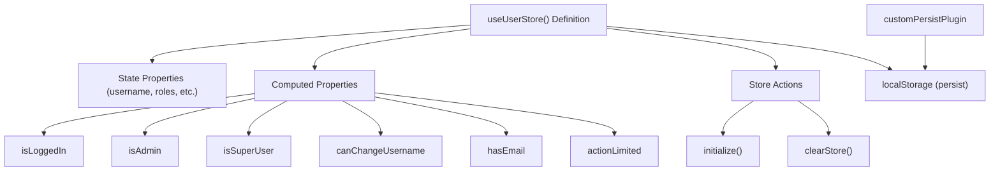

# Admin Panel

## Purpose and Scope

The Admin Panel in CSGHub provides administrative capabilities for managing the platform, including system configuration, user management, model management, tag management, and broadcasting. This document covers the structure, architecture, and features of the Admin Panel, which is accessible only to users with admin privileges (those with the `admin` or `super_user` role).

For information about other frontend components, see the [Frontend Architecture](#5) and [Component System and Navigation](#5.1) pages.

## Access Control

The Admin Panel is only accessible to authenticated users with admin privileges. The access mechanism is implemented in the main navigation component, where the admin panel link is conditionally displayed.



The admin privileges check is performed using computed properties in the UserStore that check for the presence of admin roles:

Sources:
- [frontend/src/components/navbar/Navbar.vue:137-145]()
- [frontend/src/stores/UserStore.js:26-27]()

## Architecture

The Admin Panel is implemented as a dedicated Vue application within the CSGHub platform, with its own router, state management, and component hierarchy. This separation provides better maintainability and performance isolation.

### Admin Panel Application Structure



Sources:
- [frontend/src/admin.js:46-70]()
- [frontend/src/components/admin_next/router/index.js:51-202]()

## Navigation Structure

The Admin Panel is organized into hierarchical menu groups that provide logical categorization of administrative features.

### Admin Panel Menu Structure

```mermaid
graph TD
    AdminPanel["Admin Panel"] --> BaseConfig["Basic Settings"]
    AdminPanel --> SystemMenu["System"]
    AdminPanel --> AccountMenu["Account"]
    AdminPanel --> HubMenu["Hub"]
    
    BaseConfig --> Dashboard["AdminDashboard"]
    
    SystemMenu --> SystemConfig["AdminSystemConfig"]
    SystemMenu --> Broadcasts["AdminBroadcastList"]
    
    AccountMenu --> Users["AdminUserList"]
    
    HubMenu --> Sync["AdminSyncSetting"]
    HubMenu --> Models["AdminModelList"]
    HubMenu --> Serverless["AdminServerlessList"]
    HubMenu --> Tags["AdminTagsList"]
    HubMenu --> TagCategories["AdminTagCategoriesList"]
    
    Users --> UserDetail["AdminUserDetail (/:id)"]
    Models --> ModelDetail["AdminModelDetail (/:namespace/:name)"]
    Models --> ModelEdit["AdminModelEdit (/:namespace/:name/edit)"]
    Serverless --> ServerlessForm["AdminServerlessForm (new/edit)"]
    Serverless --> ServerlessDetail["AdminServerlessDetail (/:id)"]
    Tags --> TagForm["AdminTagsForm (new/edit)"]
    Tags --> TagDetail["AdminTagsDetail (/:id)"]
    TagCategories --> TagCategoryForm["AdminTagCategoriesForm (new/edit)"]
    Broadcasts --> BroadcastNew["AdminBroadcastNew"]
    Broadcasts --> BroadcastEdit["AdminBroadcastEdit (/:id/edit)"]
```



Sources:
- [frontend/src/components/admin_next/router/index.js:51-202]()
- [frontend/src/components/admin_next/router/index.js:34-39]()

## Features and Components

The Admin Panel provides several administrative features, each implemented as a set of Vue components:

### Dashboard

The dashboard displays an overview of the platform and administrative information. It's the default landing page for the Admin Panel.

Sources:
- [frontend/src/components/admin_next/router/index.js:51-60]()
- [frontend/src/main.js:64]()

### User Management

Allows administrators to view, edit, and manage user accounts. It includes components for listing users and viewing detailed user information.

| Component | Purpose |
|-----------|---------|
| AdminUserList | Displays all users with search and filtering capabilities |
| AdminUserDetail | Shows detailed information for a single user |

Sources:
- [frontend/src/components/admin_next/router/index.js:70-83]()
- [frontend/src/main.js:66-67]()

### System Configuration

Provides settings for configuring system-wide behavior. In addition to general system configuration, this section also includes broadcast message management.

| Component | Purpose |
|-----------|---------|
| AdminSystemConfig | Contains system-wide settings |
| AdminBroadcastList | Manages broadcast messages shown to users |
| AdminBroadcastNew | Creates new broadcast messages |
| AdminBroadcastEdit | Edits existing broadcast messages |

Sources:
- [frontend/src/components/admin_next/router/index.js:61-69]()
- [frontend/src/components/admin_next/router/index.js:184-201]()
- [frontend/src/main.js:68]()

### Multi-Source Sync

Provides settings for synchronizing with external sources including concurrent task settings and bandwidth limit management.

Sources:
- [frontend/src/components/admin_next/router/index.js:84-91]()
- [frontend/src/main.js:69]()
- [frontend/src/locales/zh_js/admin.js:35-43]()
- [frontend/src/locales/en_js/admin.js:35-43]()

### Model Management

Allows administrators to view, edit, and manage models, including model weight settings and synchronization.

| Component | Purpose |
|-----------|---------|
| AdminModelList | Lists all models with filtering and search capabilities |
| AdminModelDetail | Shows detailed information for a single model |
| AdminModelEdit | Provides form for editing model properties |

Sources:
- [frontend/src/components/admin_next/router/index.js:92-111]()
- [frontend/src/locales/zh_js/admin.js:54-64]()
- [frontend/src/locales/en_js/admin.js:54-64]()

### Serverless API Management

Allows administrators to manage serverless API deployments, including deployment configuration and status management.

| Component | Purpose |
|-----------|---------|
| AdminServerlessList | Lists serverless deployments |
| AdminServerlessForm | Creates/edits serverless deployments |
| AdminServerlessDetail | Shows details for a single deployment |

Sources:
- [frontend/src/components/admin_next/router/index.js:112-137]()
- [frontend/src/components/admin_next/serverless/AdminServerlessList.vue:1-132]()
- [frontend/src/locales/zh_js/admin.js:65-90]()
- [frontend/src/locales/en_js/admin.js:65-90]()

### Tag Management

Allows administrators to manage tags and tag categories, which are used throughout the platform for content organization.

| Component | Purpose |
|-----------|---------|
| AdminTagsList | Lists all tags with filtering capabilities |
| AdminTagsForm | Creates/edits tags |
| AdminTagsDetail | Shows details for a single tag |
| AdminTagCategoriesList | Lists tag categories |
| AdminTagCategoriesForm | Creates/edits tag categories |

Sources:
- [frontend/src/components/admin_next/router/index.js:138-163]()
- [frontend/src/components/admin_next/router/index.js:164-183]()
- [frontend/src/locales/zh_js/admin.js:92-130]()
- [frontend/src/locales/en_js/admin.js:92-130]()

## Internationalization Support

The Admin Panel fully supports internationalization (i18n) with English and Chinese language options. Translation strings are defined in dedicated locale files.

| Language | File Path |
|----------|-----------|
| English | frontend/src/locales/en_js/admin.js |
| Chinese | frontend/src/locales/zh_js/admin.js |

The locale selection is determined by user preference stored in cookies, with a fallback to browser language detection.

Sources:
- [frontend/src/admin.js:29-39]()
- [frontend/src/components/admin_next/router/index.js:24-31]()
- [frontend/src/locales/en_js/admin.js:1-143]()
- [frontend/src/locales/zh_js/admin.js:1-143]()

## State Management

The Admin Panel uses Pinia for state management, with UserStore providing user data and access control. A custom persist plugin ensures state is available across page refreshes.



Sources:
- [frontend/src/stores/UserStore.js:7-93]()
- [frontend/src/admin.js:38-39]()
- [frontend/src/packs/persistPinia.js:1-20]()

## Implementation Details

### Routing Configuration

The Admin Panel routing is defined in `admin_next/router/index.js`. The routes are organized into menu groups (Basic Settings, System, Account, Hub) with parent-child relationships.

```javascript
export const ROUTERS = [
  {
    path: BASE_URL,
    children: MENU_SETTING,
  },
];
```

Sources:
- [frontend/src/components/admin_next/router/index.js:34-46]()
- [frontend/src/components/admin_next/router/index.js:215-220]()

### Admin Panel Initialization

The Admin Panel is initialized in `admin.js`, which creates and configures a Vue application with the AdminLayout component as its root:

```javascript
const app = createApp(AdminLayout);
// Register components and plugins
app.mount("#admin");
```

Sources:
- [frontend/src/admin.js:46-70]()

### Component Reuse

The Admin Panel uses shared components for consistent UI patterns:

- Container component for layout structure
- Table component for data display
- Form components for data input
- SvgIcon component for icons
- CsgButton component for actions

Sources:
- [frontend/src/admin.js:51-52]()
- [frontend/src/components/admin_next/serverless/AdminServerlessList.vue:86]()

## Admin Panel vs Main Application

The Admin Panel is built as a separate Vue application (`admin.js`) rather than as a component within the main application (`main.js`). This separation provides better isolation and maintainability, while allowing the Admin Panel to use the same UI components and styling as the main application.

Sources:
- [frontend/src/admin.js:46-70]()
- [frontend/src/main.js:147-152]()

## Conclusion

The CSGHub Admin Panel provides a comprehensive set of administrative tools organized into a logical hierarchy. Its implementation as a separate Vue application with dedicated routing and state management ensures good separation of concerns while maintaining a consistent user experience with the rest of the platform.