# Backend Architecture

This document provides a technical overview of the CSGHub backend architecture, focusing on the server-side components that power the platform. This includes the web server, routing system, request handling, middleware, and the integration patterns with external services. For information about the frontend architecture, see [Frontend Architecture](#5).

## 1. Overview

The CSGHub backend is built using Go with the Gin web framework, providing high-performance HTTP request handling with a middleware-based architecture. The backend serves both API endpoints and server-rendered web pages, acting as the central coordination point between the user interface, database, and external services like S3 storage and the Starhub Server.

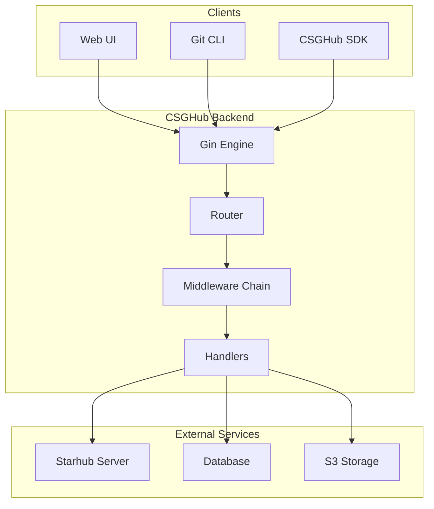

Sources: [internal/routes/router.go:33-95]()

## 2. Router System

The router system uses Gin's group-based routing to organize endpoints by resource type and authentication requirements. The main router initialization happens in the `Initialize` function, which sets up the server, configures logging, and registers routes.

### 2.1 Router Initialization

The router initialization process follows these steps:

1. Create a new Gin engine
2. Configure trusted proxies and logging
3. Register global middleware
4. Initialize handler registries
5. Set up static file serving
6. Register API and view routes
7. Configure 404 handling

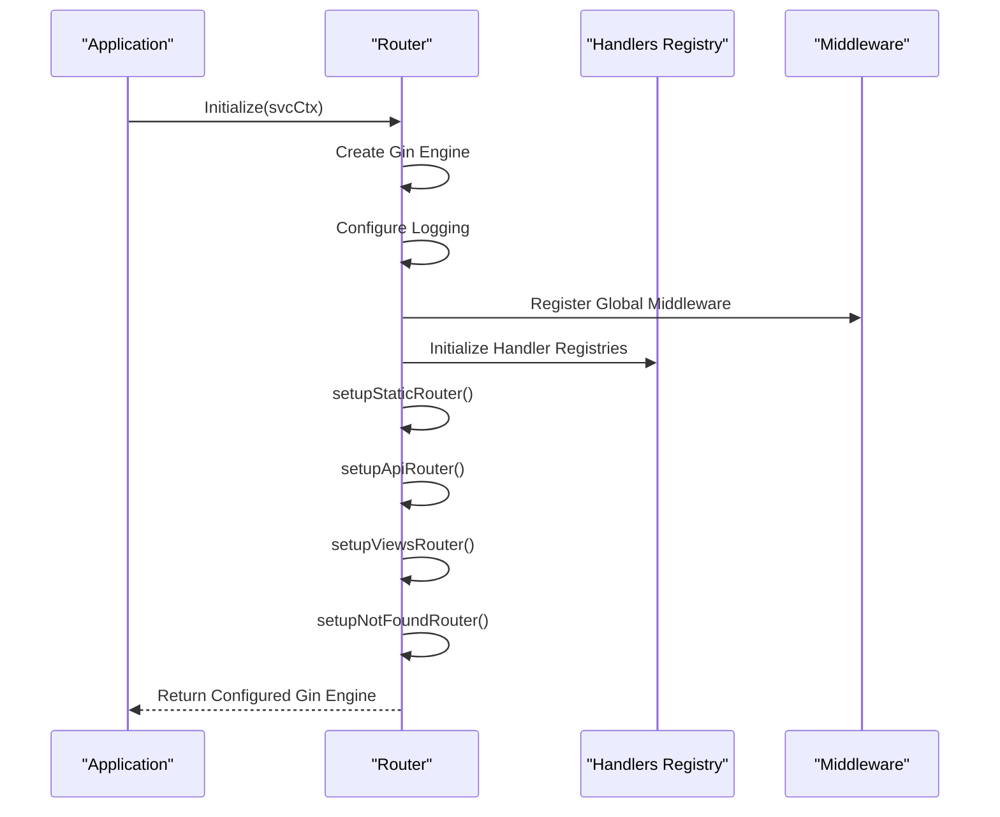

Sources: [internal/routes/router.go:33-95]()

### 2.2 Route Organization

Routes are organized by resource type (models, datasets, codes, spaces, etc.) and are registered in separate functions. Each resource type has its own route group, and routes are further divided into public and authenticated routes.

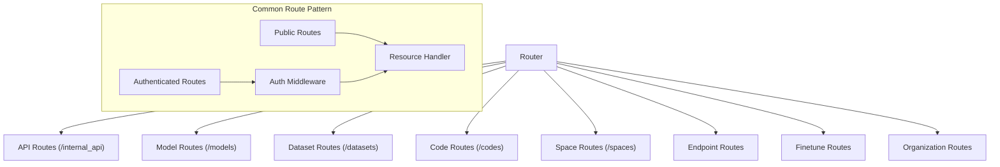

Sources: [internal/routes/router.go:205-230](), [internal/routes/models.go](), [internal/routes/datasets.go](), [internal/routes/codes.go](), [internal/routes/spaces.go]()

## 3. Middleware System

The Gin framework's middleware pattern is used extensively in CSGHub to handle cross-cutting concerns like authentication, logging, and error handling. Middleware is registered globally for the entire application and can also be applied to specific route groups.

### 3.1 Global Middleware

The following middleware is applied globally to all requests:

1. Error recovery middleware (with custom logging)
2. Authentication middleware
3. Cache control middleware
4. Request logging middleware

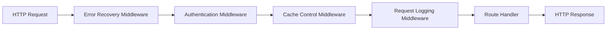

Sources: [internal/routes/router.go:61-72]()

### 3.2 Route-Specific Middleware

For protected routes, additional middleware is applied to check if a user is authenticated before allowing access to specific resources.

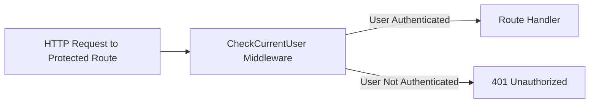

Sources: [internal/routes/models.go:22-23](), [internal/routes/datasets.go:16-17](), [internal/routes/codes.go:22-23](), [internal/routes/spaces.go:16-17]()

## 4. Handler Architecture

The handler architecture follows a hierarchical pattern with handler registries that manage related handlers. Handlers are organized into interfaces and implementations, with common functionality extracted into base handlers.

### 4.1 Handler Registries

Handler registries serve as collections of related handlers and are initialized during application startup. There are two main types of handler registries:

1. `FrontendHandlerRegistry` - Handles API requests
2. `RenderHandlerRegistry` - Handles view rendering

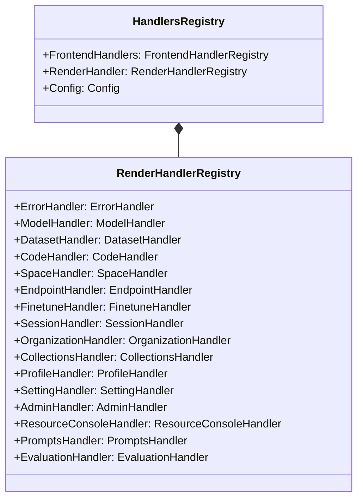

Sources: [internal/routes/router.go:26-31](), [internal/handlers/render/registry.go:9-26]()

### 4.2 Base Handler Pattern

Resource handlers follow a base handler pattern, where common functionality is implemented in a base handler and specialized behavior is added in resource-specific handlers.

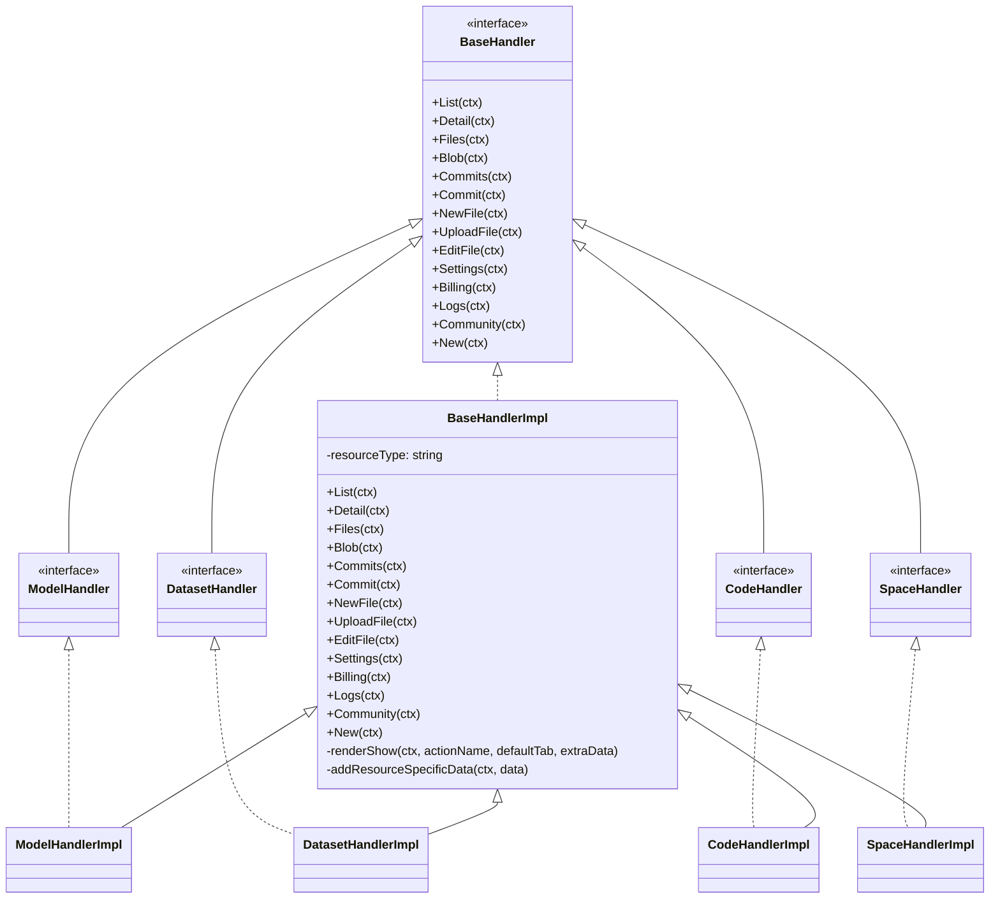

Sources: [internal/handlers/render/repo.go:39-163](), [internal/handlers/render/models.go](), [internal/handlers/render/datasets.go](), [internal/handlers/render/codes.go](), [internal/handlers/render/spaces.go]()

## 5. Authentication and Session Management

CSGHub uses JWT (JSON Web Tokens) for authentication and session management. The JWT contains user information and is used to authenticate requests to protected resources.

### 5.1 JWT Token Flow

The JWT token system works as follows:

1. User logs in and receives a JWT token
2. Token is stored in a cookie and used for subsequent requests
3. Token can be refreshed to extend the session
4. Token contains user information, including permissions and organizations

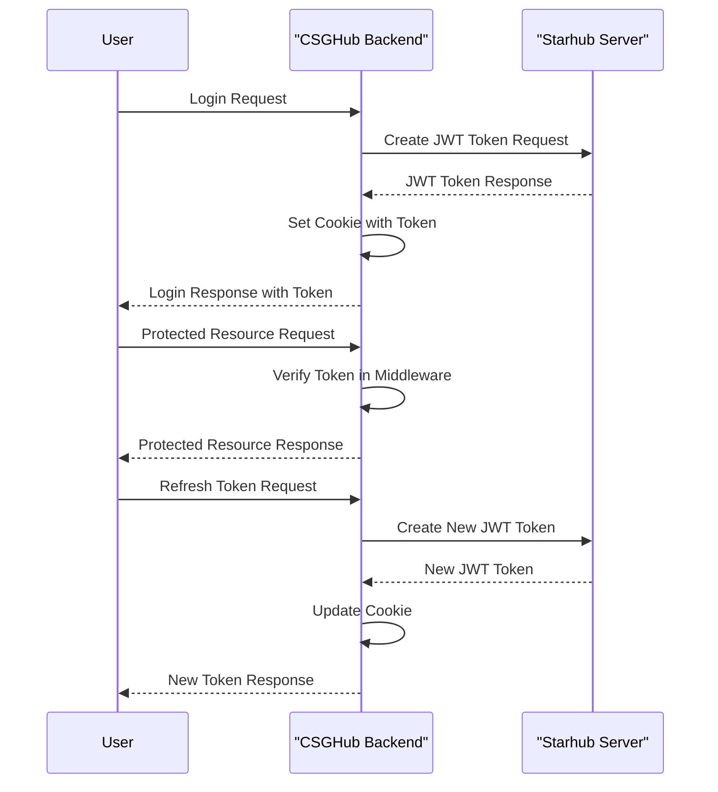

Sources: [internal/handlers/frontend/token.go:34-59](), [pkg/server/types/jwt.go]()

### 5.2 Authentication Middleware

The authentication middleware is responsible for verifying JWT tokens and extracting user information for protected routes. 

Table: Authentication Middleware Components

| Component | Description |
|-----------|-------------|
| `AuthMiddleware` | Main middleware that validates JWT tokens |
| `CheckCurrentUser` | Ensures a user is authenticated for protected routes |
| `JwtUtils` | Utility for working with JWT tokens |
| `GetCurrentUser` | Extracts user information from JWT token |

Sources: [internal/routes/router.go:69](), [internal/routes/models.go:23](), [internal/handlers/frontend/token.go:35]()

## 6. View Rendering

CSGHub uses server-side rendering with Go templates for HTML views. The template system is configured to use layouts and partials for consistent page structure.

### 6.1 Template System

The template system uses the `multitemplate.Renderer` to manage templates with layouts and partials:

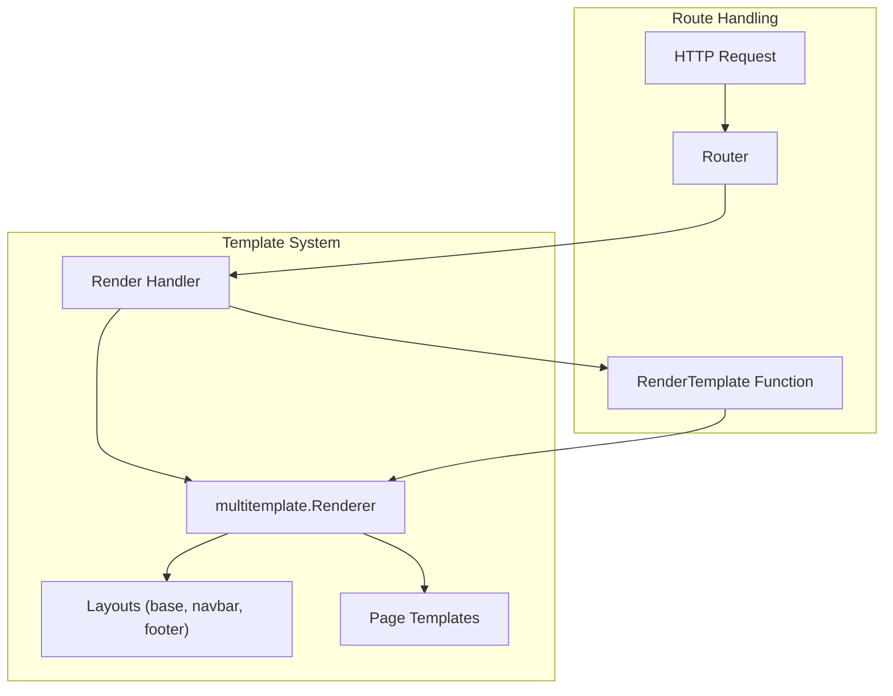

Sources: [internal/routes/router.go:106-203]()

## 7. Static File Serving

The backend serves static files from the embedded frontend distribution. Files are served from memory without requiring external file access.

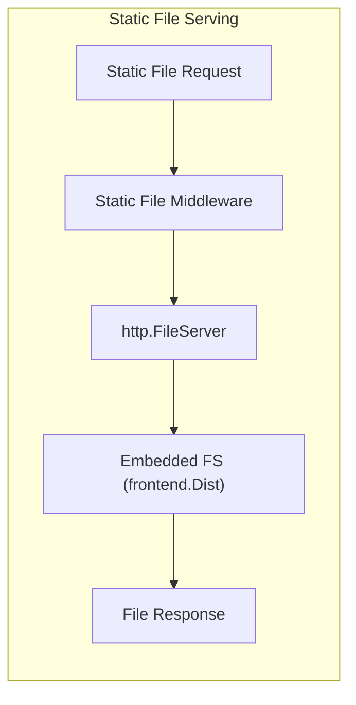

Sources: [internal/routes/router.go:232-250]()

## 8. API Integration

The backend provides internal API endpoints for use by the frontend, using a consistent pattern for API responses.

### 8.1 Internal API Endpoints

The internal API endpoints are registered in the `setupApiRouter` function and include:

- `/internal_api/ping` - Health check endpoint
- `/internal_api/users/jwt_token` - Token refresh endpoint
- `/internal_api/upload` - File upload endpoint

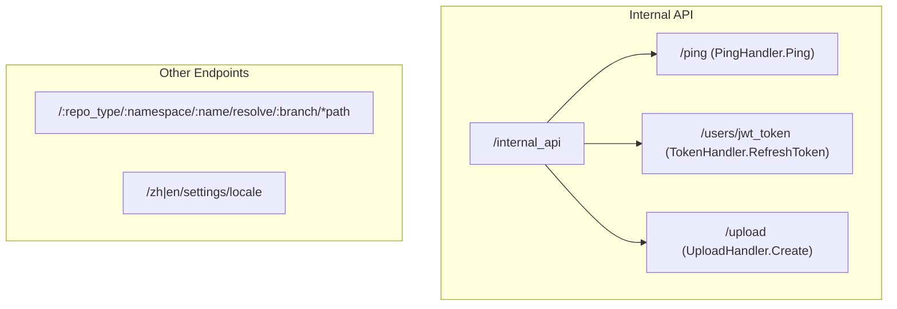

Sources: [internal/routes/router.go:252-265]()

## 9. Error Handling

The backend includes comprehensive error handling with custom recovery middleware and structured logging.

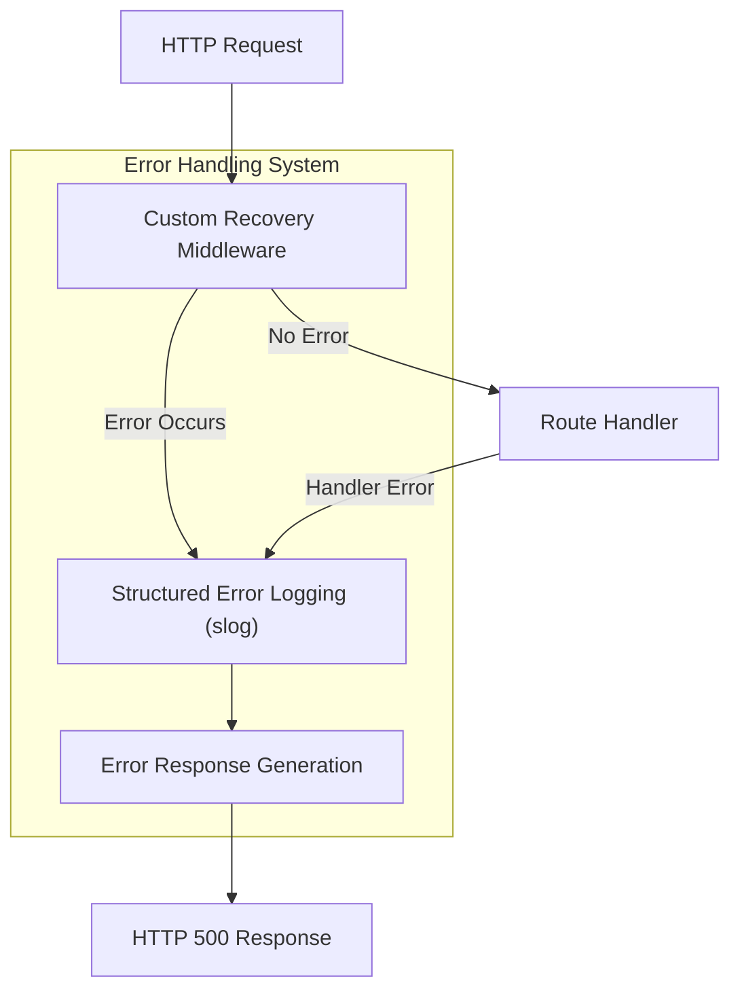

Sources: [internal/routes/router.go:61-68]()

## Conclusion

The CSGHub backend architecture follows a well-structured design pattern based on the Gin web framework. It uses middleware extensively for cross-cutting concerns, implements a hierarchical handler structure for code reuse, and provides both API endpoints and server-rendered views. The authentication system is based on JWT tokens, and the template system uses layouts and partials for consistent page rendering.

This architecture enables the backend to efficiently handle a variety of request types while maintaining separation of concerns between authentication, routing, and business logic.