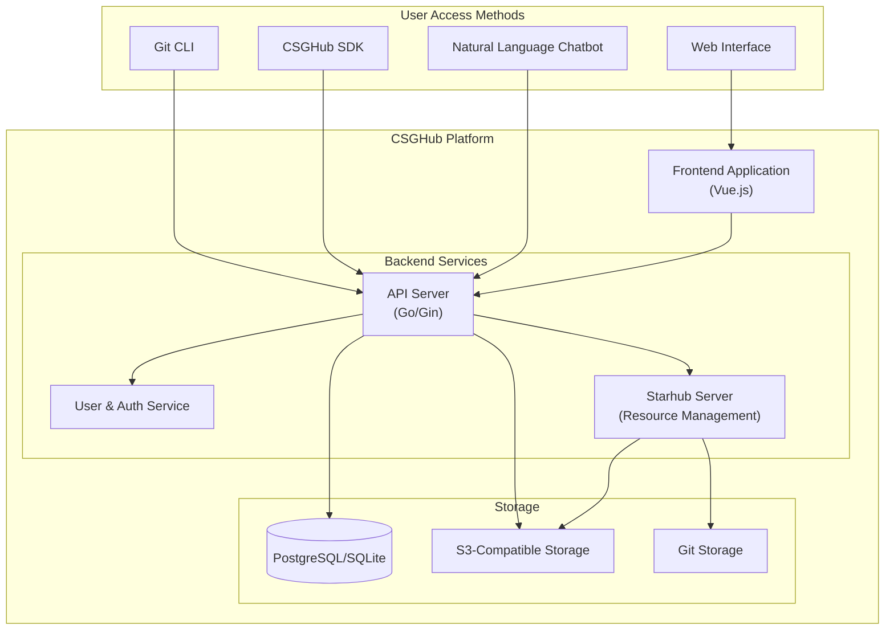
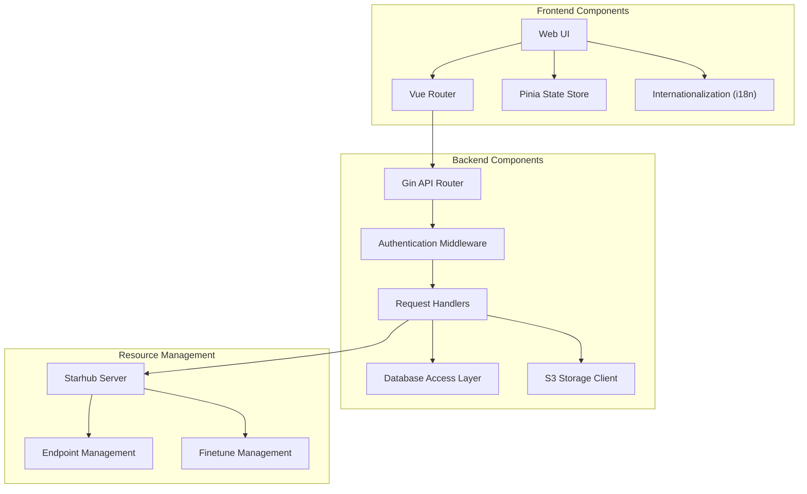
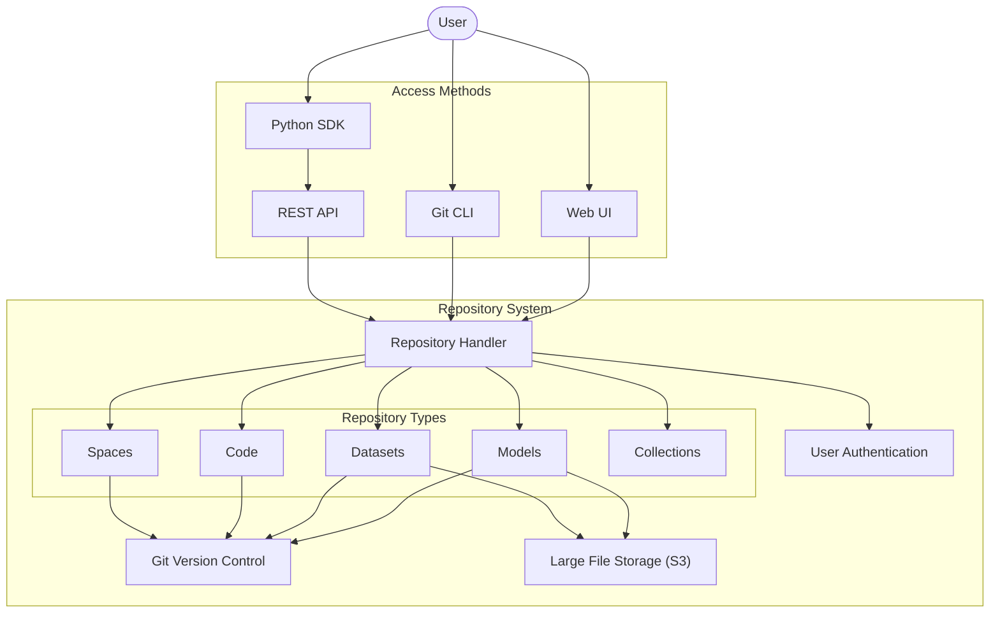
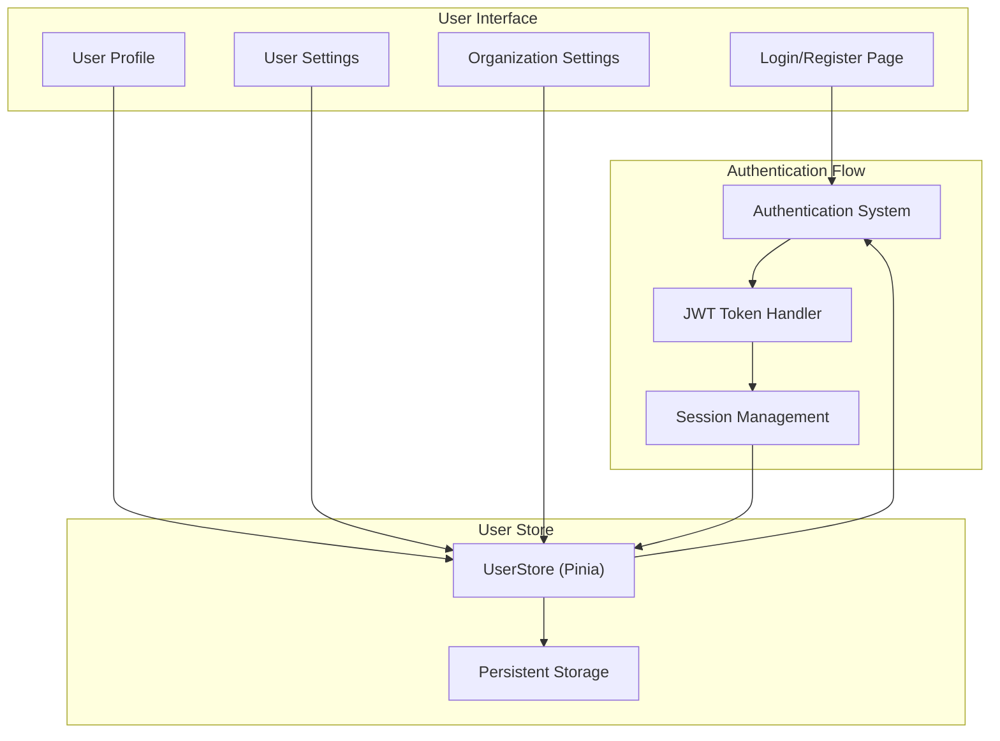
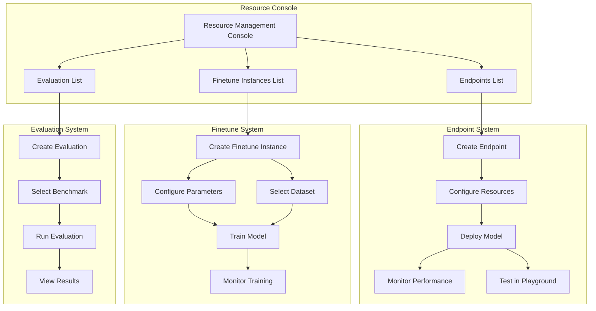
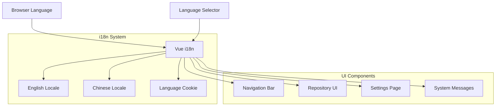
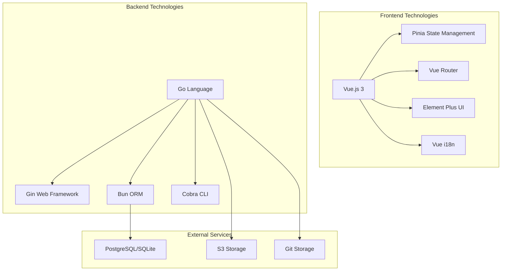

# CSGHub Overview

CSGHub is an open-source platform designed for managing Large Language Model (LLM) assets. It provides a comprehensive solution for handling the entire lifecycle of LLMs and related assets such as datasets, spaces, and code repositories. CSGHub enables users to upload, download, store, verify, and distribute LLM assets through multiple interfaces: a web UI, Git command line, natural language chatbot, or the CSGHub SDK.

This document provides a high-level overview of the CSGHub architecture and its core components. For more detailed information about specific subsystems, please refer to the dedicated pages for [Repository Management System](#2), [Model Deployment and Fine-tuning](#3), [User and Authentication System](#4), and [Frontend Architecture](#5).

## Platform Architecture

CSGHub implements a modern web application architecture with clear separation between frontend and backend components, connected through standardized APIs. The platform features microservice submodules that can be deployed either together or separately, making it suitable for both cloud and on-premise deployments.

## Core Components

CSGHub is built with a modular architecture consisting of several key components:

### 1. Frontend Application

The frontend is a Vue.js-based single-page application that provides the web interface for users to interact with the platform. It includes:

- User interface components (built with Element Plus)
- Internationalization support (English and Chinese)
- State management using Pinia
- Client-side routing with Vue Router

### 2. Backend API Server

The backend is primarily written in Go using the Gin web framework and provides APIs for:

- Repository management (models, datasets, code, spaces)
- User and organization management
- Authentication and authorization
- Resource deployment (endpoints, fine-tuning)

### 3. Storage Systems

CSGHub uses multiple storage solutions:

- Relational database (PostgreSQL or SQLite) for metadata and user information
- S3-compatible storage for binary assets and large files
- Git-based storage for version control of repositories

### 4. Starhub Server

A dedicated service for managing model deployment, inference endpoints, and fine-tuning instances.

## Repository System

The repository system is the core of CSGHub, providing management of various LLM assets:

### Repository Types

| Repository Type | Description | Primary Assets |
|----------------|-------------|----------------|
| Models | Large language models and their artifacts | Model weights, tokenizers, configuration files |
| Datasets | Training and evaluation data | Structured datasets, raw data, metadata |
| Code | Source code for LLM applications | Python scripts, notebooks, training code |
| Spaces | Interactive applications | Gradio and Streamlit applications |
| Collections | Curated groups of repositories | References to other repositories |

### Repository Management

Repositories in CSGHub can be accessed and managed through multiple methods:

1. **Web Interface**: Browse, create, view, and manage repositories through the web UI
2. **Git CLI**: Use standard Git commands for version control and file management
3. **CSGHub SDK**: Programmatic access through the Python SDK
4. **API**: Direct API access for custom integrations

Sources: [frontend/src/main.js:32-51](../../frontend/src/main.js), [README.md:12-14](../../README.md), [frontend/src/components/navbar/Navbar.vue:159-195](../../frontend/src/components/navbar/Navbar.vue)

## User and Authentication System

CSGHub implements a comprehensive user management and authentication system with the following features:

1. **User accounts**: Registration, login, profile management
2. **Organizations**: Team-based access and repository ownership
3. **Role-based access control**: Different permission levels (admin, user)
4. **Authentication methods**: Username/password, OAuth, and API tokens
5. **SSH key management**: For secure Git operations

## Resource Management

CSGHub provides specialized tools for AI model deployment, fine-tuning, and evaluation:

### Model Inference (Endpoints)

Users can deploy models as endpoints for inference, with options for:
- Dedicated or shared instances
- Resource configuration
- Framework selection
- Region selection
- Interactive testing via playground interface

### Model Fine-tuning

CSGHub supports model fine-tuning with:
- Multiple fine-tuning frameworks (like LLaMA Factory)
- Dataset selection and preview
- Parameter configuration
- Resource allocation
- Performance monitoring

### Model Evaluation

The platform includes tools for comparing and evaluating models using standard benchmarks and custom datasets.

## Internationalization

CSGHub provides comprehensive internationalization support for multiple languages:

1. **Default languages**: English and Chinese
2. **Language detection**: Automatically detects browser language preference
3. **Language switching**: Users can manually switch between available languages
4. **Localized components**: All UI components and messages are localized

## Deployment Options

CSGHub can be deployed in several ways:

| Deployment Method | Description | Use Case |
|------------------|-------------|----------|
| Docker All-in-One | Single container with all components | Quick experimentation, small-scale deployments |
| Docker Compose | Multi-container deployment | Development environments, medium deployments |
| Helm | Kubernetes-based deployment | Production, scalable environments |
| SaaS | Cloud service at opencsg.com | Immediate access without infrastructure |

## Version History

CSGHub follows a regular release cycle with version updates. Key milestones include:

- v1.3.0 (2025.01.15): Added tag management, improved filters, SGLang support
- v1.2.0 (2024.12.15): Added model evaluation, redesigned admin UI
- v1.1.0 (2024.11.15): Enhanced multi-sync features, admin improvements
- v1.0.0 (2024.10.15): Stable multi-sync function, Docker for ARM, region support
- v0.9.0 (2024.09.15): Migrated to Go, added Collections feature

## Technical Implementation

CSGHub is built using modern web technologies:

### Frontend
- Vue.js 3 as the frontend framework
- Pinia for state management
- Vue Router for client-side routing
- Element Plus for UI components
- Internationalization through Vue i18n

### Backend
- Go programming language
- Gin web framework for routing and API
- PostgreSQL or SQLite for database storage
- S3-compatible storage for binary assets
- JWT for authentication

## Conclusion

CSGHub provides a comprehensive platform for managing LLM assets throughout their lifecycle. Its modular architecture and multiple deployment options make it suitable for a wide range of use cases, from individual research to enterprise-scale model management. The platform continues to evolve with regular updates and new features to support the growing needs of the LLM community.