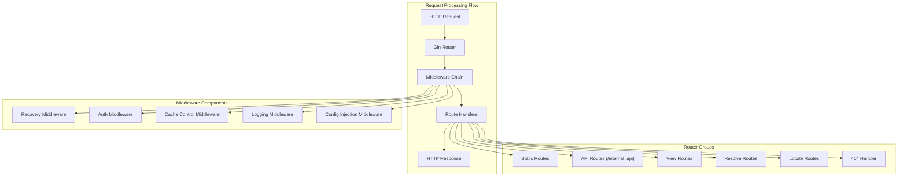
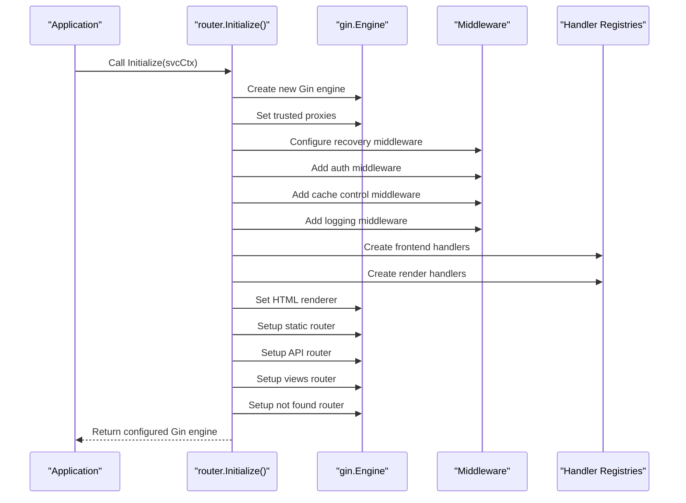
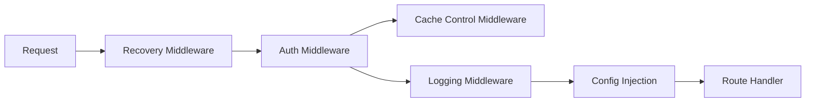
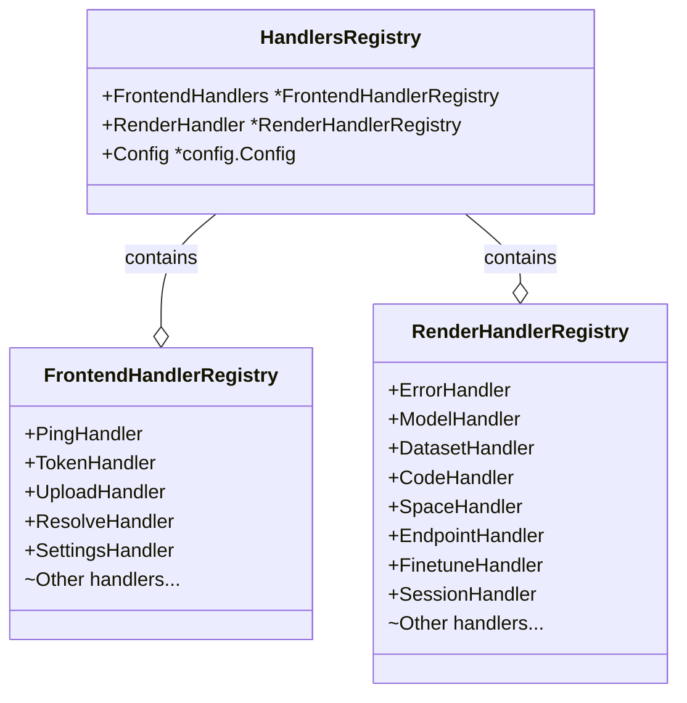
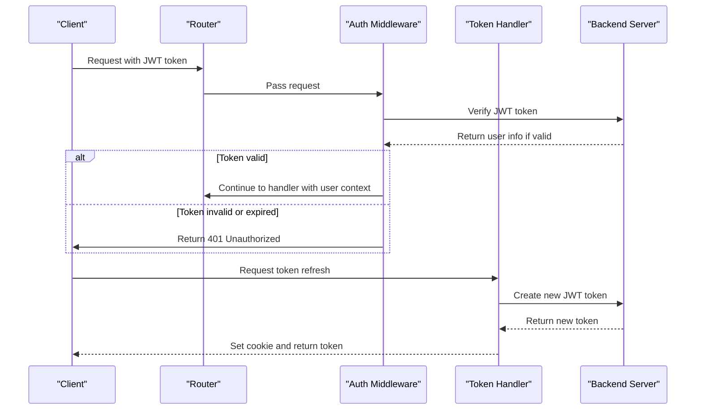

# Routing and Middleware

This page documents the routing system and middleware chain in CSGHub's backend architecture. It covers how HTTP requests are handled, routed to the appropriate handlers, and processed through middleware components. For information about repository-specific handlers, see [Repository Handlers](#6.2).

## Overview of the Routing System

CSGHub uses the Gin framework for HTTP routing and middleware management. The routing system is responsible for directing incoming requests to the appropriate handlers based on URL patterns, HTTP methods, and other request characteristics.



Sources: [internal/routes/router.go:33-96]()

## Router Initialization

The router initialization process sets up the Gin engine, configures middleware, and registers all route handlers. This process is handled by the `Initialize` function in the `routes` package.



Sources: [internal/routes/router.go:33-96]()

## Middleware Components

CSGHub's middleware components process HTTP requests before they reach route handlers, performing tasks such as authentication, logging, and error handling.

### Middleware Chain

The middleware chain executes in the following order:

1. **Recovery Middleware**: Captures panics and converts them to 500 responses with error logging
2. **Authentication Middleware**: Verifies user authentication using JWT tokens
3. **Cache Control Middleware**: Manages HTTP caching headers
4. **Logging Middleware**: Logs all requests for monitoring and debugging
5. **Configuration Injection**: Injects global configuration into request contexts



Sources: [internal/routes/router.go:61-73](), [internal/routes/router.go:98-104]()

### Authentication Middleware

The authentication middleware validates JWT tokens and populates user information in the request context. It's a critical component that secures routes requiring authentication.

Key functions:
- Extracts JWT tokens from cookies or Authorization headers
- Verifies token validity using the backend service
- Attaches authenticated user information to the request context
- Handles token refreshing for extended sessions

Sources: [internal/handlers/frontend/token.go:34-59](), [internal/routes/router.go:69]()

## Route Groups

CSGHub organizes routes into distinct groups based on functionality, making the codebase more maintainable and easier to navigate.

### Static Routes

Static routes serve frontend assets such as JavaScript, CSS, and image files directly from the filesystem.

Sources: [internal/routes/router.go:232-250]()

### API Routes

API routes handle internal AJAX requests from the frontend, providing data endpoints for dynamic features.

```
/internal_api/ping                  - Health check endpoint
/internal_api/users/jwt_token       - JWT token refresh
/internal_api/upload                - File upload handling
```

Sources: [internal/routes/router.go:252-265]()

### View Routes

View routes render HTML templates for different parts of the application. These routes are organized into functional categories:

| Category | Purpose |
|----------|---------|
| Error routes | Display error pages (404, 401, etc.) |
| Home routes | Main dashboard and landing pages |
| Model routes | Model repository pages |
| Dataset routes | Dataset repository pages |
| Code routes | Code repository pages |
| Space routes | Space repository pages |
| Endpoint routes | Model endpoint management |
| Finetune routes | Model fine-tuning interfaces |
| Session routes | Authentication and session management |
| Organization routes | Organization profile and management |
| Profile routes | User profile pages |
| Setting routes | User settings pages |
| Resource console routes | Resource management console |
| Admin routes | Administrative interfaces |

Sources: [internal/routes/router.go:205-230]()

### Resolve Routes

Resolve routes handle repository content resolution, mapping repository paths to specific files or directories:

```
/:repo_type/:namespace/:name/resolve/:branch/*path
```

Sources: [internal/routes/router.go:259-260]()

## Handler Registries

The routing system relies on handler registries to organize and access route handlers. These registries group related handlers together for better code organization.



Sources: [internal/routes/router.go:26-31](), [internal/handlers/render/registry.go:9-26]()

## Template Rendering

CSGHub uses a template rendering system to generate HTML responses. The system uses the `multitemplate.Renderer` package to manage multiple templates for different views.

The template rendering process:
1. Templates are organized into layouts and pages
2. Layouts provide common structure (header, footer, etc.)
3. Pages provide view-specific content
4. Templates are parsed from the embedded filesystem during initialization
5. Rendered templates are served in response to view route requests

Sources: [internal/routes/router.go:106-203]()

## Error Handling

The routing system includes comprehensive error handling to provide appropriate responses for various error conditions:

1. **Panic Recovery**: Catches unhandled panics, logs them with stack traces, and returns a 500 response
2. **404 Not Found**: Redirects to a dedicated not-found page for unmatched routes
3. **Authentication Errors**: Redirects unauthenticated users to appropriate error pages

Sources: [internal/routes/router.go:61-68](), [internal/routes/router.go:267-272]()

## JWT Authentication Flow

JWT (JSON Web Token) authentication is central to CSGHub's authentication system. The flow begins with the authentication middleware and includes token verification and refresh mechanisms.



Sources: [internal/handlers/frontend/token.go:34-59](), [pkg/server/types/jwt.go:1-45]()

## Implementation Details

### Router Initialization

The router is initialized in the `Initialize` function, which sets up the Gin engine, configures middleware, and registers routes:

1. Creates a new Gin engine
2. Sets up logging
3. Configures middleware
4. Creates handler registries
5. Sets up the HTML renderer
6. Registers all routes

Sources: [internal/routes/router.go:33-96]()

### Global Configuration Injection

The router injects global configuration into the request context using middleware, making configuration accessible to all handlers:

```go
// Global configuration structure
type GlobalConfig struct {
    ServerBaseUrl string
    OnPremise     bool
    EnableHttps   bool
}

// Middleware to inject configuration
func injectConfig(config types.GlobalConfig) gin.HandlerFunc {
    return func(c *gin.Context) {
        c.Set("Config", config)
        c.Next()
    }
}
```

Sources: [internal/routes/router.go:98-104](), [internal/routes/router.go:206-211]()

## Conclusion

The routing and middleware system in CSGHub provides a structured approach to handling HTTP requests, with clear separation of concerns and organized code. The system leverages Gin's powerful routing capabilities and middleware chain to process requests efficiently and securely.

The key strengths of the system include:
- Organized route grouping by functionality
- Comprehensive middleware chain for cross-cutting concerns
- Structured error handling and recovery
- Template-based view rendering
- JWT-based authentication

This architecture allows CSGHub to maintain a clean codebase while providing robust HTTP request handling capabilities.