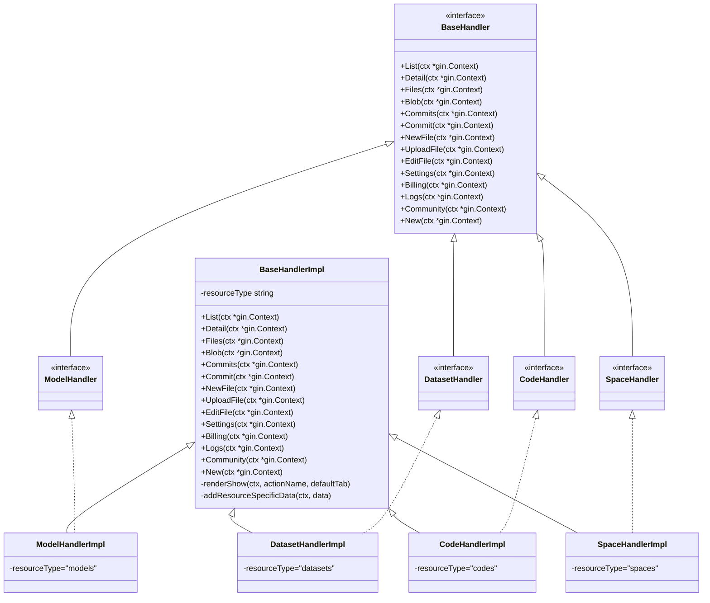
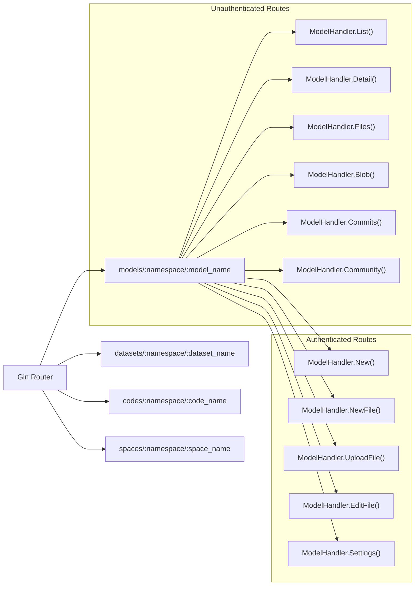
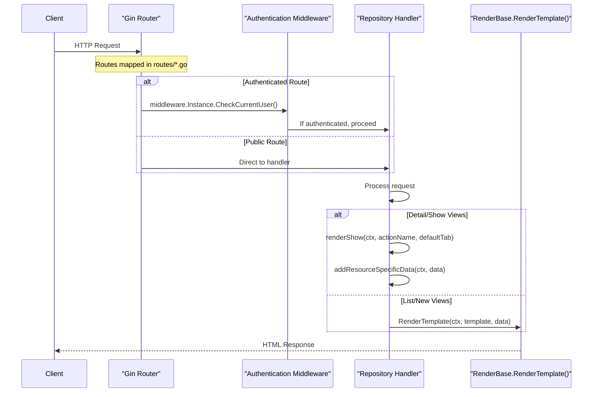
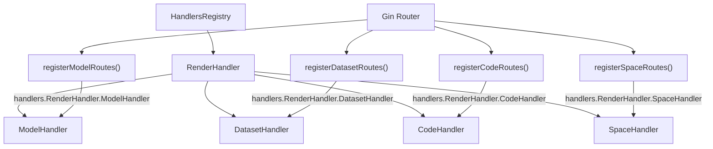

# Repository Handlers

## Purpose and Scope

Repository Handlers form a core component of CSGHub's backend architecture, responsible for processing HTTP requests related to different repository types (models, datasets, codes, and spaces). These handlers serve as the bridge between the router and the template rendering system, processing user interactions and generating appropriate responses.

This document covers the structure, implementation, and flow of Repository Handlers within the CSGHub backend system. For information about the overall routing system and middleware chain, see [Routing and Middleware](#6.1).

## Repository Handler Architecture

The Repository Handlers in CSGHub follow a structured inheritance pattern that promotes code reuse while allowing for repository-specific customizations.



Sources: [internal/handlers/render/repo.go:39-53](), [internal/handlers/render/models.go](), [internal/handlers/render/datasets.go](), [internal/handlers/render/codes.go](), [internal/handlers/render/spaces.go]()

## Repository Types and Handler Implementation

CSGHub supports four primary repository types, each with its dedicated handler implementation:

| Repository Type | Handler Interface | Implementation | Resource Type Value |
|-----------------|-------------------|----------------|---------------------|
| Models | `ModelHandler` | `ModelHandlerImpl` | "models" |
| Datasets | `DatasetHandler` | `DatasetHandlerImpl` | "datasets" |
| Codes | `CodeHandler` | `CodeHandlerImpl` | "codes" |
| Spaces | `SpaceHandler` | `SpaceHandlerImpl` | "spaces" |

Each specific handler implementation primarily differs in the `resourceType` field value, which is used to determine which templates to render and what type-specific data to include.

Sources: [internal/handlers/render/models.go](), [internal/handlers/render/datasets.go](), [internal/handlers/render/codes.go](), [internal/handlers/render/spaces.go]()

## Route to Handler Mapping

The system maps HTTP routes to handler methods based on the repository type, following a consistent pattern across all repository types:



Sources: [internal/routes/models.go](), [internal/routes/datasets.go](), [internal/routes/codes.go](), [internal/routes/spaces.go]()

## Handler Method Behavior

The `BaseHandlerImpl` provides a default implementation for all handler methods, with consistent behavior:

| Method | Purpose | URL Pattern Example | Template Name Pattern |
|--------|---------|---------------------|------------------------|
| `List` | List repositories | `/models` | `{resourceType}_index` |
| `Detail` | Show repo details | `/models/:namespace/:model_name` | `{resourceType}_show` (summary tab) |
| `Files` | Display file tree | `.../files/:branch/*path` | `{resourceType}_show` (files tab) |
| `Blob` | Show file content | `.../blob/:branch/*path` | `{resourceType}_show` (files tab) |
| `Commits` | Show commit history | `.../commits` | `{resourceType}_show` (files tab) |
| `Commit` | Show commit details | `.../commit/:commit_id` | `{resourceType}_show` (files tab) |
| `NewFile` | Create file form | `.../:branch/new` | `{resourceType}_show` (files tab) |
| `UploadFile` | Upload file form | `.../:branch/upload` | `{resourceType}_show` (files tab) |
| `EditFile` | Edit file form | `.../edit/:branch/*path` | `{resourceType}_show` (files tab) |
| `Settings` | Repository settings | `.../settings` | `{resourceType}_show` (settings tab) |
| `Billing` | Billing information | `.../billing` | `{resourceType}_show` (billing tab) |
| `Community` | Community info | `.../community` | `{resourceType}_show` (community tab) |
| `New` | New repo form | `/models/new` | `{resourceType}_new` |

Most methods call a common `renderShow` helper method that prepares a data context and renders the appropriate template.

Sources: [internal/handlers/render/repo.go:68-123]()

## Request Processing Flow

The following diagram illustrates how a request flows through the Repository Handlers system:



Sources: [internal/routes/models.go](), [internal/handlers/render/repo.go:125-163]()

## Template Rendering and Data Context

The `renderShow` method plays a key role in preparing the data context for template rendering:

1. It creates a base data map with common information:
   ```go
   data := map[string]interface{}{
       "namespace":     ctx.Param("namespace"),
       "actionName":    actionName,
       "currentPath":   strings.TrimPrefix(ctx.Param("path"), "/"),
       "currentBranch": ctx.Param("branch"),
       "defaultTab":    defaultTab,
   }
   ```

2. It adds resource-specific data through `addResourceSpecificData`:
   ```go
   switch b.resourceType {
   case "datasets":
       data["datasetName"] = ctx.Param("dataset_name")
   case "models":
       data["modelName"] = ctx.Param("model_name")
   case "codes":
       data["codeName"] = ctx.Param("code_name")
   case "spaces":
       data["spaceName"] = ctx.Param("space_name")
   // ...others...
   }
   ```

3. It renders the template with the prepared data:
   ```go
   RenderBaseInstance.RenderTemplate(ctx, b.resourceType+"_show", data)
   ```

Sources: [internal/handlers/render/repo.go:125-143](), [internal/handlers/render/repo.go:145-163]()

## License Handling

The Repository Handlers system also includes built-in support for managing licenses:

```go
var DefaultLicenses = [][]string{
    {"apache-2.0", "Apache-2.0"},
    {"mit", "MIT"},
    {"lgpl", "LGPL"},
    // ... additional licenses ...
}
```

This licensing information is used when creating new repositories and is passed to the template rendering system as a JSON string.

Sources: [internal/handlers/render/repo.go:12-37](), [internal/handlers/render/repo.go:122]()

## Extension Points

While the Repository Handlers system follows a common pattern, it includes several extension points:

1. **Resource Type Customization**: Each handler implementation sets a specific `resourceType` value
2. **Method Overriding**: Specific handlers can override any base method to provide custom behavior
3. **Template Mapping**: The template naming convention (`{resourceType}_show`) allows for resource-specific templates

Sources: [internal/handlers/render/models.go:11-17](), [internal/handlers/render/datasets.go:11-17](), [internal/handlers/render/codes.go:11-17](), [internal/handlers/render/spaces.go:11-17]()

## Repository Handler Registration

Repository handlers must be registered in the `HandlersRegistry` for use by the router:



Sources: [internal/routes/models.go:8-10](), [internal/routes/datasets.go:8-10](), [internal/routes/codes.go:8-10](), [internal/routes/spaces.go:8-10]()

## Summary

Repository Handlers in CSGHub form a well-structured system based on a common interface and implementation pattern. This approach enables code reuse while allowing for repository-specific customizations through:

1. A shared `BaseHandler` interface defining all handler methods
2. A common `BaseHandlerImpl` providing default implementations
3. Specialized handlers for each repository type (models, datasets, codes, spaces)
4. Resource-specific data handling in templates

This architecture makes it easy to add new repository types or customize existing behavior while maintaining a consistent user experience across the platform.