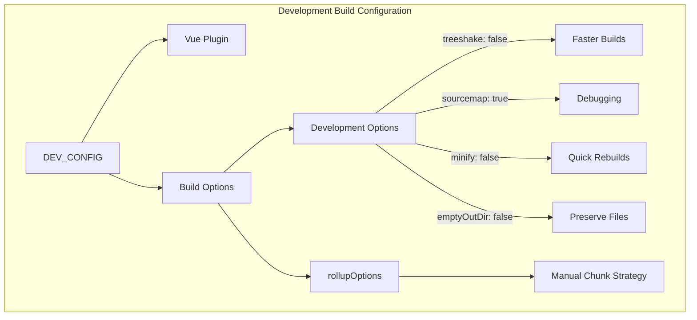
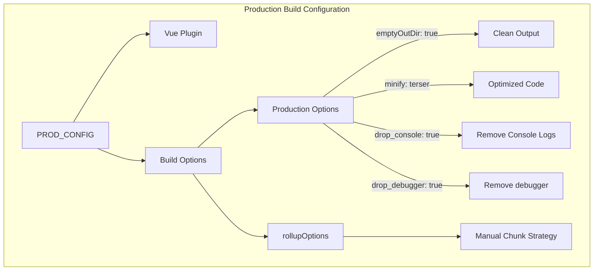
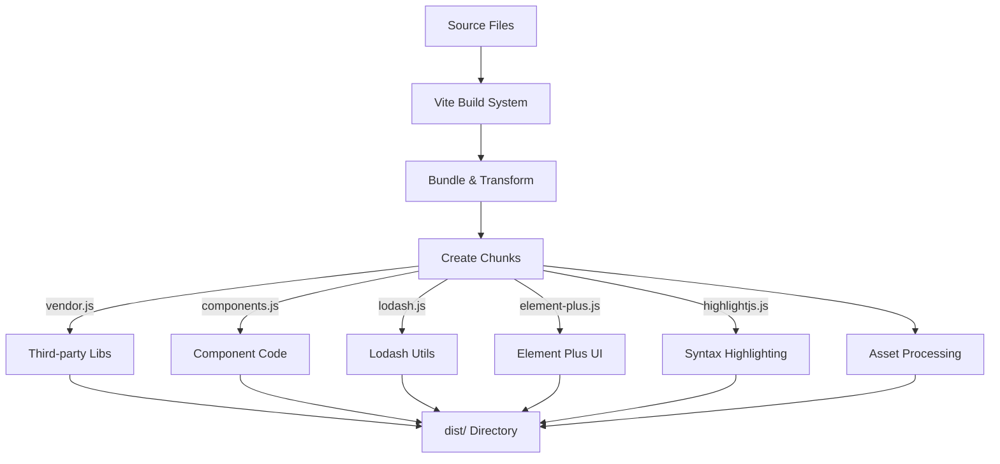
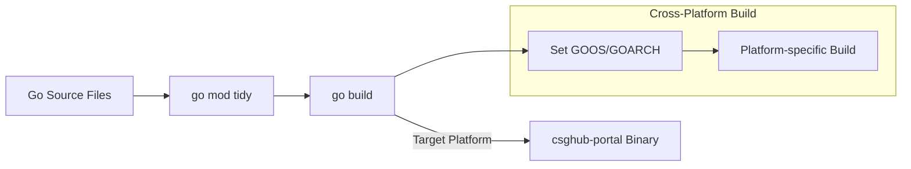
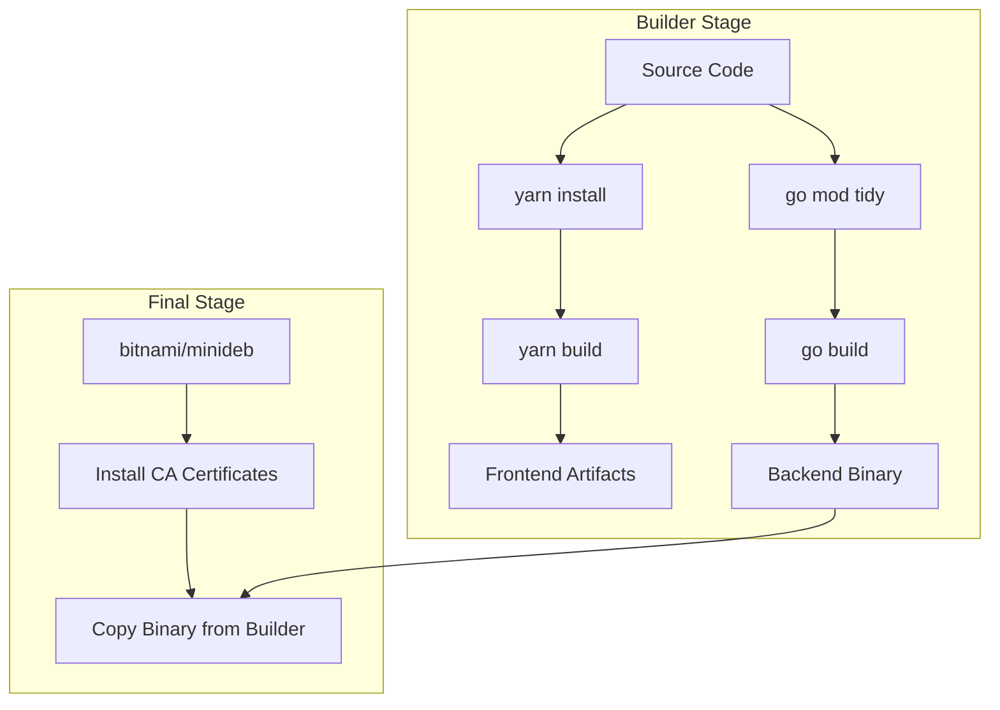
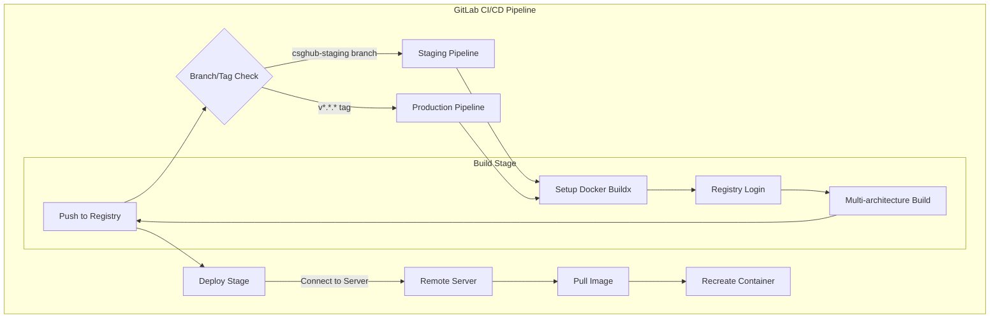
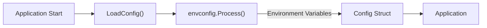

# Development and Deployment

This document provides a comprehensive guide to the development workflow, build process, and deployment procedures for the CSGHub platform. It covers setting up a development environment, building the application components, and deploying through CI/CD pipelines.

## Development Environment

### Prerequisites

To develop for CSGHub, you need the following tools installed:

- Node.js and Yarn for frontend development
- Go 1.23.3 or later for backend development
- Docker for containerization and testing
- Git for version control

### Frontend Development

The frontend is built with Vue.js 3 and uses Vite as the build tool. The following npm scripts are defined in the package.json file:

```
yarn dev         # Starts the development server with hot reloading
yarn dev_build   # Builds in development mode with watch enabled
yarn test        # Runs Vitest tests
yarn coverage    # Runs tests with coverage reporting
yarn build       # Creates a production build
yarn preview     # Previews the production build locally
```


### Backend Development

The backend is written in Go using the Gin web framework. The main entry point is `cmd/csghub-portal`. The Go dependencies are managed using Go modules.


## Build Configuration

### Frontend Build Configuration 

CSGHub uses different Vite configurations for development and production environments.

#### Development Build Config



The development build focuses on developer experience with:
- Disabled tree-shaking for faster builds
- Source maps for debugging
- No minification for quicker rebuilds
- Watch mode for immediate feedback
- Manual chunk strategy for common libraries


#### Production Build Config



The production build optimizes for end-user performance:
- Terser minification for smaller bundle size
- Removal of console logs and debugger statements
- Clean output directory
- Optimized chunk splitting for better loading performance


## Build Process

### Frontend Build Process

The frontend build process is managed by Vite, which compiles and bundles Vue components, JavaScript, CSS, and other assets.



Vite is configured to split the code into logical chunks:
- Vendor chunks for third-party libraries
- Component chunks for reusable UI components
- Specialized chunks for large libraries (lodash, element-plus, highlight.js)


### Backend Build Process

The backend is built using Go's standard build toolchain. The Dockerfile shows the build process:



The Go build process includes:
1. Dependency resolution via `go mod tidy`
2. Compilation with platform-specific settings
3. Generation of the `csghub-portal` binary


## Docker Build Process

CSGHub uses a multi-stage Docker build to create a lean production image:



The Dockerfile uses:
1. A builder stage with Go and Node.js for compiling both frontend and backend
2. A minimal final stage with only the compiled binary
3. Platform-specific build flags for cross-architecture support


## Testing

### Frontend Testing

The frontend uses Vitest for unit testing with the following commands:

- `yarn test`: Run all tests in watch mode
- `yarn coverage`: Generate test coverage reports


### Backend Testing

Backend testing uses Go's standard testing package. Tests can be run with:

```bash
go test ./...
```

## Deployment

### CI/CD Pipeline

CSGHub uses GitLab CI/CD for automated builds and deployments. The pipeline consists of three stages:



The pipeline is triggered by:
- Pushes to the `csghub-staging` branch for staging deployments
- Tags matching the pattern `v*.*.*` for production releases


### Build Stage

The build stage creates multi-architecture Docker images:

1. Sets up Docker Buildx for multi-platform builds
2. Authenticates with the GitLab container registry
3. Builds images for both amd64 and arm64 architectures
4. Pushes images to the registry

Key configuration:
- Platform targets: `linux/amd64,linux/arm64`
- Image tag based on branch/tag name
- No default attestations


### Deploy Stage

The deployment process:

1. Connects to the deployment server via SSH
2. Sets environment variables for the deployment
3. Pulls the latest image from the registry
4. Updates the running container using docker-compose
5. Cleans up unused images


## Configuration

CSGHub is configured through environment variables, which are loaded and processed by the `envconfig` package.

Key configuration categories:

| Category | Environment Variables | Description |
|----------|----------------------|-------------|
| Server | `CSGHUB_PORTAL_SERVER_PORT`, `CSGHUB_PORTAL_ENABLE_HTTPS` | Basic server configuration |
| Starhub | `CSGHUB_PORTAL_STARHUB_BASE_URL`, `CSGHUB_PORTAL_STARHUB_API_KEY` | Connection to Starhub server |
| Database | `CSGHUB_PORTAL_DATABASE_DSN`, `CSGHUB_PORTAL_DATABASE_DIALECT` | Database connection settings |
| S3 Storage | `CSGHUB_PORTAL_S3_ENDPOINT`, `CSGHUB_PORTAL_S3_ACCESS_KEY_ID` | Object storage configuration |


### Configuration Loading

The configuration is loaded at application startup using the `LoadConfig` function:




## Troubleshooting

Common issues and solutions:

1. **Frontend build errors**: Verify Node.js/Yarn versions and clear node_modules.
2. **Cross-platform issues**: Ensure Docker buildx is configured correctly for multi-architecture builds.
3. **Deployment failures**: Check SSH access and environment variables on deployment servers.

## Bug Reporting

When reporting bugs, please use the bug report template and include:

- CSGHub version
- Operating system
- Hardware configuration
- Deployment method (docker compose, helm chart)
- Steps to reproduce


## Feature Requests

Feature enhancement requests should:
- Clearly describe the proposed solution
- Explain the benefits of the feature
- Include links to relevant documentation or design documents

