# Repository Management System

The Repository Management System is the core framework in CSGHub that manages different types of repositories (models, datasets, code, spaces, endpoints, finetunes, and collections). It provides a unified set of components and APIs to display, browse, filter, and interact with repositories while supporting type-specific behaviors for each repository kind.

This document explains the overall architecture, components, and interactions of the repository system. For information on specific repository types and their specialized capabilities, see [Model Deployment and Fine-tuning](#3) or [User and Authentication System](#4).

## System Overview

The Repository Management System handles several repository types, each with common functionality but also specialized features:

| Repository Type | Purpose | Key Features |
|-----------------|---------|--------------|
| Model | ML models | Inference, fine-tuning, evaluation |
| Dataset | Training data | Data previews, versioning |
| Code | Development code | Code browsing, versioning |
| Space | Application deployments | Runtime environments, user interfaces |
| Endpoint | Inference services | Runtime options, scaling, monitoring |
| Finetune | Fine-tuned models | Training status, parameters |
| Collection | Repository grouping | Themed collections, multiple repos |

The system provides consistent interfaces for all repository types while enabling specialized functionality for each.

### Architecture Overview

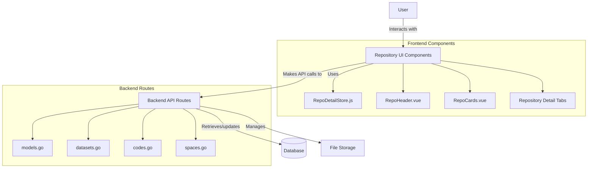

## Repository Data Model

All repository types share a common data model while having type-specific extensions. The state for repositories is centrally managed through the `RepoDetailStore`.

### Core Repository Properties

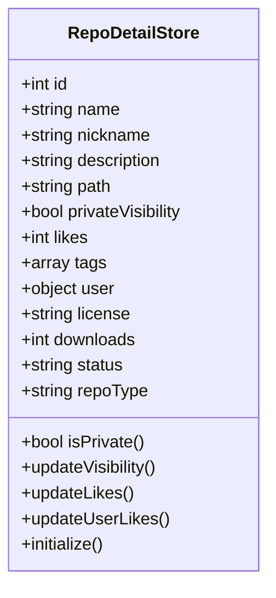

The `RepoDetailStore` contains all properties for the currently viewed repository. It includes common properties shared by all repository types as well as type-specific properties that only apply to certain repository types.


### Type-Specific Extensions

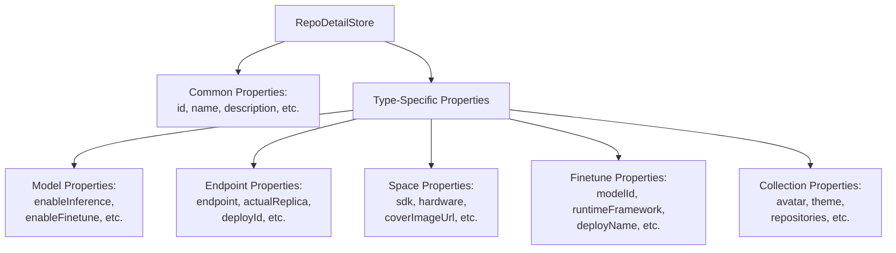

The store includes specialized properties for each repository type:

```javascript
// For models
enableInference: true/false
enableFinetune: true/false
enableEvaluation: true/false

// For endpoints
endpoint: "endpoint-url"
minReplica: 1
maxReplica: 3
actualReplica: 2
proxyEndpoint: "proxy-url"
deployId: 123

// For spaces
sdk: "gradio"
hardware: "cpu"
coverImageUrl: "image-url"

// For collections
avatar: "avatar-url"
theme: "#F5F3FF"
repositories: []
```

## User Interface Components

The Repository Management System includes several UI components that collectively provide the repository interface.

### Repository Header

The `RepoHeader` component displays key repository information at the top of repository pages:

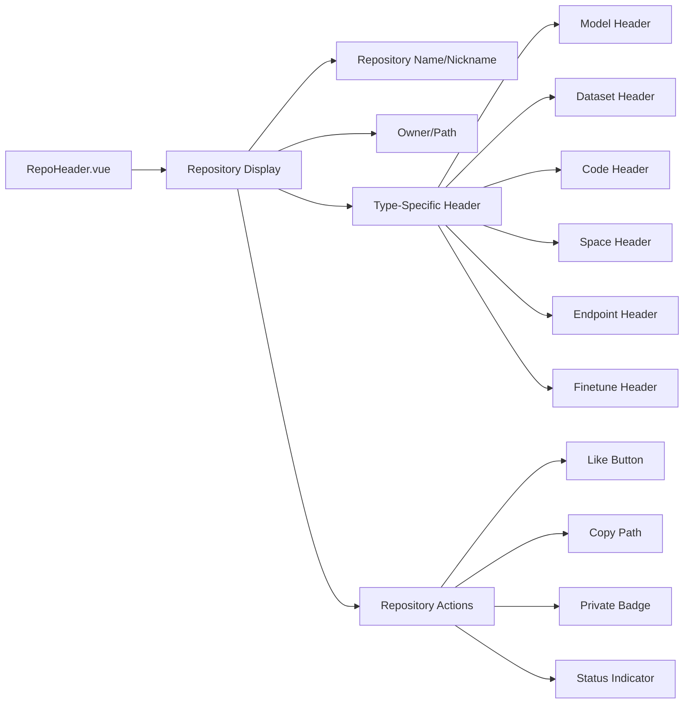

The header adapts its display based on repository type:
- For datasets: Shows a dataset icon and name
- For endpoints: Shows status and resource information
- For finetunes: Shows finetune status and model information
- For other types: Shows repository type icon and metadata


### Repository Cards Browser

The `RepoCards` component provides a browsing interface for repositories:

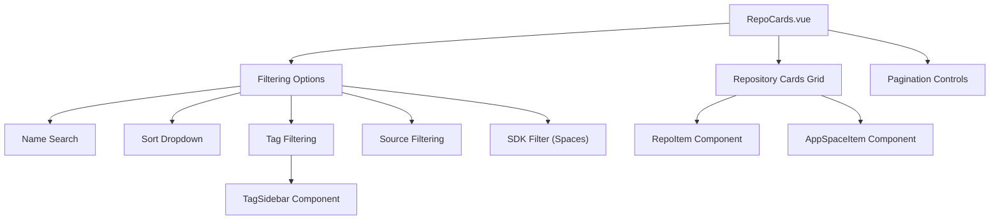

`RepoCards` supports filtering by:
- Text search by name
- Sorting (trending, recently updated, downloads, favorites)
- Tags via the sidebar
- Source (for on-premise installations)
- SDK type (for spaces)

### Repository Detail Views

Each repository type has a specialized detail view that extends a common pattern:

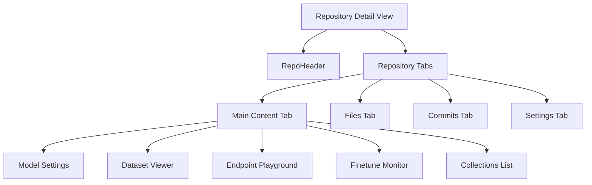

The detail views follow a consistent pattern but adapt to each repository type:
- Model detail: Shows model metadata, cards
- Dataset detail: Shows dataset preview, metadata
- Endpoint detail: Shows endpoint status, playground
- Finetune detail: Shows training status, settings
- Collection detail: Shows contained repositories

## Repository Operations

The Repository Management System supports various operations on repositories.

### Repository Browsing and Filtering

Users can browse repositories with filtering and sorting options:

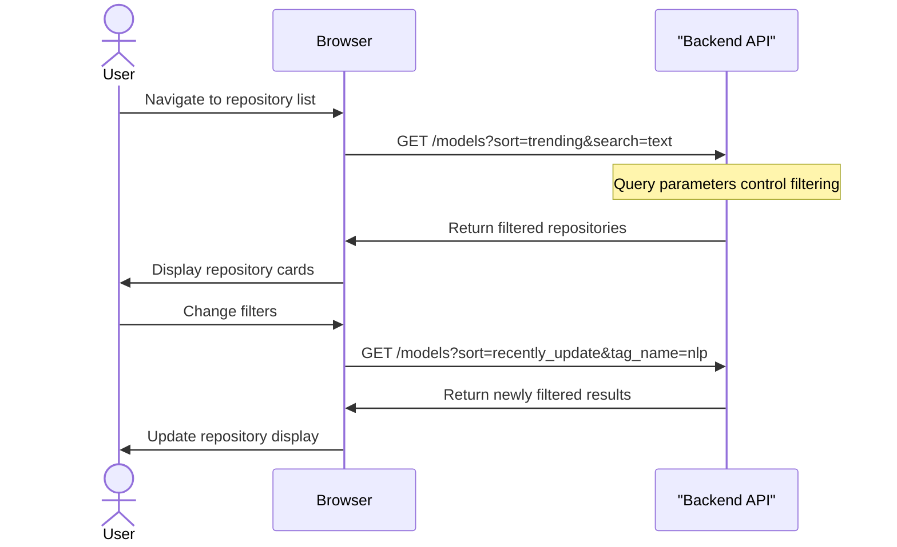

Key filtering options include:
- Text search via `search` parameter
- Sorting via `sort` parameter (trending, recently_update, most_download, most_favorite)
- Tag filtering via `tag_category` and `tag_name` parameters
- Source filtering via `source` parameter
- SDK filtering via `sdk` parameter (for spaces)
- Pagination via `page` and `per` parameters


### Repository Detail Display

When viewing a specific repository, the system follows this pattern:

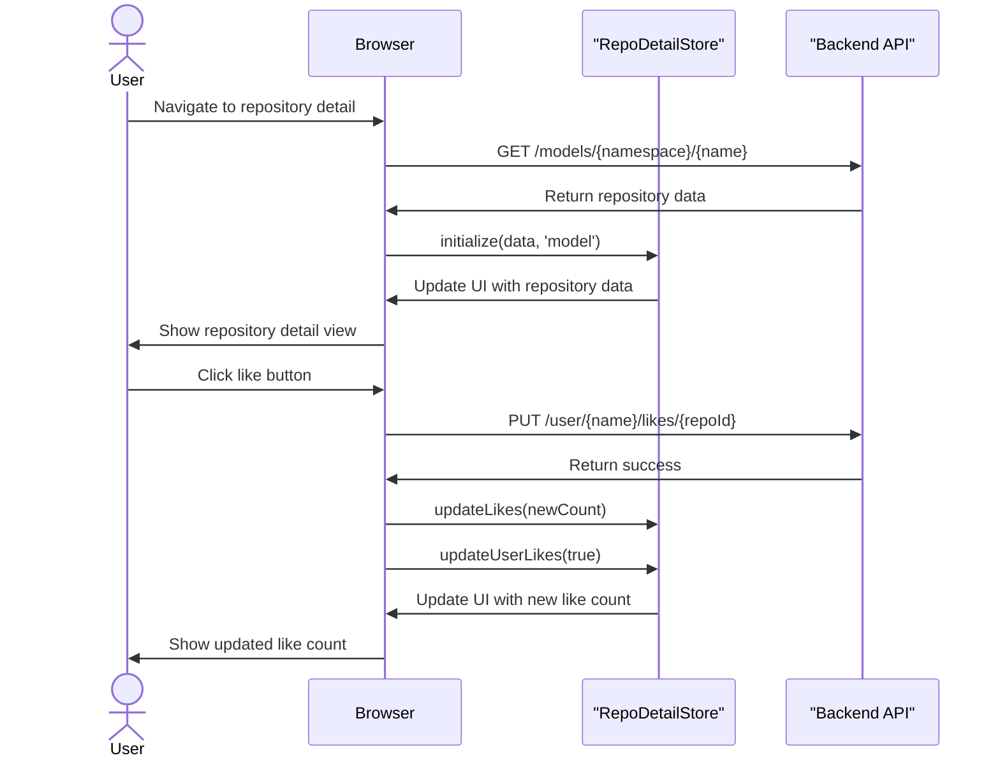

### Repository Empty States

The system also handles empty states, such as when no models are available:

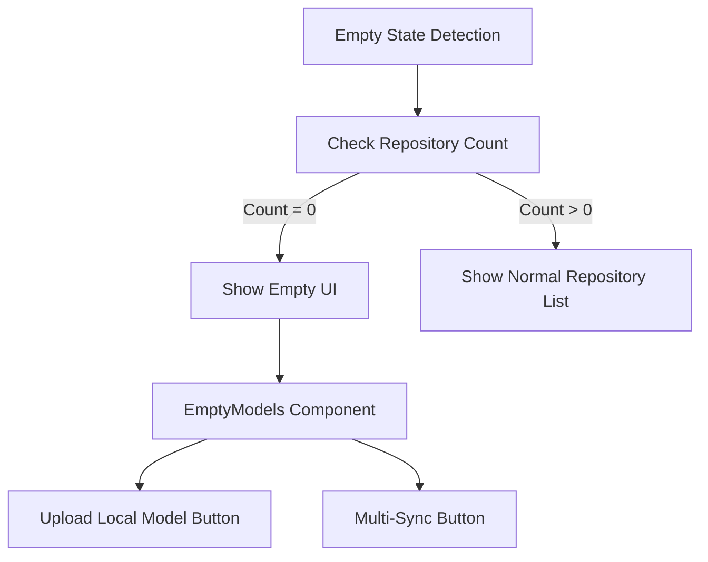

The empty state provides guidance to users on how to add their first repositories.


## Backend Integration

The repository frontend interfaces with backend routes to retrieve and manipulate data.

### Backend Routes Structure

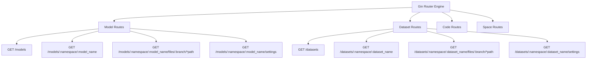

The backend implements consistent route patterns across repository types:
- List route: `GET /{repoType}s`
- Detail route: `GET /{repoType}s/:namespace/:repo_name`
- Files route: `GET /{repoType}s/:namespace/:repo_name/files/:branch/*path`
- Settings route: `GET /{repoType}s/:namespace/:repo_name/settings`


### Base Handler Implementation

The backend uses a common base handler implementation for all repository types:

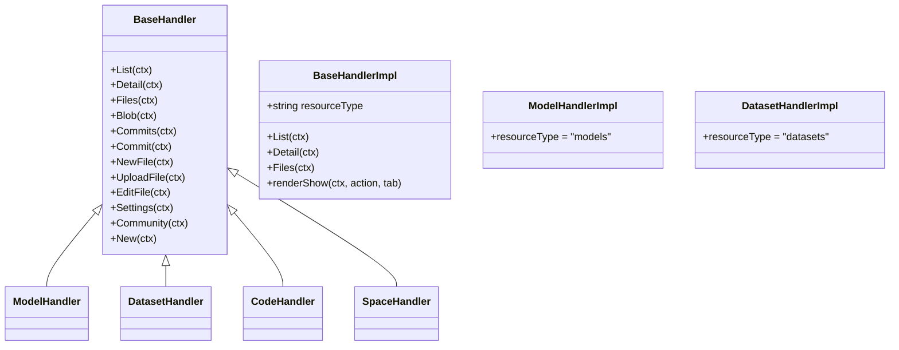

This design provides consistent behaviors across repository types while allowing for type-specific customizations.


## State Management

The Repository Management System uses Pinia for state management, with the `RepoDetailStore` as the central store.

### Store Initialization and Persistence

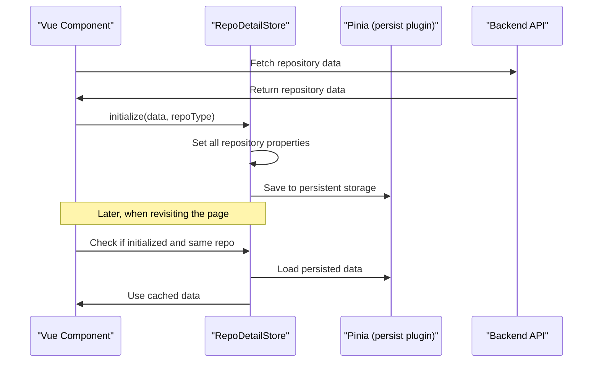

The store is initialized when a user navigates to a repository detail page. The store:
1. Sets the repository type and initialized flag
2. Populates common and type-specific properties
3. Uses Pinia's persistence plugin to cache data


### API Integration for State Updates

The repository components integrate with backend APIs to update repository state:

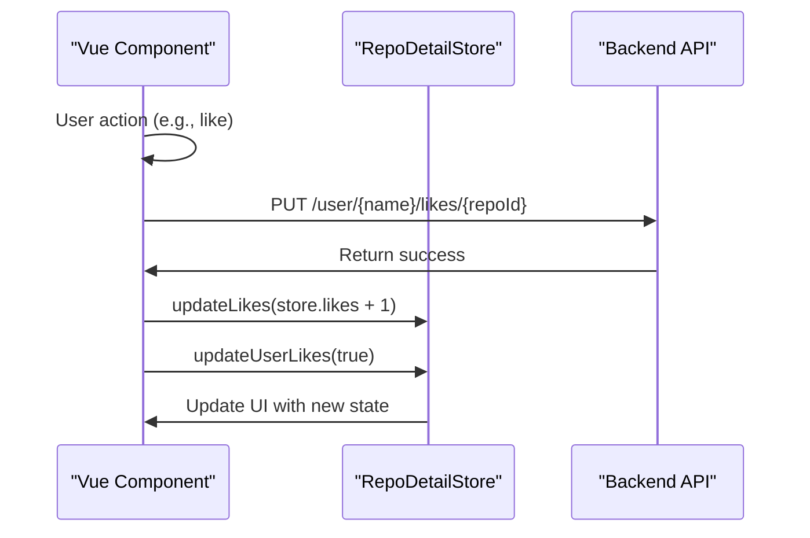

This pattern ensures that UI state stays synchronized with server state.


## Conclusion

The Repository Management System provides a unified framework for handling different repository types in CSGHub. It uses consistent patterns for displaying, browsing, and manipulating repositories while accommodating type-specific behaviors. The system is built on a combination of Vue.js components, Pinia state management, and RESTful backend routes.

This architecture enables CSGHub to support diverse repository types (models, datasets, code, spaces, endpoints, finetunes, and collections) through shared components and patterns while allowing for specialized functionality where needed.

For more detailed information on specific repository types, see [Model Deployment and Fine-tuning](#3) or [Repository Detail Components](#2.1).