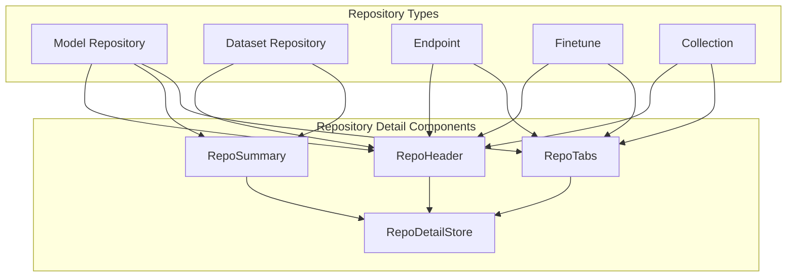
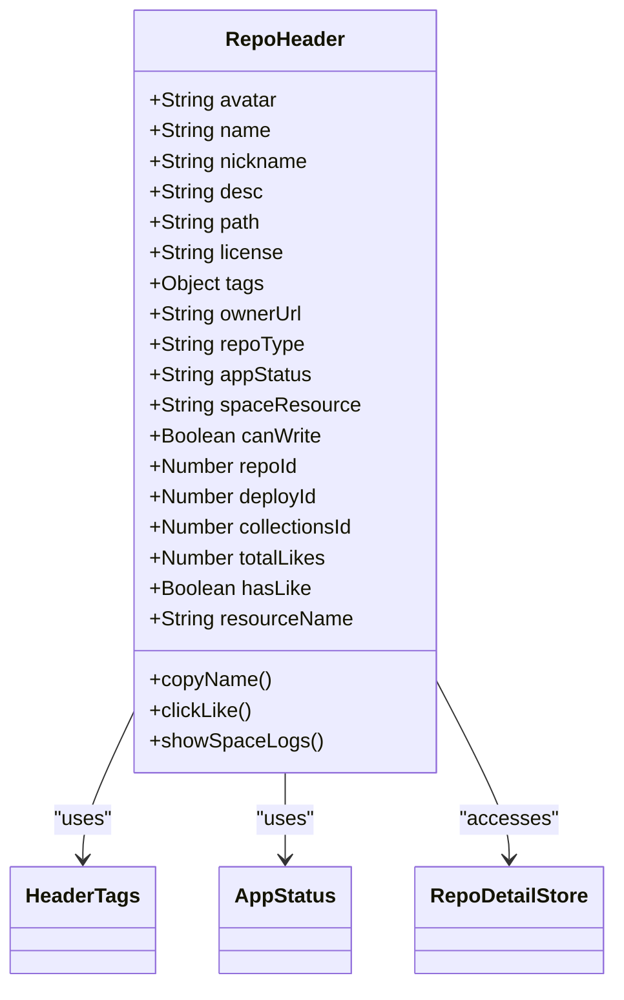
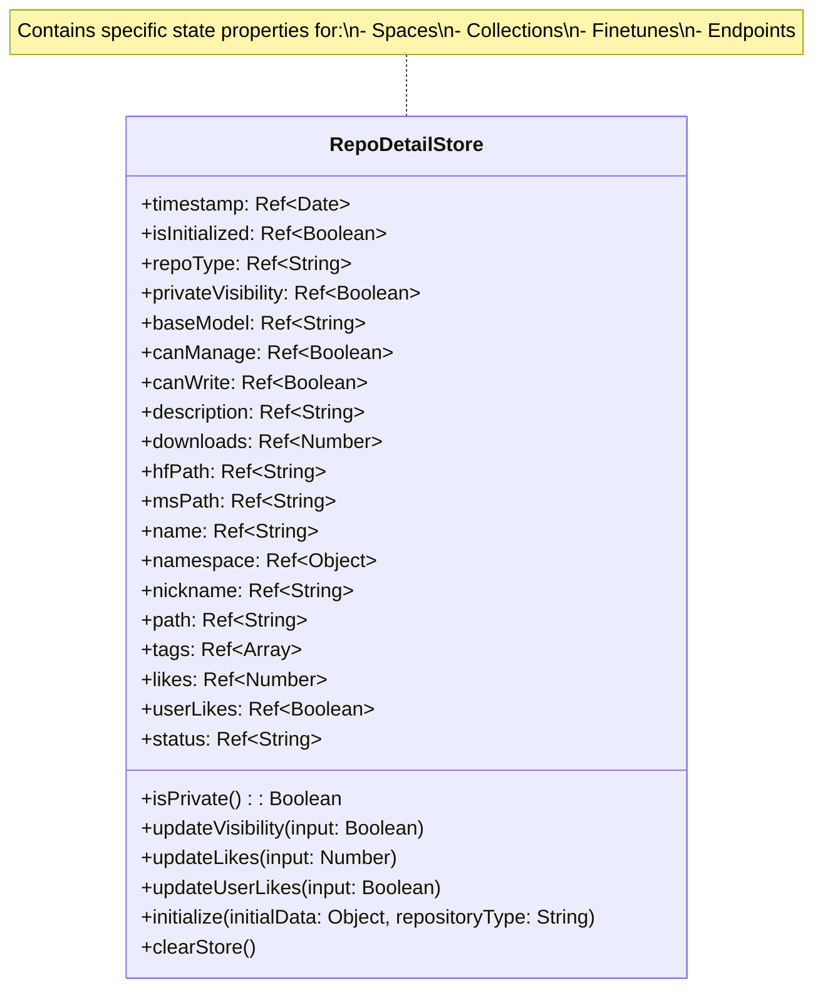
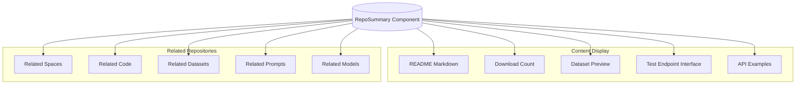

# Repository Detail Components

This document details the components used for displaying repository information and details in CSGHub. These components form the core user interface for viewing and interacting with repositories of various types (models, datasets, endpoints, finetunes, and collections). For information about repository browsing and filtering, see [Repository Browsing and Filtering](#2.3), and for information about cloning and other actions, see [Repository Clone and Actions](#2.2).

## Overview

The Repository Detail Components system provides a consistent interface for displaying repository information while accommodating the specific needs of different repository types. The system consists of a header component, backing store, and content display components that adapt based on the repository type.



Sources: [frontend/src/components/shared/RepoHeader.vue:1-369](), [frontend/src/stores/RepoDetailStore.js:1-246](), [frontend/src/components/shared/RepoSummary.vue:1-261]()

## Repository Header Component

The RepoHeader component is a versatile UI element that adapts its display based on the repository type. It presents critical information about a repository such as name, owner, visibility, and status.

### RepoHeader Structure



Sources: [frontend/src/components/shared/RepoHeader.vue:1-180](), [frontend/src/components/shared/RepoHeader.vue:228-368]()

### Type-Specific Headers

The RepoHeader adapts to different repository types with conditional rendering:

1. **Dataset Header** (lines 5-44): Displays dataset icon, name, and metadata
2. **Endpoint Header** (lines 47-74): Shows endpoint status and deployment information
3. **Finetune Header** (lines 77-98): Displays finetune status and resource information
4. **Other Repository Header** (lines 101-157): Handles models, code, spaces with appropriate icons

Sources: [frontend/src/components/shared/RepoHeader.vue:5-157]()

### Key Features

- **Private Repository Indicator**: Shows private badge for private repositories
- **Repository Source Display**: Shows source icons for repositories mirrored from HuggingFace or ModelScope
- **Like Functionality**: Allows users to like/unlike repositories with counter
- **Error Status Indicators**: Displays error tooltips for failed deployments
- **Path Information**: Shows owner and repository path with clickable links
- **Copy Functionality**: Allows copying repository path with a single click

Sources: [frontend/src/components/shared/RepoHeader.vue:26-43](), [frontend/src/components/shared/RepoHeader.vue:116-143](), [frontend/src/components/shared/RepoHeader.vue:185-196]()

## RepoDetailStore

The RepoDetailStore is a centralized state management store built with Pinia that maintains the repository's data and state. It's shared across all repository detail components.

### Store Structure



Sources: [frontend/src/stores/RepoDetailStore.js:6-244]()

### Repository Types Support

The store includes specialized fields for various repository types:
- **Common fields**: ID, name, path, description, visibility, etc.
- **Space-specific**: coverImageUrl, endpoint, hardware, sdk, sku, svcName
- **Collections-specific**: avatar, theme, repositories list
- **Finetune-specific**: clusterId, deployId, imageId, replicas, proxyEndpoint
- **Endpoint-specific**: gitBranch, task, replica, instances, engineArgs

Sources: [frontend/src/stores/RepoDetailStore.js:10-77](), [frontend/src/stores/RepoDetailStore.js:95-158]()

### State Management Functions

RepoDetailStore provides several functions to manage repository state:
- `initialize(initialData, repositoryType)`: Sets up the store with data from the backend
- `updateVisibility(input)`: Updates repository visibility
- `updateLikes(input)`: Updates like count
- `updateUserLikes(input)`: Updates user's like status
- `clearStore()`: Resets the store state

Sources: [frontend/src/stores/RepoDetailStore.js:83-163]()

## Repository Summary Component

The RepoSummary component displays the repository's detailed content, including README information, statistics, and related repositories.

### Structure and Features



Sources: [frontend/src/components/shared/RepoSummary.vue:1-219]()

### Key Components

1. **Markdown Viewer**: Renders the repository's README file
2. **ParquetViewer**: For dataset repositories, provides a tabular view of the dataset contents
3. **TestEndpoint**: For model repositories with active endpoints, provides an interface for testing the model
4. **Related Repositories**: Shows relationships between the current repository and other repositories

Sources: [frontend/src/components/shared/RepoSummary.vue:5-14](), [frontend/src/components/shared/RepoSummary.vue:48-71](), [frontend/src/components/datasets/ParquetViewer.vue:1-261]()

### Data Fetching

RepoSummary fetches several types of data:
- README content from the repository
- Dataset catalog information (for datasets)
- Repository relations (connected repositories)
- Endpoint information (for models with deployments)

Sources: [frontend/src/components/shared/RepoSummary.vue:147-196]()

## Integration with Repository Types

The Repository Detail Components adapt to different repository types to provide specialized views and functionality.

### Repository Type Integrations

| Repository Type | Header Adaptations | Summary Content | Store-specific Fields |
|-----------------|-------------------|----------------|----------------------|
| Model | Model icon, likes display | README, endpoint testing, API examples | enableEvaluation, enableFinetune, enableInference |
| Dataset | Dataset icon, likes display | README, dataset preview (ParquetViewer) | N/A |
| Endpoint | Endpoint icon, status display | Deployment information | endpoint, instances, proxyEndpoint, engineArgs, status |
| Finetune | Finetune icon, status display | Finetune settings | clusterId, deployId, imageId, runtimeFramework |
| Collection | Collection icon, likes display | Collection settings, repositories list | avatar, theme, repositories |

Sources: [frontend/src/components/shared/RepoHeader.vue:5-157](), [frontend/src/components/finetune/FinetuneDetail.vue:1-128](), [frontend/src/components/endpoints/EndpointDetail.vue:1-63](), [frontend/src/components/collections/CollectionsDetail.vue:1-98]()

### Repository Type Specific Components

```mermaid
graph TD
    RepoDetail["Repository Detail Page"]
    RH["RepoHeader"]
    RepoDetail --> RH
    
    subgraph "Model Repository"
        ModelSummary["RepoSummary"]
        ModelTabs["RepoTabs"]
        ModelSummary --> README["README Content"]
        ModelSummary --> TestEndpoint["Endpoint Testing"]
        ModelTabs --> Files["Files Tab"]
        ModelTabs --> Community["Community Tab"]
        ModelTabs --> Settings["Settings Tab"]
    end
    
    subgraph "Endpoint Repository"
        EndpointDetail["EndpointDetail"]
        EndpointPage["EndpointPage"]
        EndpointLogs["EndpointLogs"]
        EndpointPlayground["EndpointPlayground"]
        EndpointSettings["EndpointSettings"]
        EndpointDetail --> EndpointPage
        EndpointDetail --> EndpointLogs
        EndpointDetail --> EndpointPlayground
        EndpointDetail --> EndpointSettings
    end
    
    subgraph "Finetune Repository"
        FinetuneTabs["Finetune Tabs"]
        FinetuneSettings["FinetuneSettings"]
        FinetuneConsole["Finetune Console"]
        BillingDetail["Billing Detail"]
        FinetuneTabs --> FinetuneConsole
        FinetuneTabs --> FinetuneSettings
        FinetuneTabs --> BillingDetail
    end
    
    subgraph "Collection Repository"
        CollectionTabs["Collection Tabs"]
        CollectionSettings["CollectionSettings"]
        RepoList["CollectionsRepoList"]
        CollectionTabs --> RepoList
        CollectionTabs --> CollectionSettings
    end
    
    RepoDetail --> ModelSummary
    RepoDetail --> EndpointDetail
    RepoDetail --> FinetuneTabs
    RepoDetail --> CollectionTabs
```



Sources: [frontend/src/components/finetune/FinetuneDetail.vue:30-105](), [frontend/src/components/endpoints/EndpointDetail.vue:17-39](), [frontend/src/components/collections/CollectionsDetail.vue:30-98]()

## Repository Status Indicators

The repository components include sophisticated status indicators for deployable repositories (endpoints, finetunes, spaces).

### Status Display

Status information is displayed in the header and is kept up-to-date using Server-Sent Events (SSE):

1. **Status Indicators**:
   - Running: Shows active status
   - Building/Deploying: Shows loading state
   - DeployFailed: Shows failure state with tooltip explanation
   - Stopped/Sleeping: Shows inactive state

2. **Status Messages**:
   - Error states show descriptive error messages
   - Messages are internationalized with i18n translations

Sources: [frontend/src/components/finetune/FinetuneDetail.vue:232-280](), [frontend/src/components/endpoints/EndpointDetail.vue:147-192](), [frontend/src/locales/en_js/all.js:112-117](), [frontend/src/locales/zh_js/all.js:112-117]()

### Error States Handling

When a deployment fails, the components provide informative error messages:

```
deployFailed: 'deploy failed',
Error: 'incomplete model or an incorrect inference engine parameter',
OOMKilled: 'insufficient resources',
CrashLoopBackOff: 'container crashes'
```

Sources: [frontend/src/locales/en_js/all.js:112-117](), [frontend/src/components/shared/RepoHeader.vue:67-73]()

## Internationalization Support

All repository components are fully internationalized with support for English and Chinese languages.

### Localized Elements

Key localized elements include:
- Status messages and tooltips
- Button labels and actions
- Visibility indicators (public/private)
- Settings labels and descriptions

Sources: [frontend/src/locales/en_js/all.js:1-118](), [frontend/src/locales/zh_js/all.js:1-118]()

## Repository Settings Integration

For repositories with editable settings, the components integrate with the appropriate settings components.

### Settings Components

- **Collection Settings**: Enables editing collection name, description, theme, and visibility
- **Endpoint/Finetune Settings**: Shows deployment configuration and allows updating settings
- **Security Settings**: Controls repository visibility (public/private)

Sources: [frontend/src/components/collections/CollectionsSettings.vue:1-326]()

## Conclusion

The Repository Detail Components system provides a flexible and consistent interface for displaying repository information across different repository types. By using a shared store and adaptable display components, the system can present relevant information for models, datasets, endpoints, finetunes, and collections while maintaining a cohesive user experience.

The components are designed to handle various repository states, including error conditions, and provide appropriate user feedback. Internationalization support ensures that the interface is accessible to both English and Chinese users.