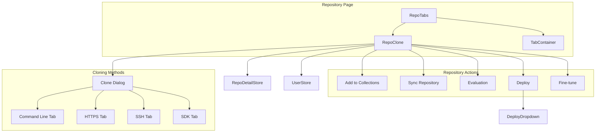
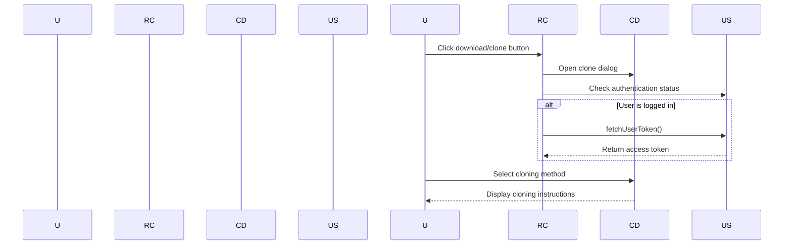
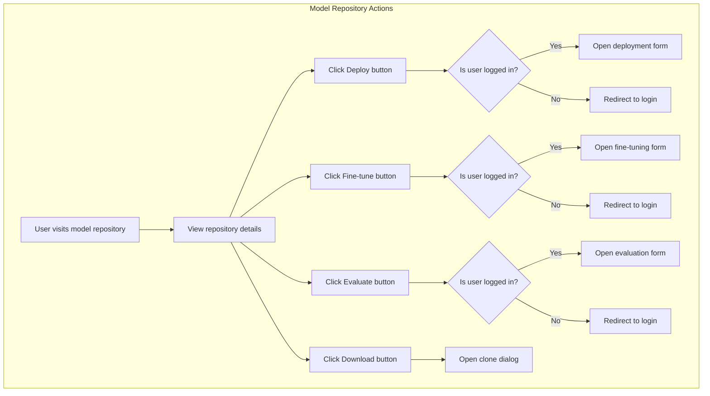
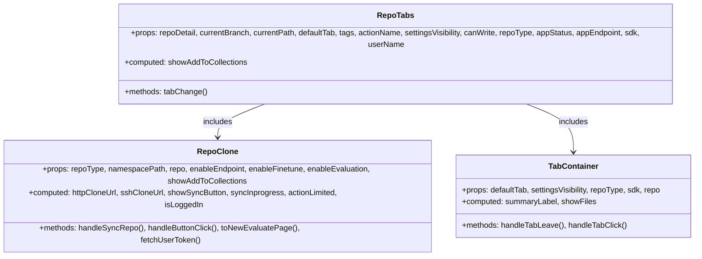
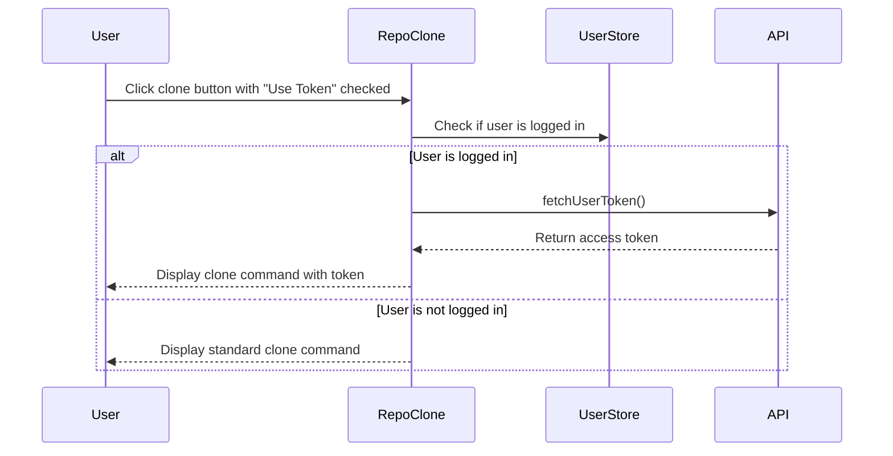

# Repository Clone and Actions

## Purpose and Scope

This document explains the Repository Clone and Actions system in CSGHub, which provides users with a unified interface for cloning repositories and performing repository-specific actions like deployment, fine-tuning, and evaluation. It focuses on the UI components, available cloning methods, and action flows for different repository types.

For information about repository management and detailed views, see [Repository Detail Components](#2.1). For browsing and filtering repositories, see [Repository Browsing and Filtering](#2.3).

## Component Overview

The Repository Clone and Actions system consists of a set of user interface components that enable users to interact with repositories in various ways. The system adapts based on repository type (model, dataset, code, space) and the user's permissions.




## Repository Clone Button and Dialog

The clone functionality is accessible via a primary button in the repository interface. When clicked, it opens a dialog with multiple tabs representing different cloning methods.




### Cloning Methods

The system offers four different methods for cloning repositories:

1. **Command Line** - Uses the CSGHub CLI tool
2. **HTTPS** - Standard Git clone with HTTPS URL
3. **SSH** - Git clone with SSH URL
4. **SDK** - Python SDK for programmatic access

Each method has specific instructions and commands tailored to the repository type.

#### Command Line Tab

Available for models, datasets, and spaces, this tab provides instructions for using the CSGHub CLI tool.

```
pip install csghub-sdk
csghub-cli download [repository-path] [-t repository-type]
```


#### HTTPS Tab

Standard Git clone with HTTPS URL, including instructions for Git LFS and authentication.

```
git lfs install
git clone [https-clone-url]
```

For authenticated access:
```
git lfs install
git clone https://[username]:[token]@[repository-url]
```


#### SSH Tab

Git clone with SSH URL, requiring SSH key setup for authentication.

```
git lfs install
git clone [ssh-clone-url]
```


#### SDK Tab

Available for models and datasets, this tab provides Python code for downloading repository contents using the CSGHub SDK.

```python
from pycsghub.snapshot_download import snapshot_download
token = '' # token from opencsg.com
endpoint = "https://hub.opencsg.com"
repo_type = "[repository-type]"
repo_id = '[namespace-path]'
cache_dir = '' # cache dir of download data
result = snapshot_download(repo_id, cache_dir=cache_dir, endpoint=endpoint, token=token, repo_type=repo_type)
```


## Repository Actions

The Repository Clone and Actions system provides various action buttons depending on the repository type and user permissions.

### Common Actions

| Action | Description | Availability |
|--------|-------------|--------------|
| Clone/Download | Downloads repository contents | All repositories with HTTP clone URL |
| Add to Collections | Adds repository to user's collections | Models, datasets, codes, spaces |


### Model-Specific Actions

Models have additional actions related to model lifecycle management:

| Action | Description | Conditions |
|--------|-------------|------------|
| Deploy | Creates an inference endpoint | User logged in, endpoint enabled, HTTP clone URL available |
| Fine-tune | Creates a fine-tuning job | User logged in, fine-tuning enabled, HTTP clone URL available |
| Evaluate | Creates an evaluation job | User logged in, evaluation enabled, HTTP clone URL available |




### Administrative Actions

For administrators and super users, additional actions are available:

| Action | Description | Conditions |
|--------|-------------|------------|
| Sync | Synchronizes repository from remote source | User is admin/super_user, repository source is 'opencsg', sync status is pending/inprogress/failed |


## Technical Implementation

### Component Structure

The Repository Clone and Actions system is implemented primarily through the `RepoClone.vue` component, which is incorporated into the `RepoTabs.vue` component in the repository detail view.




### Authentication Flow

When performing authenticated actions (like deploying a model), the system first checks if the user is logged in:

1. If the user is logged in, they are directed to the appropriate form
2. If not logged in, they are redirected to the login page

For cloning with HTTPS authentication, the system fetches the user's access token:




### Conditional Rendering

The Repository Clone and Actions system adapts its interface based on various factors:

- **Repository Type** - Different actions are available for different repository types
- **User Permissions** - Some actions are only available to logged-in users or administrators
- **Repository State** - Actions may be disabled based on repository status
- **Feature Enablement** - Actions like deployment, fine-tuning, and evaluation can be enabled/disabled


## Integration with Other Systems

The Repository Clone and Actions system integrates with several other systems in CSGHub:

1. **User Authentication** - Checks login status and retrieves tokens
2. **Collections** - Adds repositories to collections
3. **Deployment** - Initiates model deployment
4. **Fine-tuning** - Starts fine-tuning jobs
5. **Evaluation** - Creates evaluation jobs
6. **Repository Detail** - Obtains repository metadata


## Summary

The Repository Clone and Actions system provides a versatile interface for interacting with repositories in CSGHub. It offers multiple cloning methods and repository-specific actions, adapting to the repository type and user permissions. The system is designed to guide users through the appropriate workflows for accessing repository content and performing operations like deployment, fine-tuning, and evaluation.