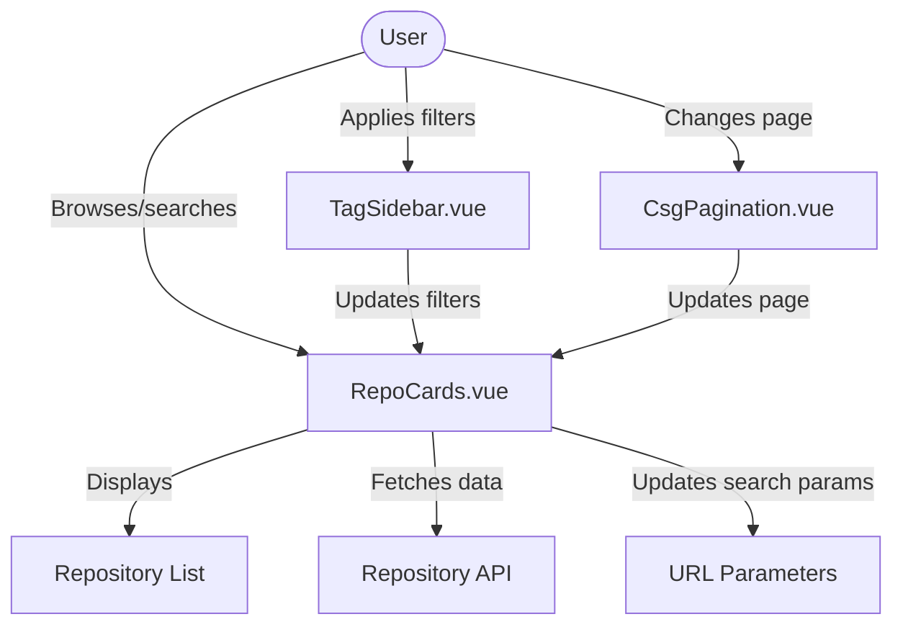
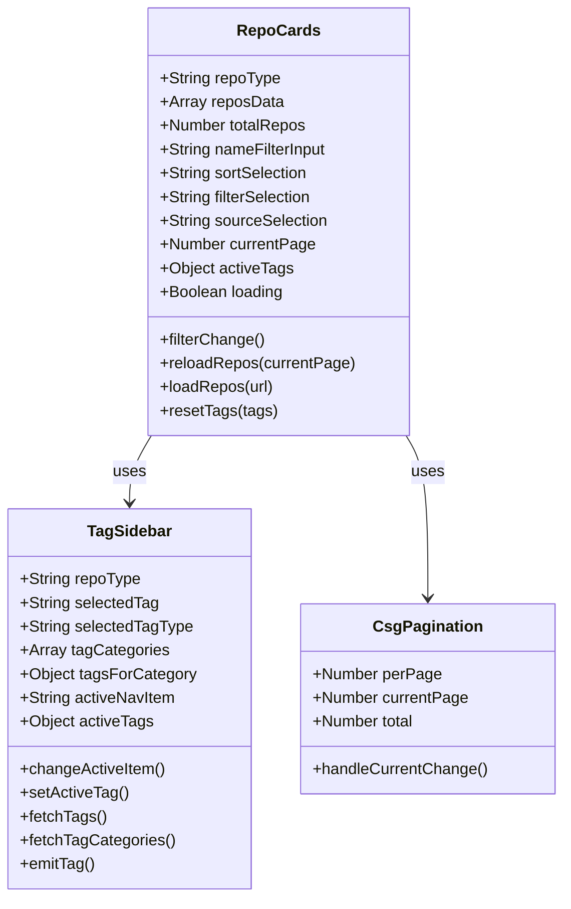
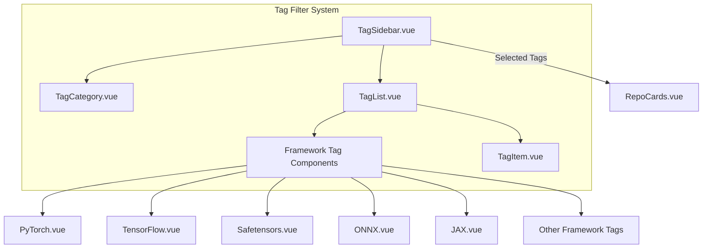
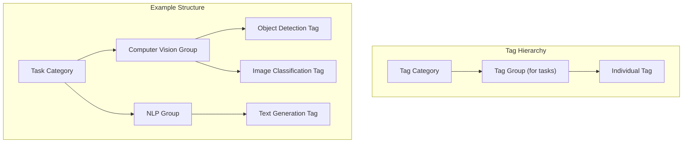

# Repository Browsing and Filtering

This document covers the repository browsing and filtering functionality in CSGHub, explaining how users can discover, search, and filter repositories (models, datasets, code, and spaces) across the platform. For information about detailed repository views, see [Repository Detail Components](#2.1), and for clone functionality, see [Repository Clone and Actions](#2.2).

## Overview

The repository browsing system enables users to efficiently navigate through CSGHub's repository collection with robust filtering, sorting, and search capabilities. The system is built with reusable components that adapt to different repository types while maintaining consistent user experience.




## Key Components

### Repository Cards Component

The `RepoCards.vue` component serves as the central hub for repository browsing functionality. It handles:

1. Displaying repository cards in a responsive grid layout
2. Managing filtering and sorting controls
3. Coordinating with the tag sidebar for category-based filtering
4. Implementing pagination of results
5. Processing search queries




### Repository Item Rendering

The system adapts the display based on repository type:

- For models, datasets, and code repositories, it uses the standard `RepoItem` component
- For spaces, it uses the specialized `ApplicationSpaceItem` component
- Empty states are handled with specific components like `EmptyModels`

Different layouts are applied based on repository type and screen size:

```
models, datasets, code: grid-cols-2 xl:grid-cols-1
spaces: grid-cols-3 xl:grid-cols-2 md:grid-cols-1
```


## Filtering Capabilities

### Search and Sort

The system provides multiple filtering dimensions:

1. **Text Search**: Allows free-text search across repository names and descriptions
2. **Sorting Options**:
   - Trending (default)
   - Recently updated
   - Most downloaded
   - Most favorited

```javascript
const sortOptions = [
  { value: 'trending', label: t('all.trending') },
  { value: 'recently_update', label: t('all.recentlyUpdate') },
  { value: 'most_download', label: t('all.mostDownload') },
  { value: 'most_favorite', label: t('all.mostFavorite') }
]
```

3. **Source Filtering** (on-premise installations):
   - All
   - OpenCSG
   - Local


### Tag-Based Filtering

The `TagSidebar` component enables powerful category-based filtering:

1. **Tag Categories**: Organized into categories (task, framework, language, license, etc.)
2. **Multi-select**: Users can select multiple tags within categories
3. **Tag Search**: Users can filter available tags with a search input

For framework tags, the system includes specialized visual components for popular frameworks:

- PyTorch
- TensorFlow
- Safetensors
- ONNX
- JAX
- PaddlePaddle
- GGUF
- Joblib




### Special Filters by Repository Type

Different repository types have specialized filtering options:

1. **Models**:
   - Runtime framework (inference, finetune, evaluation)
   - Serverless availability

2. **Spaces**:
   - SDK type (Gradio, Streamlit, Nginx, Docker, MCP Server)


## Implementation Details

### API Integration

The repository browsing system interacts with the backend API through the following pattern:

1. Constructing a URL with query parameters based on current filter state
2. Fetching data using the `useFetchApi` utility
3. Updating the UI with the fetched results

```javascript
// URL construction pattern
let url = `/${props.repoType}s`
url = url + `?page=${currentPage.value}`
url = url + `&per=${perPage.value}`
url = url + `&search=${nameFilterInput.value}`
url = url + `&sort=${sortSelection.value}`
// Additional parameters based on filters
```


### Pagination

The system implements pagination with the following features:

1. Dynamic per-page count based on repository type:
   - 9 items per page for spaces
   - 16 items per page for other repository types

2. Page navigation through the `CsgPagination` component

The pagination component tracks:
- Current page
- Items per page
- Total item count
- Emits events for page changes


### URL Parameter Integration

The system supports URL parameters for deep linking and sharing filtered views:

1. When a page loads, it reads URL parameters to set initial filter state:
   - `tag`: Selected tag value
   - `tag_type`: Type of tag (framework, task, etc.)

2. Active filters are synchronized with URL parameters for bookmarking and sharing

```javascript
const getQueryParams = () => {
  const { searchParams } = new URL(window.location.href)
  return {
    tag: searchParams.get('tag') ?? '',
    tagType: searchParams.get('tag_type') ?? ''
  }
}
```


## Tag System Architecture

Tags are organized into a hierarchical structure that enables powerful filtering:

1. **Categories**: Top-level organization (task, framework, language, license)
2. **Groups**: Sub-categories within task tags (e.g., computer_vision, natural_language_processing)
3. **Tags**: Individual selectable options

The system fetches tags based on scope (model, dataset, code, space) and category.




## Localization Support

The repository browsing system fully supports internationalization:

1. Text labels use the Vue i18n system with the `$t` function
2. Localized strings are defined in language-specific files:
   - English: 'models.js', etc.
   - Chinese: 'zh_js/models.js', etc.

This enables a consistent experience across languages while maintaining the same filtering capabilities.


## Collections Integration

In addition to browsing individual repositories, the system also supports browsing collections:

- Collections group related repositories together
- Similar filtering patterns are used (search, sort, pagination)
- Collections have their own specialized card display component

```javascript
// Collection filtering pattern
const params = new URLSearchParams()
params.append('per', perPage.value)
params.append('page', currentPage.value)
params.append('search', nameFilterInput.value)
params.append('sort', sortSelection.value)
const url = `/collections?${params.toString()}`
```


## Header Tags Display

When browsing repositories with active tag filters, the `HeaderTags` component provides a visual representation of the currently applied tags, organized by category:

- Task tags
- Framework tags (with specialized icons)
- Language tags
- Industry tags
- License tags

This component also enables quick removal of tag filters.


## Summary

The Repository Browsing and Filtering system in CSGHub provides a comprehensive and flexible way for users to discover and filter repositories. Key features include:

1. Responsive grid layout adapting to different repository types
2. Powerful filtering through tags, search, and sorting
3. Type-specific filters for specialized repository types
4. Pagination for navigating large result sets
5. URL parameter integration for sharing filtered views
6. Internationalization support for multiple languages

The component-based architecture allows for reuse across different repository types while maintaining consistent user experience.