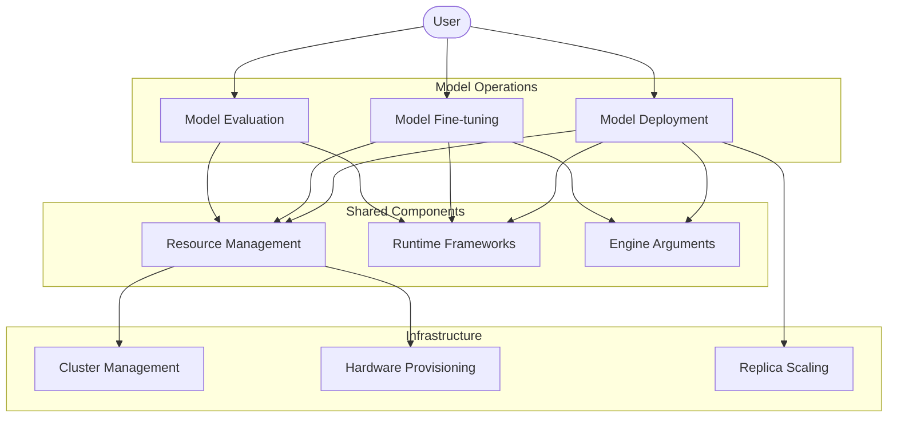
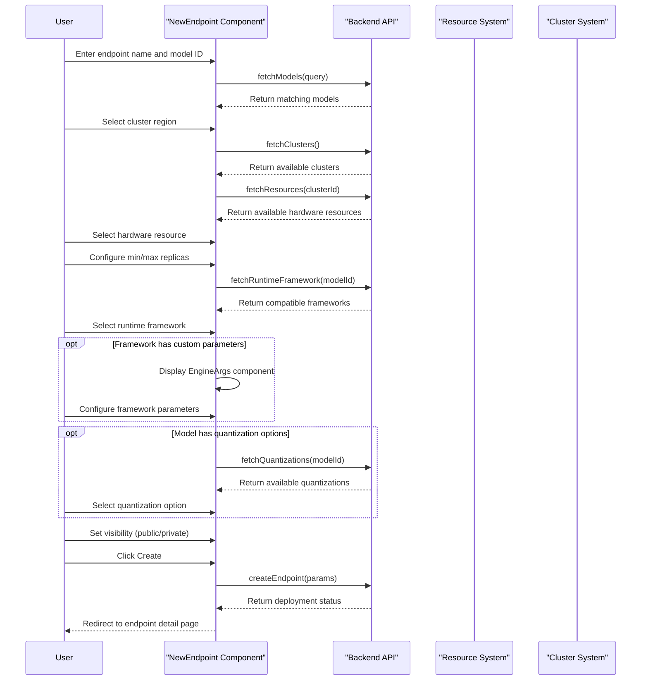
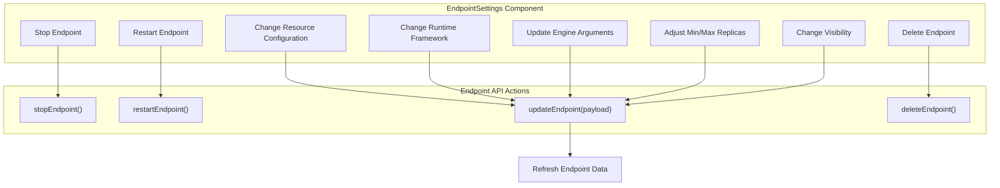
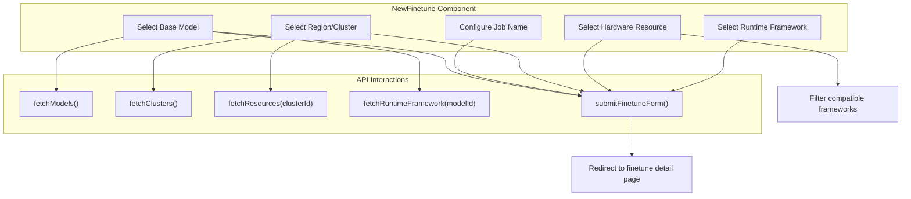
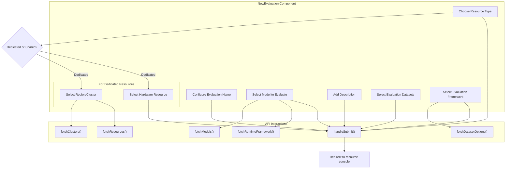
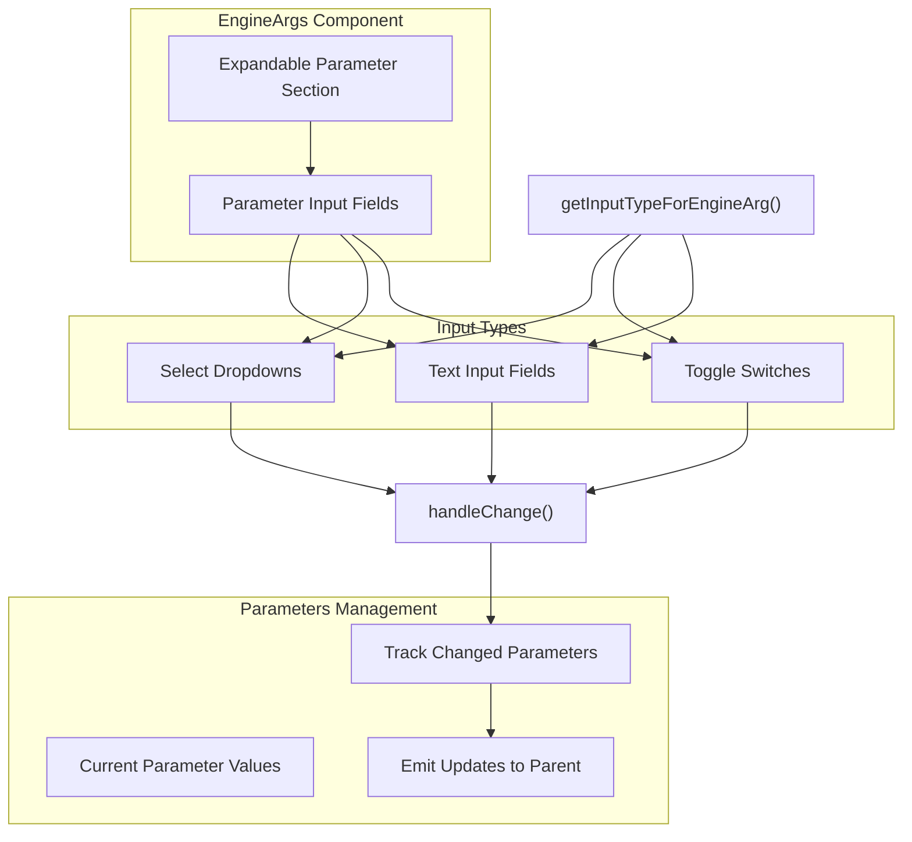
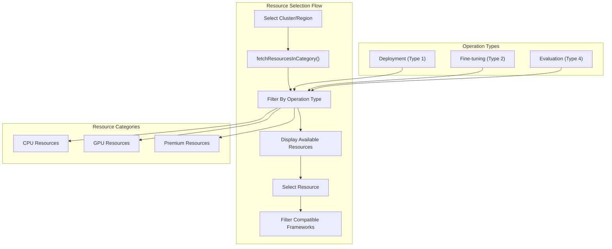
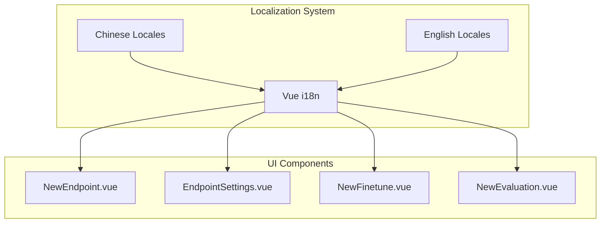

# Model Deployment and Fine-tuning

This document covers the systems and processes for deploying models as inference endpoints and fine-tuning models in CSGHub. It explains how to create, configure, and manage both inference endpoints and fine-tuning jobs, as well as how to evaluate models.

For repository management details, see [Repository Management System](#2).

## Overview

CSGHub provides three main AI model operations:

1. **Model Deployment** - Deploy models as inference endpoints for real-time prediction
2. **Model Fine-tuning** - Customize pre-trained models with your own data
3. **Model Evaluation** - Measure model performance with standardized metrics

These operations share common infrastructure components but serve different purposes in the ML lifecycle.

Sources:
- [frontend/src/components/endpoints/NewEndpoint.vue:1-611]()
- [frontend/src/components/finetune/NewFinetune.vue:1-416]()
- [frontend/src/components/evaluations/NewEvaluation.vue:1-553]()
- [frontend/src/components/endpoints/EngineArgs.vue:1-128]()

## Inference Endpoint System

Inference endpoints provide a deployable API for using models in production. The endpoint system handles deployment configuration, resource allocation, and replica scaling.

### Creating an Endpoint

The endpoint creation flow allows users to deploy a model with specific hardware resources and runtime parameters:

Sources:
- [frontend/src/components/endpoints/NewEndpoint.vue:1-611]()
- [frontend/src/components/endpoints/EngineArgs.vue:1-128]()

The form allows configuration of:

| Parameter | Description | Default |
|-----------|-------------|---------|
| Endpoint name | Unique identifier for the endpoint | - |
| Model ID | The model to deploy | - |
| Min Replicas | Minimum number of running instances | 1 |
| Max Replicas | Maximum number of instances for scaling | 1 |
| Cluster | Region for deployment | First available |
| Cloud Resource | Hardware resource type | First available |
| Runtime Framework | Inference framework | Model-dependent |
| Engine Arguments | Framework-specific parameters | Framework defaults |
| Quantization | Optional model quantization | None |
| Visibility | Public or private access | Public |

Sources:
- [frontend/src/components/endpoints/NewEndpoint.vue:16-265]()
- [frontend/src/locales/en_js/endpoints.js:1-90]()

### Managing Endpoints

The endpoint settings interface provides controls for managing deployed endpoints:

Sources:
- [frontend/src/components/endpoints/EndpointSettings.vue:1-573]()

Key management operations include:

1. **State Management**: Stop, start, and restart the endpoint
2. **Resource Management**: Change the hardware resources (only when stopped)
3. **Framework Configuration**: Change the runtime framework and engine arguments
4. **Scaling Configuration**: Adjust the minimum and maximum replicas
5. **Visibility Control**: Toggle between public and private access
6. **Deletion**: Permanently remove the endpoint

Sources:
- [frontend/src/components/endpoints/EndpointSettings.vue:24-276]()

### Endpoint Lifecycle and States

The endpoint goes through several states during its lifecycle:

| State | Description | Actions Available |
|-------|-------------|-------------------|
| Building | Initial build process | None |
| Deploying | Deployment in progress | None |
| Startup | Starting the service | None |
| Running | Active and serving requests | Stop, monitoring |
| Stopped | Endpoint is paused | Start, configure, delete |
| Sleeping | Low-activity state | Start |
| BuildingFailed | Build process failed | Restart, delete |
| DeployFailed | Deployment failed | Restart, delete |
| RuntimeError | Error during operation | Restart, delete |
| NoAppFile | Missing application file | Delete |

Sources:
- [frontend/src/components/endpoints/EndpointSettings.vue:334-354]()
- [frontend/src/components/endpoints/EndpointPage.vue:1-142]()

## Fine-tuning System

The fine-tuning system allows users to customize pre-trained models with their own data.

### Creating a Fine-tuning Job

Sources:
- [frontend/src/components/finetune/NewFinetune.vue:1-416]()

The fine-tuning form allows configuration of:

| Parameter | Description | Default |
|-----------|-------------|---------|
| Job Name | Name for the fine-tuning job | - |
| Model ID | Base model to fine-tune | - |
| Cluster | Region for fine-tuning | First available |
| Cloud Resource | Hardware resource (GPU required) | First available |
| Runtime Framework | Fine-tuning framework | Model-dependent |

Sources:
- [frontend/src/components/finetune/NewFinetune.vue:16-164]()

### Managing Fine-tuning Jobs

The fine-tuning settings interface provides controls similar to endpoint management:

1. **State Management**: Stop and restart the fine-tuning job
2. **View Configuration**: Examine the resource allocation and framework settings
3. **Deletion**: Permanently remove the fine-tuning job

Fine-tuning jobs share the same lifecycle states as endpoints (Building, Running, Stopped, etc.).

Sources:
- [frontend/src/components/finetune/FinetuneSettings.vue:1-387]()

## Model Evaluation System

The evaluation system allows users to measure model performance against standard benchmarks.

### Creating an Evaluation

Sources:
- [frontend/src/components/evaluations/NewEvaluation.vue:1-553]()

The evaluation form allows configuration of:

| Parameter | Description | Required |
|-----------|-------------|----------|
| Evaluation Name | Name for the evaluation task | Yes |
| Model ID | Model to evaluate | Yes |
| Description | Purpose and notes for evaluation | No |
| Datasets | Evaluation datasets (filtered by framework) | Yes |
| Resource Type | Shared (pooled) or Dedicated resources | Yes |
| Cluster | Region (for dedicated resources) | Conditional |
| Cloud Resource | Hardware (for dedicated resources) | Conditional |
| Evaluation Framework | Framework for running evaluations | Yes |

Sources:
- [frontend/src/components/evaluations/NewEvaluation.vue:16-244]()

## Shared Components and Infrastructure

### Engine Arguments System

The Engine Arguments component allows configuration of framework-specific parameters for both endpoints and fine-tuning jobs:

Sources:
- [frontend/src/components/endpoints/EngineArgs.vue:1-128]()
- [frontend/src/packs/useEngineArgs.js:1-55]()

The component intelligently selects input types based on parameter names and values:

| Input Type | Used For | Example Parameters |
|------------|----------|-------------------|
| Select Dropdown | Parameters with predefined options | `block-size`, `dtype`, `load-format` |
| Toggle Switch | Boolean parameters | `enable-prefix-caching`, `enforce-eager` |
| Text Input | All other parameters | Custom values, numeric settings |

Sources:
- [frontend/src/packs/useEngineArgs.js:1-55]()

### Resource and Cluster Management

All three systems (deployment, fine-tuning, evaluation) share common resource selection and cluster management:

Sources:
- [frontend/src/components/endpoints/NewEndpoint.vue:397-408]()
- [frontend/src/components/finetune/NewFinetune.vue:257-269]()
- [frontend/src/components/evaluations/NewEvaluation.vue:380-390]()

Key aspects of resource management:

1. **Clusters**: Geographic regions where resources are deployed
2. **Resource Types**: Hardware configurations (CPU/GPU/specialized accelerators)
3. **Framework Compatibility**: Filtering frameworks based on selected resources
4. **Operation Types**: Different operations (deployment, fine-tuning, evaluation) filter for appropriate resources

Sources:
- [frontend/src/components/shared/deploy_instance/fetchResourceInCategory.js]() (referenced but not shown in provided files)

## Integration with Repository System

The deployment and fine-tuning systems integrate with the repository management system:

1. **Model Selection**: Deployed endpoints and fine-tuning jobs use models from the repository
2. **Dataset Selection**: Evaluations and fine-tuning use datasets from the repository
3. **Visibility Control**: Aligns with repository visibility settings (public/private)

Sources:
- [frontend/src/components/endpoints/NewEndpoint.vue:246-252]()
- [frontend/src/components/endpoints/EndpointSettings.vue:185-224]()

## User Interface and Localization

The system provides a fully localized interface with support for both English and Chinese:

Sources:
- [frontend/src/locales/en_js/endpoints.js:1-90]()
- [frontend/src/locales/zh_js/endpoints.js:1-90]()

## API Integration

All model operations interact with backend API endpoints:

| Operation | API Endpoint | HTTP Method |
|-----------|--------------|-------------|
| Create Endpoint | `/models/{modelId}/run` | POST |
| Update Endpoint | `/models/{modelId}/run/{endpointId}` | PUT |
| Stop Endpoint | `/models/{modelId}/run/{endpointId}/stop` | PUT |
| Start Endpoint | `/models/{modelId}/run/{endpointId}/start` | PUT |
| Delete Endpoint | `/models/{modelId}/run/{endpointId}` | DELETE |
| Create Fine-tune | `/models/{modelId}/finetune` | POST |
| Update Fine-tune | `/models/{modelId}/finetune/{finetuneId}` | PUT |
| Stop Fine-tune | `/models/{modelId}/finetune/{finetuneId}/stop` | PUT |
| Start Fine-tune | `/models/{modelId}/finetune/{finetuneId}/start` | PUT |
| Delete Fine-tune | `/models/{modelId}/finetune/{finetuneId}` | DELETE |
| Create Evaluation | `/evaluations` | POST |

Sources:
- [frontend/src/components/endpoints/NewEndpoint.vue:550-553]()
- [frontend/src/components/endpoints/EndpointSettings.vue:398-400]()
- [frontend/src/components/finetune/NewFinetune.vue:353-359]()
- [frontend/src/components/finetune/FinetuneSettings.vue:285-288]()
- [frontend/src/components/evaluations/NewEvaluation.vue:472-473]()

## Summary

The Model Deployment and Fine-tuning systems in CSGHub provide comprehensive capabilities for operationalizing AI models through:

1. **Inference Endpoints** for real-time predictions
2. **Fine-tuning Jobs** for customizing models with specialized data
3. **Evaluation Tasks** for measuring model performance

These systems share common infrastructure components including resource management, runtime frameworks, and engine argument configuration, while providing specialized interfaces for each operation type.