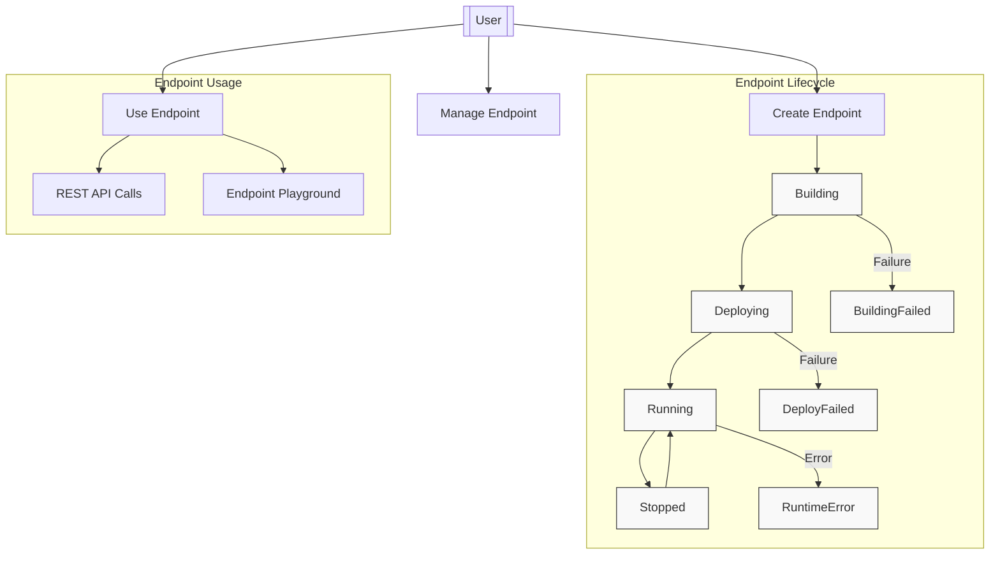
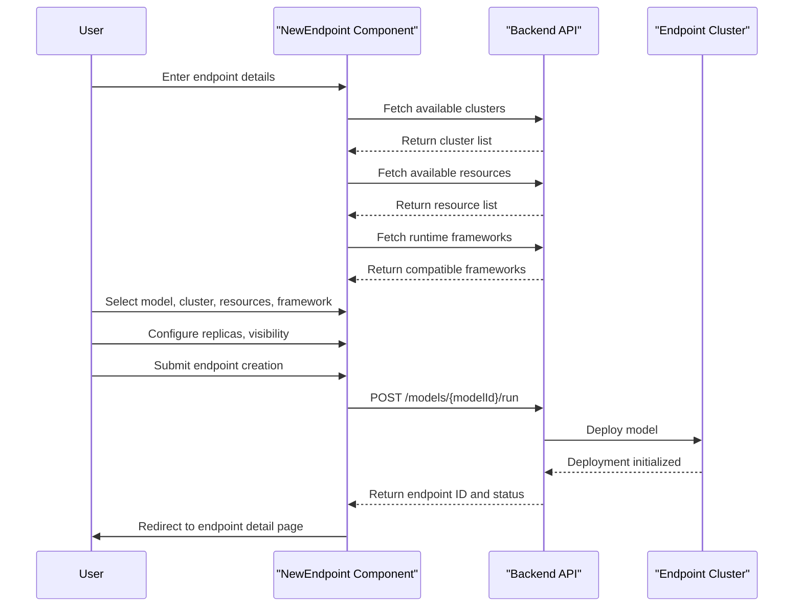
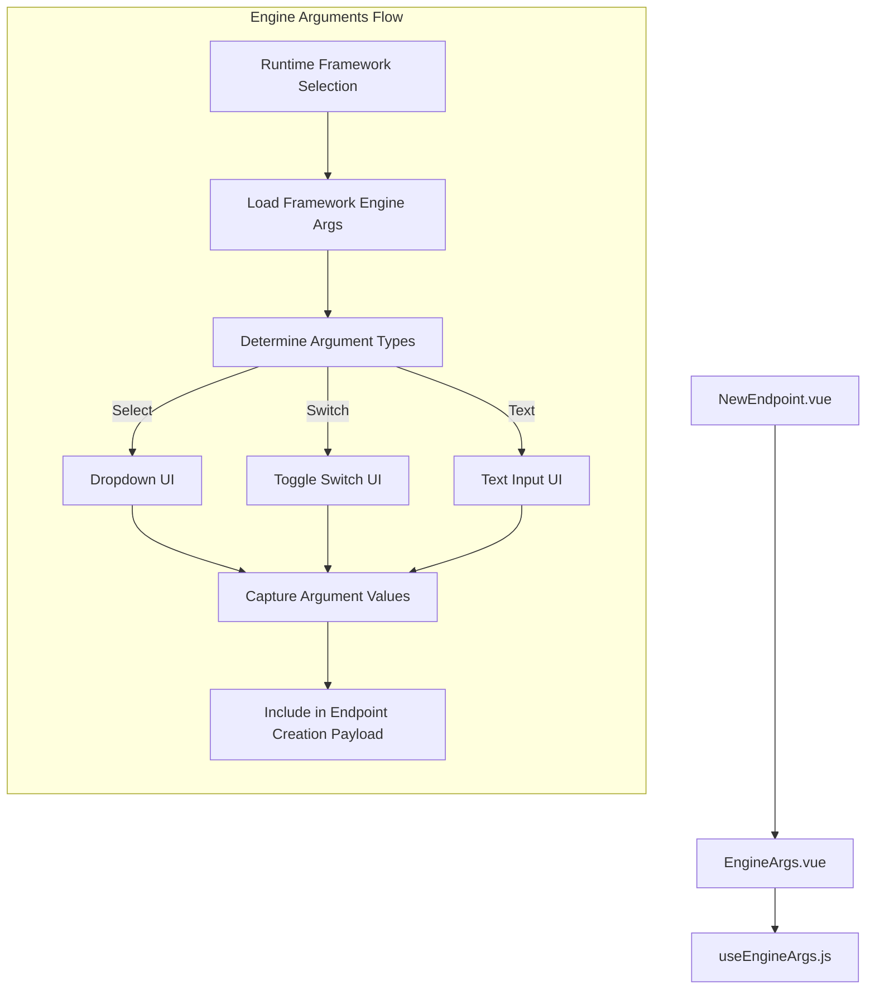
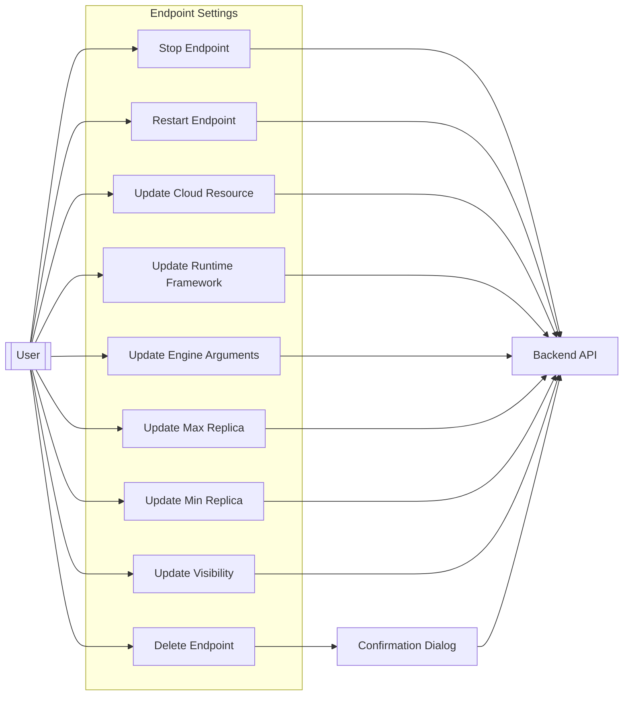
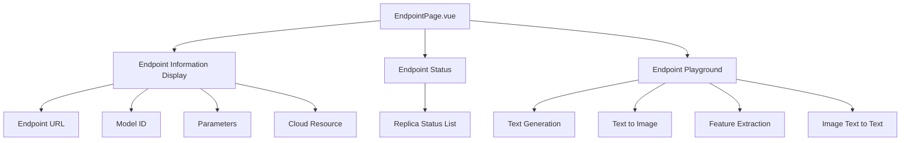

# Creating and Managing Endpoints

This page documents the process of creating, configuring, managing, and deleting inference endpoints in CSGHub. Inference endpoints allow you to deploy models for real-time inference, making them accessible via API calls. For information about model fine-tuning, see [Model Fine-tuning](#3.2).

## 1. Overview of Endpoints

Inference endpoints in CSGHub are dedicated instances that host models for inference. They provide a REST API for sending inference requests to your deployed models. Endpoints can be configured with different resources, frameworks, and settings to optimize for performance, cost, and availability.

Sources: [frontend/src/components/endpoints/EndpointSettings.vue:334-346](), [frontend/src/components/endpoints/EndpointPage.vue:64-73]()

## 2. Creating an Endpoint

Creating an endpoint involves specifying the model to deploy, configuring the resources, and setting various parameters to control how the model is deployed and accessed.

### 2.1 Endpoint Creation Flow

Sources: [frontend/src/components/endpoints/NewEndpoint.vue:526-566]()

### 2.2 Required Parameters

When creating an endpoint, you need to specify the following parameters:

| Parameter | Description | Required |
|-----------|-------------|----------|
| Endpoint Name | A unique name for your endpoint (2-64 characters) | Yes |
| Model ID | The ID of the model to deploy (in format `owner/model`) | Yes |
| Min Replica | Minimum number of replicas (0-5) | Yes |
| Max Replica | Maximum number of replicas (1-5) | Yes |
| Cluster | Region where the endpoint will be deployed | Yes |
| Cloud Resource | Hardware resources for the endpoint | Yes |
| Runtime Framework | Framework used to run the model | Yes |
| Visibility | Public or private access | Yes |
| Quantization | Optional model quantization for optimization | No |

Sources: [frontend/src/components/endpoints/NewEndpoint.vue:25-243]()

### 2.3 Endpoint Creation Form

To create a new endpoint, follow these steps:

1. Navigate to the endpoint creation page.
2. Enter a unique name for your endpoint, following naming rules:
   - 2-64 characters long
   - Start with a letter
   - End with a letter or number
   - Can only contain letters, numbers, hyphens, underscores, and periods
   - Special characters cannot appear together

3. Enter the model ID in the format `owner/model`.
4. Select minimum and maximum replica counts.
5. Choose a cluster region for deployment.
6. Select a cloud resource configuration based on your performance needs.
7. Choose a compatible runtime framework.
8. Configure optional engine arguments if needed.
9. Select a quantization option if available.
10. Choose visibility (public or private).
11. Click "Create" to deploy the endpoint.

Sources: [frontend/src/components/endpoints/NewEndpoint.vue:1-266](), [frontend/src/components/endpoints/NewEndpoint.vue:306-345]()

### 2.4 Engine Arguments

Depending on the selected runtime framework, you can configure various engine arguments to optimize performance. These arguments are framework-specific and can include:

- Block size
- Data type
- Scheduling policy
- Memory utilization
- Caching options

Sources: [frontend/src/components/endpoints/EngineArgs.vue:1-127](), [frontend/src/packs/useEngineArgs.js:1-54]()

## 3. Managing Endpoints

After creating an endpoint, you can manage its state, update its configuration, and monitor its status.

### 3.1 Endpoint States

Endpoints can be in one of several states:

| State | Description |
|-------|-------------|
| Building | The endpoint is being built |
| Deploying | The endpoint is being deployed |
| Startup | The endpoint is starting up |
| Running | The endpoint is running and available for inference |
| Stopped | The endpoint is stopped |
| Sleeping | The endpoint is in sleep mode |
| BuildingFailed | The endpoint failed during building |
| DeployFailed | The endpoint failed during deployment |
| RuntimeError | The endpoint encountered a runtime error |

Sources: [frontend/src/components/endpoints/EndpointSettings.vue:334-345]()

### 3.2 Controlling Endpoint State

You can control the state of your endpoint using the following actions:

1. **Stop Endpoint**: Pauses the endpoint and stops all running instances.
2. **Restart Endpoint**: Restarts a stopped endpoint or restarts a running endpoint.

These actions can be performed from the endpoint settings page.

Sources: [frontend/src/components/endpoints/EndpointSettings.vue:4-41]()

### 3.3 Updating Endpoint Configuration

You can update various aspects of an endpoint's configuration after it has been created. Note that some changes require the endpoint to be in the "Stopped" state.

Sources: [frontend/src/components/endpoints/EndpointSettings.vue:44-276]()

#### 3.3.1 Updating Cloud Resources

You can change the hardware resources allocated to your endpoint. This is useful for scaling up or down based on your performance needs and budget.

1. Navigate to the endpoint settings page.
2. Ensure the endpoint is in the "Stopped" state.
3. Select a new cloud resource from the dropdown.
4. The change will be applied when you restart the endpoint.

Sources: [frontend/src/components/endpoints/EndpointSettings.vue:44-81]()

#### 3.3.2 Updating Runtime Framework

You can change the runtime framework used by your endpoint:

1. Navigate to the endpoint settings page.
2. Ensure the endpoint is in the "Stopped" state.
3. Select a new compatible runtime framework from the dropdown.
4. The change will be applied when you restart the endpoint.

Sources: [frontend/src/components/endpoints/EndpointSettings.vue:84-124]()

#### 3.3.3 Updating Engine Arguments

You can modify engine arguments to optimize performance:

1. Navigate to the endpoint settings page.
2. Ensure the endpoint is in the "Stopped" state.
3. Expand the engine arguments section.
4. Modify the arguments as needed.
5. Click "Update" to save changes.
6. The changes will be applied when you restart the endpoint.

Sources: [frontend/src/components/endpoints/EndpointSettings.vue:111-124]()

#### 3.3.4 Updating Replica Count

You can adjust the minimum and maximum number of replicas for your endpoint:

1. Navigate to the endpoint settings page.
2. Ensure the endpoint is in the "Stopped" state.
3. Select new values for minimum and maximum replicas.
4. The changes will be applied when you restart the endpoint.

Sources: [frontend/src/components/endpoints/EndpointSettings.vue:128-182]()

#### 3.3.5 Changing Visibility

You can change the visibility of your endpoint between public and private:

1. Navigate to the endpoint settings page.
2. Ensure the endpoint is in the "Stopped" state.
3. Select the desired visibility option.
4. Confirm the change in the confirmation dialog.
5. The new visibility will be applied when you restart the endpoint.

Sources: [frontend/src/components/endpoints/EndpointSettings.vue:186-224]()

### 3.4 Deleting an Endpoint

To delete an endpoint:

1. Navigate to the endpoint settings page.
2. Scroll to the "Delete Endpoint" section.
3. Enter the confirmation text (endpoint name/ID) in the text field.
4. Click the "I understand and confirm deletion" button.
5. The endpoint will be permanently deleted.

**Note**: Deletion is irreversible and will permanently remove the endpoint and all its files.

Sources: [frontend/src/components/endpoints/EndpointSettings.vue:227-276]()

## 4. Viewing Endpoint Information

The endpoint detail page provides information about your deployed endpoint, including:

- Endpoint URL
- Model ID
- Parameters (visibility, replica count)
- Cloud resource details
- Endpoint status

Sources: [frontend/src/components/endpoints/EndpointPage.vue:1-73]()

## 5. Using the Endpoint Playground

If your endpoint is in the "Running" state and has a compatible task type (text-generation, text-to-image, feature-extraction, or image-text-to-text), you can test it using the endpoint playground.

The playground provides a user-friendly interface to:

1. Send requests to your endpoint
2. View the responses
3. Adjust parameters for inference
4. Test different inputs

Sources: [frontend/src/components/endpoints/EndpointPage.vue:64-70](), [frontend/src/locales/en_js/endpoints.js:72-89]()

## 6. Endpoint API Overview

Endpoints expose a REST API that allows you to send inference requests programmatically. The API endpoint URL is displayed on the endpoint detail page.

Key API endpoints for managing endpoints include:

| Endpoint | Method | Description |
|----------|--------|-------------|
| `/models/{modelId}/run` | POST | Create a new endpoint |
| `/models/{modelId}/run/{endpointId}` | PUT | Update endpoint configuration |
| `/models/{modelId}/run/{endpointId}/stop` | PUT | Stop an endpoint |
| `/models/{modelId}/run/{endpointId}/start` | PUT | Start or restart an endpoint |
| `/models/{modelId}/run/{endpointId}` | DELETE | Delete an endpoint |

Sources: [frontend/src/components/endpoints/NewEndpoint.vue:550-552](), [frontend/src/components/endpoints/EndpointSettings.vue:398-424](), [frontend/src/components/endpoints/EndpointSettings.vue:485-518]()

## 7. Comparison with Fine-tuning and Evaluation

CSGHub provides three main types of computing resources: Endpoints, Fine-tuning, and Evaluation. Here's how they compare:

| Feature | Endpoints | Fine-tuning | Evaluation |
|---------|-----------|-------------|------------|
| Purpose | Deploy models for inference | Train and refine models | Evaluate model performance |
| Resource Type | Inference-optimized | Training-optimized | Evaluation-optimized |
| Typical Duration | Long-running | Time-limited task | Time-limited task |
| Interaction | Real-time API access | No direct interaction | Results report |
| Management | Start/stop/update | Start/stop/delete | View results |

For more details on fine-tuning and evaluation, see [Model Fine-tuning](#3.2) and [Model Settings and Evaluation](#3.3).

Sources: [frontend/src/components/endpoints/NewEndpoint.vue](), [frontend/src/components/finetune/NewFinetune.vue](), [frontend/src/components/evaluations/NewEvaluation.vue]()