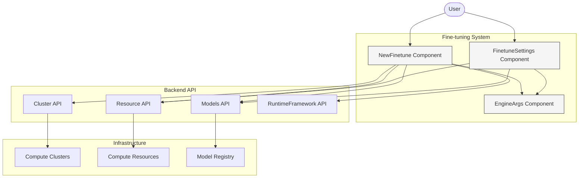
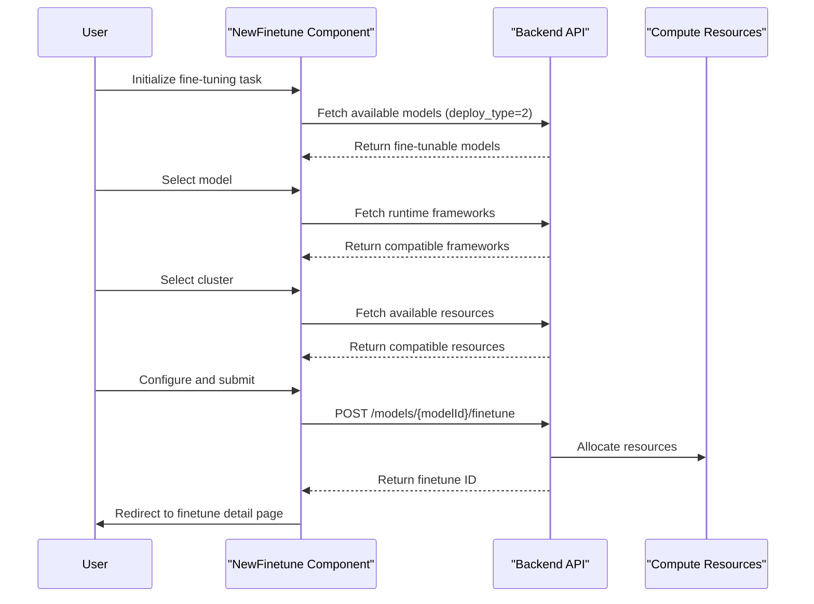
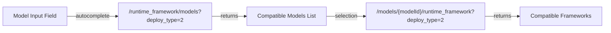
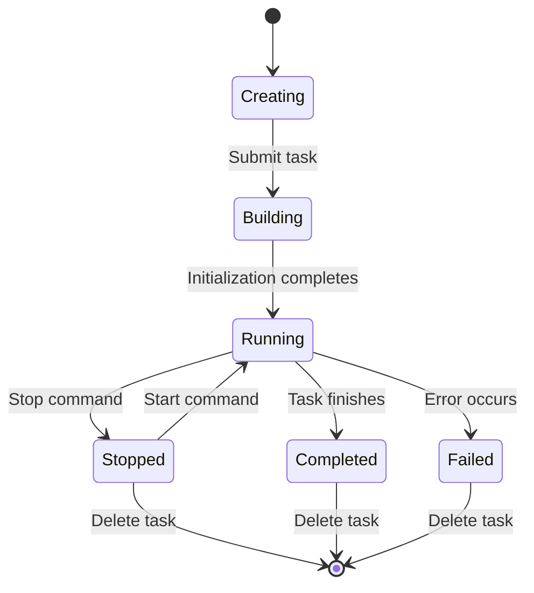
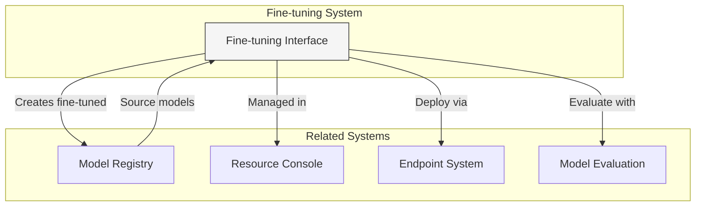

# Model Fine-tuning

Model Fine-tuning in CSGHub provides a structured approach to adapt pre-trained large language models (LLMs) to specific use cases. This document explains the fine-tuning system architecture, the process for creating and managing fine-tuning tasks, configuration options, and integration points.

For information about deploying fine-tuned models, see [Creating and Managing Endpoints](#3.1). For details on evaluating model performance, see [Model Settings and Evaluation](#3.3).

## 1. Fine-tuning System Architecture

The fine-tuning system in CSGHub enables users to customize pre-trained models with domain-specific data. The system integrates with the platform's resource management, cluster configuration, and model registry components.

### Architecture Overview




### Fine-tuning Creation Process




## 2. Creating a Fine-tuning Task

### Required Parameters

To create a fine-tuning task, the following parameters must be specified:

| Parameter | Description | Required |
|-----------|-------------|----------|
| deploy_name | Name for the fine-tuning task | Yes |
| model_id | Source model in format `owner/model_name` | Yes |
| cluster_id | Compute cluster for execution | Yes |
| resource_id | Computational resources for the task | Yes |
| runtime_framework_id | Framework for fine-tuning | Yes |
| secure_level | Visibility setting (1=public, 2=private) | Yes |


### Model Selection Interface

The system provides an autocomplete interface to select from available models that support fine-tuning. Only models that are compatible with the fine-tuning process (deploy_type=2) are displayed.




### Resource and Framework Selection

Resource selection follows a hierarchical process:

1. Select a cluster/region for execution
2. View available computational resources in that cluster
3. Select a compatible framework based on the model and resource type

The system filters available frameworks based on the selected resource type to ensure compatibility.


## 3. Managing Fine-tuning Tasks

### Fine-tuning Task Lifecycle




### Starting and Stopping Tasks

Fine-tuning tasks can be started and stopped through the FinetuneSettings interface. This allows users to pause resource-intensive operations and resume them later.

The controls become available based on the current status of the fine-tuning task:
- Stop button is only active for initialized or running tasks
- Start button is only active for stopped tasks


### Deleting Fine-tuning Tasks

To delete a fine-tuning task, users must confirm by typing the full task identifier in the format `finetuneName/finetuneId`. This prevents accidental deletion of valuable fine-tuning tasks.


## 4. Configuration Options

### Resource Types

Fine-tuning requires specific resource types, typically GPU-accelerated instances. The platform filters available resources to only show those compatible with fine-tuning operations (deploy_type=2).

Each resource includes:
- Name and specifications
- Availability status
- Hardware type (e.g., GPU, CPU)
- Region information


### Runtime Frameworks

Runtime frameworks define the software stack used for fine-tuning. Available frameworks are filtered based on:
1. The selected model (only compatible frameworks are shown)
2. The selected resource type (frameworks must match the compute type)

The system dynamically updates available frameworks when users change their resource selection.


### Engine Arguments

Advanced configuration is available through engine arguments, which allow fine-grained control over the fine-tuning process. These arguments vary based on the selected framework and may include:

| Argument Type | Examples | Input Type |
|---------------|----------|------------|
| Numerical Parameters | block-size, gpu-memory-utilization | Select/Text |
| Data Type Options | dtype (float16, bfloat16, etc.) | Select |
| Feature Toggles | enable-prefix-caching, enforce-eager | Switch |
| Load Format | auto, pt, safetensors, etc. | Select |


## 5. API Integration Points

### Fine-tuning API Endpoints

| Endpoint | Method | Purpose |
|----------|--------|---------|
| `/models/{modelId}/finetune` | POST | Create new fine-tuning task |
| `/models/{modelId}/finetune/{finetuneId}` | DELETE | Delete fine-tuning task |
| `/models/{modelId}/finetune/{finetuneId}/start` | PUT | Start/resume fine-tuning |
| `/models/{modelId}/finetune/{finetuneId}/stop` | PUT | Stop/pause fine-tuning |
| `/cluster` | GET | List available clusters |
| `/runtime_framework/models?deploy_type=2` | GET | List fine-tunable models |
| `/models/{modelId}/runtime_framework?deploy_type=2` | GET | List frameworks for model |


### Fine-tuning Request Format

The following JSON structure is used when creating a new fine-tuning task:

```json
{
  "deploy_name": "my-finetune-task",
  "model_id": "organization/model_name",
  "cluster_id": "cluster_identifier",
  "resource_id": "resource_id/order_detail_id",
  "runtime_framework_id": "framework_id",
  "secure_level": 2
}
```


## 6. Integration with Other Systems

Fine-tuning in CSGHub is closely integrated with other platform components:



- **Model Registry**: Source models are selected from the registry, and fine-tuned models are stored back to it
- **Resource Console**: All fine-tuning tasks are managed through the resource console
- **Endpoints**: Fine-tuned models can be deployed through the endpoint system
- **Evaluation**: Models can be evaluated before and after fine-tuning to measure improvement

