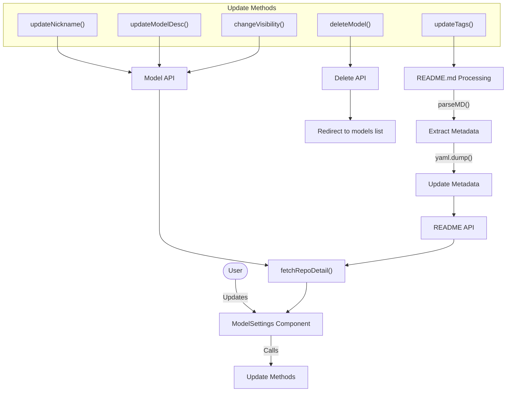
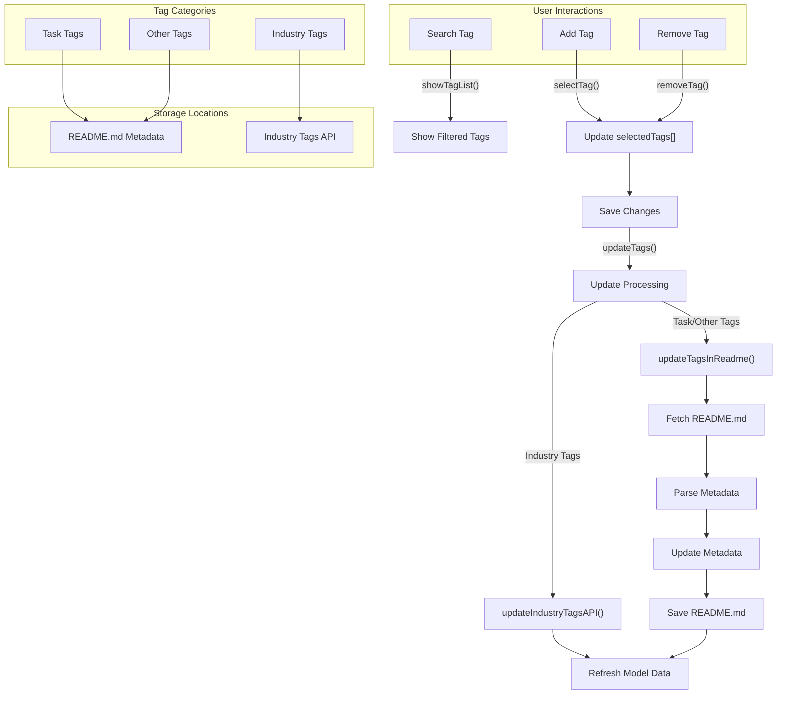
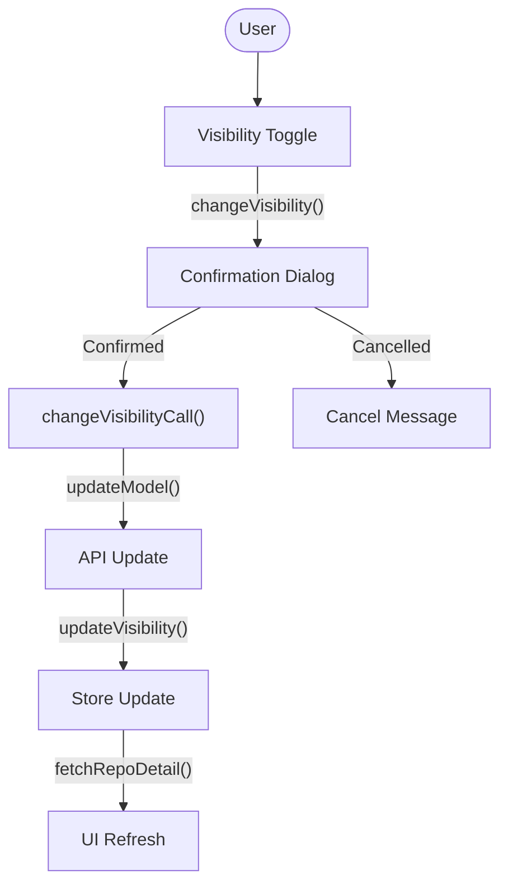
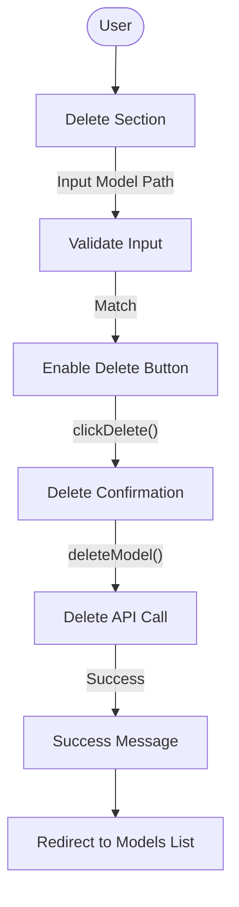
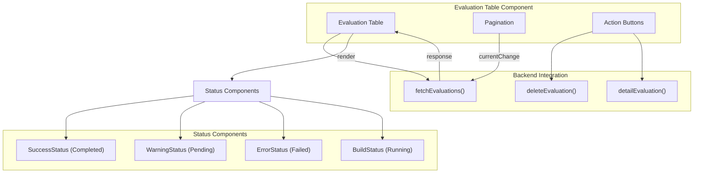
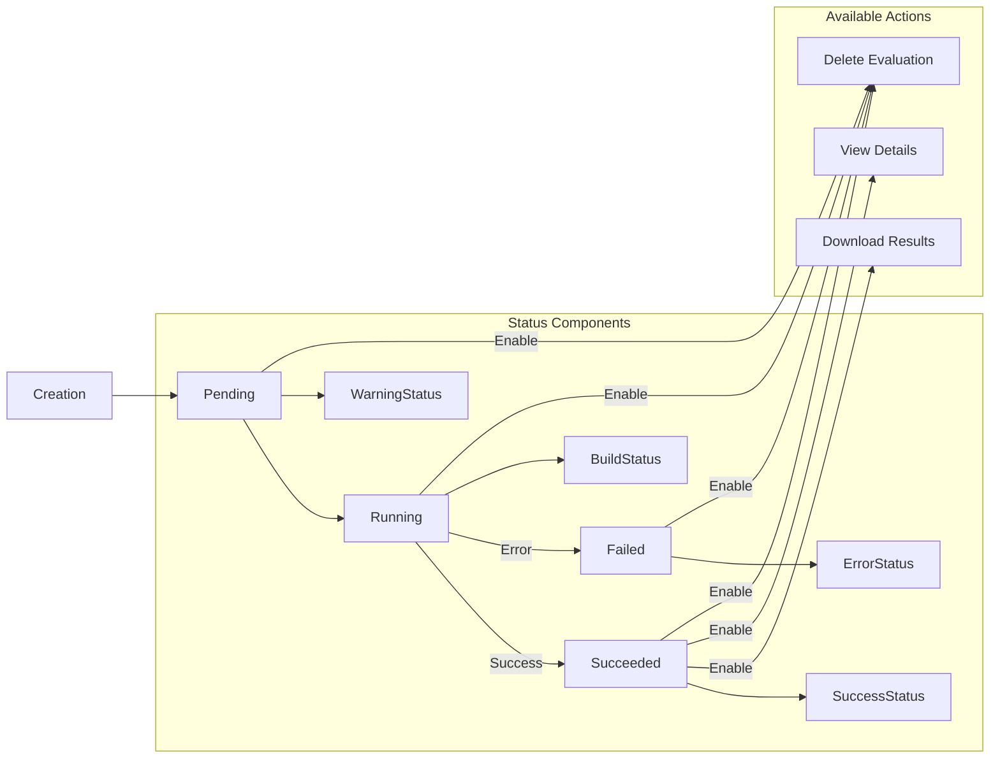
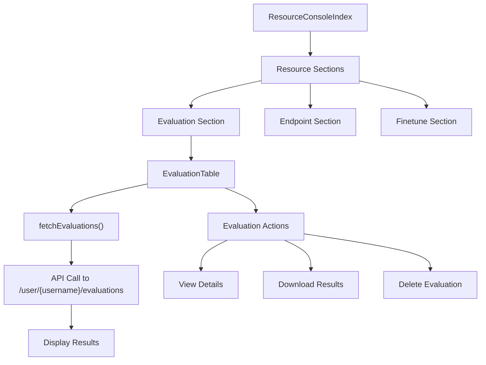
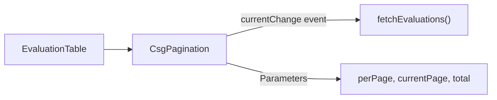

# Model Settings and Evaluation

This technical documentation covers the model settings and evaluation capabilities in CSGHub. It explains how users can manage model metadata, configure visibility settings, and create/review model evaluations. For information about inference endpoints, see [Creating and Managing Endpoints](#3.1), and for details on model fine-tuning, see [Model Fine-tuning](#3.2).

## 1. Model Settings Architecture

The model settings interface allows administrators to manage key model properties, including names, descriptions, tags, and visibility. The system follows a component-based architecture where UI elements interact with backend APIs through fetch operations.

The `ModelSettings.vue` component provides a comprehensive interface for managing model metadata and settings. It communicates with backend APIs to fetch and update model information.

## 2. Model Metadata Management

### 2.1 Basic Metadata Fields

The ModelSettings component allows editing the following model metadata:

| Field | Description | Update Method | API Endpoint |
|-------|-------------|---------------|--------------|
| Model Path | Namespace/model name (read-only) | N/A | N/A |
| Nickname | User-friendly model name | updateNickname() | /models/{path} |
| Description | Model description text | updateModelDesc() | /models/{path} |
| Visibility | Public or Private | changeVisibility() | /models/{path} |

Each field has its own update method that validates input and makes the necessary API calls to update the model metadata.

### 2.2 Tag Management System

CSGHub implements a dual-storage tag system where different tag categories are stored in different locations:

The tag management system provides interfaces for both regular tags (stored in README.md) and industry tags (stored via API):

1. **Task & Other Tags**:
   - Stored in the model's README.md metadata section
   - Updated via the updateTagsInReadme() method
   - Requires parsing and updating the README.md file

2. **Industry Tags**:
   - Stored via a dedicated API endpoint
   - Updated via the updateIndustryTagsAPI() method
   - Directly linked to the model

### 2.3 Visibility Controls

The visibility system allows toggling between private and public model access:

The visibility toggle interface provides a dropdown with "Public" and "Private" options. When changed, the system confirms the change with the user before updating the model visibility status.

### 2.4 Model Deletion

Model deletion includes a safety mechanism requiring the user to type the full model path to confirm:

This multi-step confirmation process helps prevent accidental deletion of models.

## 3. Model Evaluation System

CSGHub includes a comprehensive evaluation system for assessing model performance. The evaluation table provides a centralized view of all evaluations.

### 3.1 Evaluation Table Architecture

The evaluation table provides a unified interface for viewing and managing model evaluations across different datasets.

### 3.2 Evaluation Data Structure

Each evaluation record contains the following key information:

| Field | Description | Display Format |
|-------|-------------|----------------|
| task_name | Evaluation name | Text |
| repo_ids | Models being evaluated | Text list |
| datasets | Datasets used for evaluation | Text list with tooltips |
| submit_time | When the evaluation was created | Formatted date |
| status | Current status (Succeeded, Pending, Failed, Running) | Status component with icon |
| task_desc | Evaluation description | Text |
| download_url | URL for downloading results | Link (if available) |
| result_url | URL for viewing detailed results | Link (if available) |

The table displays evaluation metadata and provides actions to download results, view details, or delete evaluations.

### 3.3 Evaluation Status Workflow

Evaluations progress through different status states during their lifecycle:

The evaluation status determines which actions are available to the user, with completed evaluations enabling result viewing and downloading.

## 4. Integration with Resource Console

The Resource Console provides a unified interface for managing all resource types, including model evaluations.

The Resource Console integrates evaluations with other resource types (endpoints, finetunes) to provide a comprehensive management interface.

## 5. Related UI Components

Several UI components are used across both model settings and evaluation interfaces:

### 5.1 Status Components

Status components provide visual indicators for different evaluation states:

| Component | Status | Visual Appearance |
|-----------|--------|-------------------|
| SuccessStatus | Succeeded | Green checkmark with "Succeeded" text |
| WarningStatus | Pending | Yellow warning icon with "Pending" text |
| ErrorStatus | Failed | Red error icon with "Failed" text |
| BuildStatus | Running | Blue spinner with "Running" text |

These components maintain a consistent visual language across the application.

### 5.2 Pagination Component

The CsgPagination component provides standardized pagination for evaluation tables:

This component ensures consistent pagination across the application and handles interactions with the backend API.

## 6. Backend API Integration

Both model settings and evaluation components interact with backend APIs to fetch and update data.

### 6.1 Model Settings API Endpoints

| Endpoint | Method | Purpose | Implementation |
|----------|--------|---------|----------------|
| `/models/{path}` | GET | Fetch model details | fetchRepoDetail() |
| `/models/{path}` | PUT | Update model metadata | updateModel() |
| `/models/{path}` | DELETE | Delete model | deleteModel() |
| `/models/{path}/blob/README.md` | GET | Fetch README content | fetchReadme() |
| `/models/{path}/raw/README.md` | PUT | Update README content | updateReadme() |
| `/models/{path}/tags/industry` | POST | Update industry tags | updateIndustryTagsAPI() |
| `/tags` | GET | Fetch available tags | getIndustryTags() |

### 6.2 Evaluation API Endpoints

| Endpoint | Method | Purpose | Implementation |
|----------|--------|---------|----------------|
| `/user/{username}/evaluations` | GET | Fetch user evaluations | fetchEvaluations() |
| `/evaluations/{id}` | DELETE | Delete evaluation | deleteEvaluation() |
| `/evaluations/{id}` | GET | View evaluation details | detailEvaluation() |

## 7. Internationalization Support

Both model settings and evaluation interfaces support internationalization (i18n) with English and Chinese translations:

| Feature | English Key | Chinese Implementation |
|---------|-------------|------------------------|
| Model Settings | models.edit.* | Translated strings for all UI elements |
| Evaluation Table | evaluation.list.* | Translated strings for column headers and actions |
| Status Labels | Direct mapping | statusMapping object maps English to Chinese |

## Summary

The Model Settings and Evaluation system in CSGHub provides comprehensive tools for managing model metadata and assessing model performance. The model settings component allows users to update model information, manage tags, and control visibility, while the evaluation system enables users to create, manage, and review model evaluations across different datasets.

These components integrate seamlessly with the wider CSGHub platform, providing a consistent user experience and ensuring that model metadata and evaluation results are easily accessible to users.