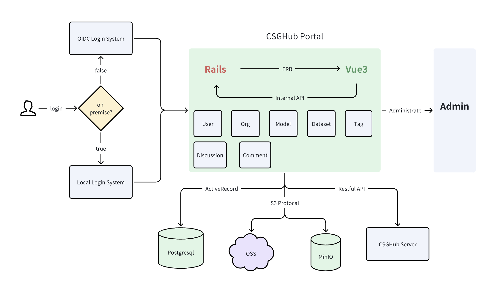
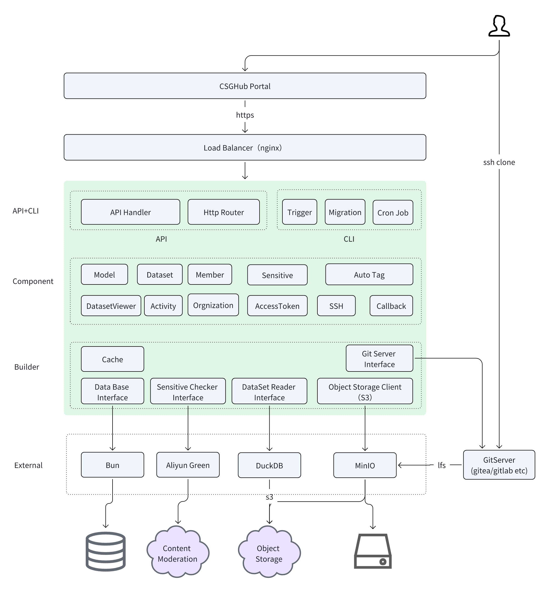

## CSGHub README
CSGHub is an open source, trustworthy large model asset management platform that can assist users in governing the assets involved in the lifecycle of LLM and LLM applications (datasets, model files, code, etc).

With CSGHub, users can perform operations on LLM assets, including uploading, downloading, storing, verifying, and distributing, through Web interface, Git command line, or natural language Chatbot. Meanwhile, the platform provides microservice submodules and standardized OpenAPIs, which could be easily integrated with users' own systems.

CSGHub is committed to bringing users an asset management platform that is natively designed for large models and can be deployed On-Premise for fully offline operation. CSGHub offers functionalities similar to a privatized Huggingface(on-premise Huggingface), managing LLM assets in a manner akin to how OpenStack Glance manages virtual machine images, Harbor manages container images, and Sonatype Nexus manages artifacts.

You can try the free SaaS version of CSGHub through the OpenCSG Community official website.https://portal.opencsg.com/

### UPDATES
- [2024.02.15] v0.2 plan: Built-in code Repo; automatic conversion for datasets, complete dataset preview function.*
- [2023.1.15] v0.1 CSGHub Alpha version release, supports model and dataset management functions, detailed function is as blew

### CORE FUNCTIONS
In the ear of LLM, data and models are increasingly becoming the most important digital assets for businesses and individual users. However, there are currently issues such as fragmented management tools, limited management methods, and localization, which not only pose potential threats to secure operations but also might hinder the updating and iteration of enterprise-scale models. If you believe that large models will become a major driving force in the upcoming revolution, you may also be considering how to manage core assets — models, data, and large model application code — more efficiently and securely. CSGHub is an open-source project designed to address these issues.

CSGHub's core funtions（update reguarly）：
- **Unified Management of LLM Assets**: A one-stop Hub for unified management of model files, datasets, and large-scale model application codes.
- **Development Ecosystem Compatibility**: Supports both HTTPS and SSH protocols for Git commands and web interface operations, ensuring convenient usage for different users.
- **Large Model Capability Expansion**: Natively supports version management, model format conversion, automatic data processing, and dataset preview functions.
- **Permissions and Security**: Supports integration with corporate user systems, setting of asset visibility, and zero-trust authentication interface design for both external and internal users, maximizing security.
- **Support for Private Deployment**: Independent of internet and cloud vendors, enabling one-click initiation of private deployment.
- **Native Design for Large Models**: Supports natural language interaction, one-click model deployment, and asset management for Agent and Copilot App.

### TECH DESIGN
The technical design of CSGHub are as follows:
- CSGHub integrates multiple technologies including Git Servers, Git LFS (Large File Storage) protocol, and Object Storage Service (OSS), providing a reliable data storage layer, a flexible infrastructure access layer, and extensive support for development tools.
- Utilizing a service-oriented architecture, CSGHub offers backend services through CSGHub Server and a management interface via CSGHub Web Service. Ordinary users can quickly initiate services using Docker compose or Kubernetes Helm Chart for enterprise-level asset management. Users with in-house development capabilities can utilize CSGHub Server for secondary development to integrate management functions into external systems or to customize advanced features.
- Leveraging outstanding open-source projects like Apache Arrow and DuckDB, CSGHub supports previewing of Parquet data file formats, facilitating localized dataset management for researchers and common users.
- CSGHub provides an intuitive web interface and permission design for enterprise organization structure. Users can realize version control management, online browsing and downloading through the web UI, as well as set the visibility scope of datasets and model files to realize data security isolation, and can also initiate topic discussions on models and datasets.

Our R&D team has been focusing on AI + DevOps for a long time, and we hope to solve the pain points in the development process of large models through the CSGHub project. We encourage everyone to contribute high-quality development and operation and maintenance documents, and work together to improve the platform, so that large models assets can be more traceable and efficient.

### DEMO VIDEOS
In order to help users to quickly understand the features and usage of CSGHub, we have recorded a series of demo videos. You can watch these videos to get a quick understanding of the main features and operation procedures of this program.
- CSGHub Web Demo: [Demo Video](https://portal.opencsg.com/)
- CSGHub Git Operation Demo：[Demo Video](https://portal.opencsg.com/)

### ROADMAP
- **Asset Management**
  - [ ] Built-in Code Repo: Built-in Code Repo management function to associate the code of model, dataset, Space space application.
  - [ ] Multi-source data synchronization: Support configure and enable remote repository, automatic data synchronization, support OpenCSG community, Huggingface and other remote sources。
- **AI Enhancement**
  - [ ] One-Click Fine-Tuning: Support integration with OpenCSG llm-finetune tool to start model fine-tuning training with one click.
  - [ ] One-Click Reasoning: Support integration with OpenCSG llm-inference tool to start model reasoning service with one click.
- **LLM App and Enterprise Features**
  - [ ] App Space: Support hosting Gradio/Streamlit applications and publishing them to App Space.
  - [ ] Fine-grained Permission Control: Fine-grained permission and access control settings for enterprise architecture.
- **Security Compliance**
  - [ ] GitServer Adapter: Generic GitServer adapter to support multiple major Git repository types through Adaptor mode.
  - [ ] Asset Metadata: Asset metadata management mechanism, supporting customized metadata types and corresponding AutoTag rules.

The detailed roadmap is designed as follows: ：[function roadmap](./roadmap.md)

### DOCS
#### CSGHub Portal Architecture

#### CSGHub Server Architecture

### QUICK START
- [refer to details](./script/all_in_one/README.md)

#### Tech docs in detail
- [setup development env](./docs/setup_en.md)

### ACKNOWLEDGEMENTS
This project is based on Rails, Vue3, Tailwind CSS, Administrate, Postgresql, Apache Arrow, DuckDB and GoGin, whose open source contributions are deeply appreciated!

### CONTACT WITH US
Any problems in the process of use, you can initiate an issue in github.
